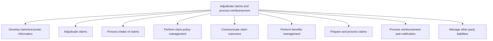

# Adjudicate claims and process reimbursement

> TODO: Business-as-Code definition for adjudicate claims and process reimbursement (unknown)

## Overview

TODO: Add process overview

## Process Hierarchy



## GraphDL

```yaml
adjudicate:
  object: Claims And Process Reimbursement
  actor: TODO
  result: TODO
```

## Actions

| Action | Description |
|--------|-------------|
| TODO | TODO |

## Events

| Event | Description |
|-------|-------------|
| TODO | TODO |

## Searches

| Search | Description |
|--------|-------------|
| TODO | TODO |

## Process Flow


## RACI Matrix

| Activity | Responsible | Accountable | Consulted | Informed |
|----------|-------------|-------------|-----------|----------|
| TODO | TODO | TODO | TODO | TODO |

## Sub-Processes

| ID | Name | Description |
|----|------|-------------|
| 5.3.1 | Develop claim/encounter informatics | TODO |
| 5.3.2 | Adjudicate claims | TODO |
| 5.3.3 | Process intake of claims | TODO |
| 5.3.4 | Perform claim policy management | TODO |
| 5.3.5 | Communicate claim outcomes | TODO |
| 5.3.6 | Perform benefits management | TODO |
| 5.3.7 | Prepare and process claims | TODO |
| 5.3.8 | Process reimbursement and notification | TODO |
| 5.3.9 | Manage other party liabilities | TODO |

## Related Processes

| Process | Relationship |
|---------|-------------|
| TODO | TODO |

## Related Departments

| Department | Role |
|-----------|------|
| TODO | TODO |

## Related Occupations

| Occupation | Involvement |
|-----------|-------------|
| TODO | TODO |

## KPIs

| KPI | Description | Unit |
|-----|-------------|------|
| TODO | TODO | TODO |

## Usage

```typescript
import { TODO } from '@headlessly/adjudicate-claims-and-process-reimbursement'

const client = TODO()

// TODO: Example action calls
```
