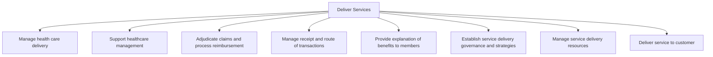

# Deliver Services

> TODO: Business-as-Code definition for deliver services (unknown)

## Overview

TODO: Add process overview

## Process Hierarchy



## GraphDL

```yaml
deliver:
  object: Services
  actor: TODO
  result: TODO
```

## Actions

| Action | Description |
|--------|-------------|
| TODO | TODO |

## Events

| Event | Description |
|-------|-------------|
| TODO | TODO |

## Searches

| Search | Description |
|--------|-------------|
| TODO | TODO |

## Process Flow


## RACI Matrix

| Activity | Responsible | Accountable | Consulted | Informed |
|----------|-------------|-------------|-----------|----------|
| TODO | TODO | TODO | TODO | TODO |

## Sub-Processes

| ID | Name | Description |
|----|------|-------------|
| 5.1 | Manage health care delivery | TODO |
| 5.2 | Support healthcare management | TODO |
| 5.3 | Adjudicate claims and process reimbursement | TODO |
| 5.4 | Manage receipt and route of transactions | TODO |
| 5.5 | Provide explanation of benefits to members | TODO |
| 5.6 | Establish service delivery governance and strategies | TODO |
| 5.7 | Manage service delivery resources | TODO |
| 5.8 | Deliver service to customer | TODO |

## Related Processes

| Process | Relationship |
|---------|-------------|
| TODO | TODO |

## Related Departments

| Department | Role |
|-----------|------|
| TODO | TODO |

## Related Occupations

| Occupation | Involvement |
|-----------|-------------|
| TODO | TODO |

## KPIs

| KPI | Description | Unit |
|-----|-------------|------|
| TODO | TODO | TODO |

## Usage

```typescript
import { TODO } from '@headlessly/deliver-services'

const client = TODO()

// TODO: Example action calls
```
