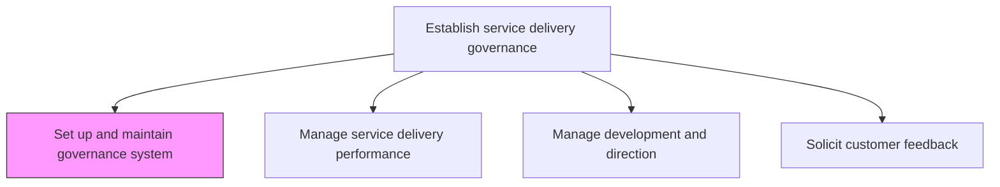
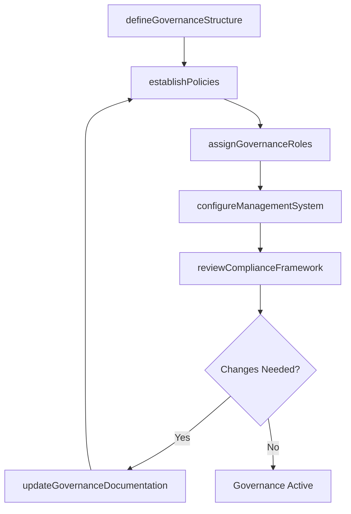

# Set up and maintain service delivery governance and management system

> Business-as-Code definition for establishing and sustaining governance frameworks that ensure consistent, high-quality service delivery through defined policies, roles, and management controls.

## Overview

Providing a system for which to manage customer needs and a structure for which to facilitate service delivery to fulfill those needs.

## Process Hierarchy



## GraphDL

```yaml
set:
  object: Up And Maintain Service Delivery Governance And Management System
  actor: ServiceDeliveryManager
  result: GovernanceFramework
```

## Actions

| Action | Description |
|--------|-------------|
| defineGovernanceStructure | Establish organizational roles, committees, and decision-making authorities for service delivery |
| establishPolicies | Create and document service delivery policies, standards, and procedures |
| configureManagementSystem | Set up tools and platforms for tracking service delivery activities |
| assignGovernanceRoles | Designate accountability and ownership for governance functions |
| reviewComplianceFramework | Assess governance controls against regulatory and contractual requirements |
| updateGovernanceDocumentation | Revise governance artifacts to reflect organizational changes |

## Events

| Event | Description |
|-------|-------------|
| governanceStructureDefined | Governance organizational structure has been established |
| policiesEstablished | Service delivery policies formally approved and published |
| managementSystemConfigured | Governance management platform deployed and operational |
| governanceRolesAssigned | Accountability matrix for governance functions completed |
| complianceFrameworkReviewed | Governance compliance assessment finalized |
| governanceDocumentationUpdated | Governance documentation revised and distributed |

## Searches

| Search | Description |
|--------|-------------|
| findGovernancePolicies | Retrieve governance policies filtered by domain, status, or effective date |
| getGovernanceRoles | List assigned governance roles and their responsibilities |
| getComplianceStatus | Retrieve current compliance status of governance controls |
| findManagementSystemConfiguration | Get current management system settings and integrations |

## Process Flow



## RACI Matrix

| Activity | Responsible | Accountable | Consulted | Informed |
|----------|-------------|-------------|-----------|----------|
| defineGovernanceStructure | ServiceDeliveryManager | VP Operations | Legal, Compliance | Executive Team |
| establishPolicies | GovernanceAnalyst | ServiceDeliveryManager | QualityAssurance | All Departments |
| configureManagementSystem | IT Operations | ServiceDeliveryManager | Vendors | Project Managers |
| reviewComplianceFramework | ComplianceOfficer | VP Operations | Legal | ServiceDeliveryManager |

## Related Processes

| Process | Relationship |
|---------|-------------|
| 5.1.1.2 Manage service delivery performance | Downstream - governance framework enables performance management |
| 5.1.2 Develop service delivery strategies | Parallel - strategies align with governance structure |
| 5.1.1.4 Solicit feedback from customer on service delivery satisfaction | Downstream - feedback informs governance improvements |

## Related Departments

| Department | Role |
|-----------|------|
| Service Delivery | Primary owner of governance framework |
| Operations | Provides operational oversight and resource allocation |
| Quality Assurance | Validates governance standards and compliance |
| Legal | Ensures regulatory alignment of governance policies |
| IT | Maintains governance management systems |

## Related Occupations

| Occupation | Involvement |
|-----------|-------------|
| Service Delivery Manager | Primary executor and governance owner |
| Compliance Officer | Ensures regulatory adherence |
| Operations Analyst | Supports governance system configuration |

## KPIs

| KPI | Description | Unit |
|-----|-------------|------|
| Governance Coverage | Percentage of service delivery processes covered by governance controls | % |
| Policy Currency | Percentage of governance policies reviewed within the last 12 months | % |
| Compliance Score | Rating of adherence to governance framework requirements | Score (1-100) |
| Issue Resolution Time | Average time to resolve governance-related issues | Days |

## Usage

```typescript
import { setUpAndMaintainServiceDeliveryGovernanceAndManagementSystem } from '@headlessly/set-up-and-maintain-service-delivery-governance-and-management-system'

const governance = setUpAndMaintainServiceDeliveryGovernanceAndManagementSystem()

// Define governance structure for service delivery
const framework = await governance.defineGovernanceStructure({
  organization: 'enterprise',
  domains: ['professional-services', 'managed-services'],
  complianceStandards: ['ISO-20000', 'ITIL']
})

// Establish service delivery policies
const policies = await governance.establishPolicies({
  frameworkId: framework.id,
  scope: 'all-service-lines',
  approvalWorkflow: 'executive-review'
})

// Review compliance framework
const compliance = await governance.reviewComplianceFramework({
  frameworkId: framework.id,
  assessmentType: 'annual'
})
```
