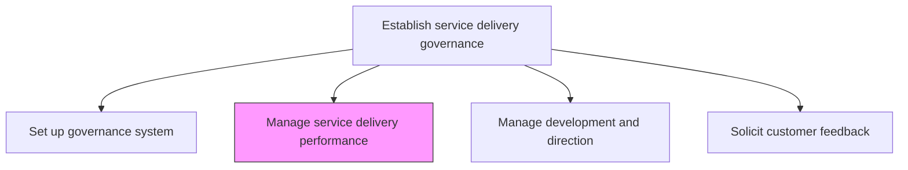
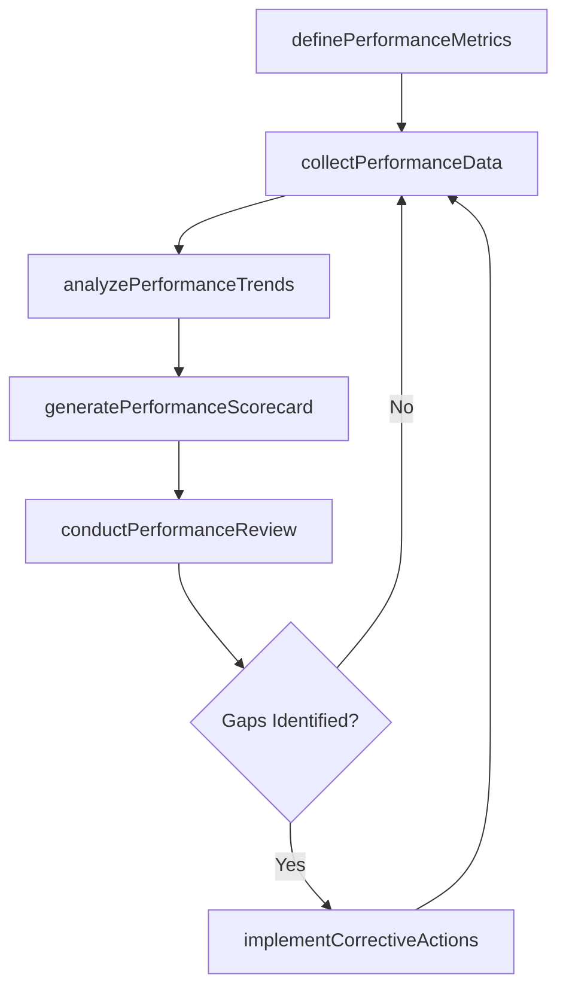

# Manage service delivery performance

> Business-as-Code definition for monitoring, measuring, and optimizing service delivery performance through defined metrics, scorecards, and continuous improvement cycles.

## Overview

Conducting and implementing performance measures to ensure successful delivery of service to the customer.

## Process Hierarchy



## GraphDL

```yaml
manage:
  object: Service Delivery Performance
  actor: ServiceDeliveryManager
  result: PerformanceReport
```

## Actions

| Action | Description |
|--------|-------------|
| definePerformanceMetrics | Establish KPIs and SLAs for measuring service delivery effectiveness |
| collectPerformanceData | Gather operational data from service delivery activities |
| analyzePerformanceTrends | Evaluate performance data to identify patterns and deviations |
| generatePerformanceScorecard | Produce consolidated performance reports and dashboards |
| conductPerformanceReview | Facilitate periodic review sessions with stakeholders |
| implementCorrectiveActions | Initiate improvements to address performance gaps |

## Events

| Event | Description |
|-------|-------------|
| performanceMetricsDefined | KPIs and SLAs formally established and approved |
| performanceDataCollected | Operational performance data aggregated for analysis |
| performanceTrendsAnalyzed | Trend analysis completed and insights documented |
| performanceScorecardGenerated | Performance dashboard or report published |
| performanceReviewConducted | Stakeholder performance review meeting completed |
| correctiveActionsImplemented | Performance improvement actions initiated |

## Searches

| Search | Description |
|--------|-------------|
| getPerformanceMetrics | Retrieve current KPIs and SLA definitions for a service line |
| findPerformanceReports | List performance reports filtered by period, service, or status |
| getPerformanceTrends | Retrieve trend data for specific metrics over a time range |
| findCorrectiveActions | List open or completed corrective actions by service area |

## Process Flow



## RACI Matrix

| Activity | Responsible | Accountable | Consulted | Informed |
|----------|-------------|-------------|-----------|----------|
| definePerformanceMetrics | ServiceDeliveryManager | VP Operations | Finance, QA | Executive Team |
| collectPerformanceData | OperationsAnalyst | ServiceDeliveryManager | IT | Project Managers |
| analyzePerformanceTrends | PerformanceAnalyst | ServiceDeliveryManager | Data Analytics | Operations |
| conductPerformanceReview | ServiceDeliveryManager | VP Operations | All Service Leads | Clients |

## Related Processes

| Process | Relationship |
|---------|-------------|
| 5.1.1.1 Set up and maintain governance system | Upstream - governance framework defines performance standards |
| 5.1.1.4 Solicit feedback from customer on service delivery satisfaction | Input - customer feedback informs performance targets |
| 5.1.2.1 Define service delivery goals | Parallel - goals drive performance metrics |

## Related Departments

| Department | Role |
|-----------|------|
| Service Delivery | Owns performance measurement and reporting |
| Operations | Provides operational data and executes improvements |
| Quality Assurance | Validates measurement methodologies |
| Finance | Contributes financial performance metrics |

## Related Occupations

| Occupation | Involvement |
|-----------|-------------|
| Service Delivery Manager | Primary executor of performance management |
| Performance Analyst | Data collection and trend analysis |
| Operations Manager | Implements corrective actions |

## KPIs

| KPI | Description | Unit |
|-----|-------------|------|
| SLA Adherence | Percentage of service level agreements met | % |
| On-Time Delivery | Percentage of services delivered within agreed timelines | % |
| Performance Review Cadence | Frequency of formal performance reviews conducted | Per Quarter |
| Corrective Action Closure Rate | Percentage of corrective actions completed on time | % |

## Usage

```typescript
import { manageServiceDeliveryPerformance } from '@headlessly/manage-service-delivery-performance'

const performance = manageServiceDeliveryPerformance()

// Define performance metrics for a service line
const metrics = await performance.definePerformanceMetrics({
  serviceLine: 'consulting',
  slaTargets: { responseTime: '4h', resolution: '24h', satisfaction: 4.5 }
})

// Generate a performance scorecard
const scorecard = await performance.generatePerformanceScorecard({
  period: '2025-Q4',
  serviceLine: 'consulting',
  includeClientBreakdown: true
})

// Initiate corrective actions for identified gaps
const actions = await performance.implementCorrectiveActions({
  scorecardId: scorecard.id,
  gapAreas: ['response-time', 'first-call-resolution']
})
```
