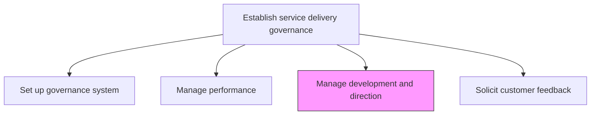
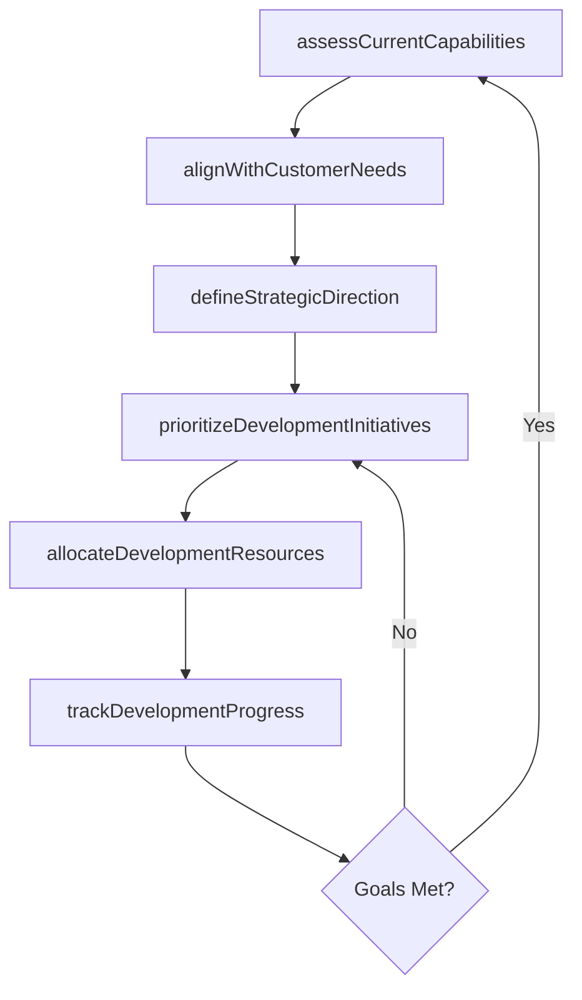

# Manage service delivery development and direction

> Business-as-Code definition for steering the evolution of service delivery capabilities, aligning development initiatives with strategic objectives and customer requirements.

## Overview

Providing guidance of resources to ensure that the development and direction of service delivery is in line with customer needs.

## Process Hierarchy



## GraphDL

```yaml
manage:
  object: Service Delivery Development And Direction
  actor: ServiceDeliveryDirector
  result: DevelopmentRoadmap
```

## Actions

| Action | Description |
|--------|-------------|
| assessCurrentCapabilities | Evaluate existing service delivery capabilities and maturity |
| defineStrategicDirection | Establish the vision and direction for service delivery evolution |
| prioritizeDevelopmentInitiatives | Rank and select improvement initiatives based on impact and feasibility |
| allocateDevelopmentResources | Assign personnel and budget to service development programs |
| trackDevelopmentProgress | Monitor progress of service delivery improvement initiatives |
| alignWithCustomerNeeds | Ensure development direction reflects evolving customer requirements |

## Events

| Event | Description |
|-------|-------------|
| currentCapabilitiesAssessed | Service delivery maturity assessment completed |
| strategicDirectionDefined | Service delivery vision and roadmap approved |
| developmentInitiativesPrioritized | Improvement initiatives ranked and selected |
| developmentResourcesAllocated | Budget and personnel assigned to development programs |
| developmentProgressTracked | Progress report on development initiatives published |
| customerNeedsAligned | Development direction validated against customer requirements |

## Searches

| Search | Description |
|--------|-------------|
| findDevelopmentInitiatives | List development initiatives filtered by status, priority, or domain |
| getCapabilityAssessment | Retrieve the latest maturity assessment for a service area |
| getDevelopmentRoadmap | Get the strategic roadmap for service delivery evolution |
| findResourceAllocations | List resource assignments for development programs |

## Process Flow



## RACI Matrix

| Activity | Responsible | Accountable | Consulted | Informed |
|----------|-------------|-------------|-----------|----------|
| assessCurrentCapabilities | ServiceDeliveryManager | ServiceDeliveryDirector | QualityAssurance | Operations |
| defineStrategicDirection | ServiceDeliveryDirector | VP Operations | Executive Team | All Departments |
| prioritizeDevelopmentInitiatives | ProgramManager | ServiceDeliveryDirector | Finance, Clients | Project Teams |
| trackDevelopmentProgress | ProgramManager | ServiceDeliveryDirector | ServiceDeliveryManager | Stakeholders |

## Related Processes

| Process | Relationship |
|---------|-------------|
| 5.1.1.1 Set up and maintain governance system | Upstream - governance framework guides development direction |
| 5.1.1.2 Manage service delivery performance | Input - performance gaps inform development priorities |
| 5.1.2 Develop service delivery strategies | Parallel - strategies shape development roadmap |

## Related Departments

| Department | Role |
|-----------|------|
| Service Delivery | Owns development direction and initiative execution |
| Strategy | Provides strategic alignment and planning support |
| Human Resources | Supports capability development and training |
| Finance | Approves and tracks development budgets |

## Related Occupations

| Occupation | Involvement |
|-----------|-------------|
| Service Delivery Director | Primary owner of development direction |
| Program Manager | Manages development initiative portfolios |
| Business Analyst | Assesses capabilities and customer needs |

## KPIs

| KPI | Description | Unit |
|-----|-------------|------|
| Capability Maturity Score | Rating of service delivery maturity across dimensions | Score (1-5) |
| Initiative Completion Rate | Percentage of development initiatives completed on schedule | % |
| Development ROI | Return on investment for service delivery development programs | Ratio |
| Customer Alignment Score | Degree to which development direction matches customer priorities | Score (1-10) |

## Usage

```typescript
import { manageServiceDeliveryDevelopmentAndDirection } from '@headlessly/manage-service-delivery-development-and-direction'

const development = manageServiceDeliveryDevelopmentAndDirection()

// Assess current service delivery capabilities
const assessment = await development.assessCurrentCapabilities({
  serviceArea: 'managed-services',
  framework: 'CMMI',
  includeGapAnalysis: true
})

// Define strategic direction based on assessment
const roadmap = await development.defineStrategicDirection({
  assessmentId: assessment.id,
  horizon: '3-year',
  focusAreas: ['automation', 'self-service', 'predictive-analytics']
})

// Track development progress
const progress = await development.trackDevelopmentProgress({
  roadmapId: roadmap.id,
  reportingPeriod: '2025-Q4'
})
```
