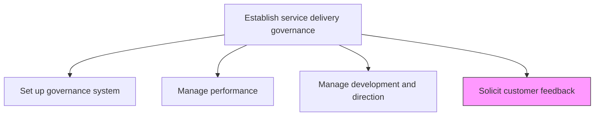
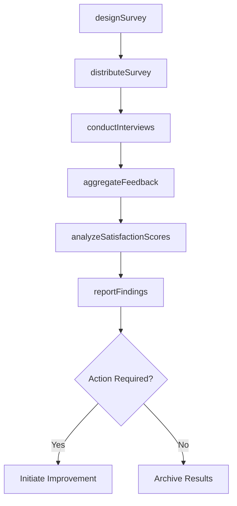

# Solicit feedback from customer on service delivery satisfaction

> Business-as-Code definition for systematically collecting, analyzing, and acting on customer satisfaction feedback to drive continuous improvement in service delivery.

## Overview

Engaging the customer post delivery to gauge the effectiveness of services rendered in order to improve on key delivery functions going forward.

## Process Hierarchy



## GraphDL

```yaml
solicit:
  object: Feedback From Customer On Service Delivery Satisfaction
  actor: ClientRelationsManager
  result: SatisfactionReport
```

## Actions

| Action | Description |
|--------|-------------|
| designSurvey | Create satisfaction surveys tailored to the service engagement |
| distributeSurvey | Send surveys to customers through appropriate channels |
| conductInterviews | Perform structured interviews with key customer stakeholders |
| aggregateFeedback | Consolidate feedback data from all collection channels |
| analyzeSatisfactionScores | Evaluate satisfaction metrics and identify improvement areas |
| reportFindings | Compile and present feedback analysis to service delivery leadership |

## Events

| Event | Description |
|-------|-------------|
| surveyDesigned | Customer satisfaction survey created and approved |
| surveyDistributed | Surveys sent to customer contacts |
| interviewsConducted | Customer stakeholder interviews completed |
| feedbackAggregated | All feedback channels consolidated into unified dataset |
| satisfactionScoresAnalyzed | Satisfaction metrics evaluated and insights documented |
| findingsReported | Feedback analysis presented to leadership |

## Searches

| Search | Description |
|--------|-------------|
| findSurveyResponses | Retrieve survey responses filtered by client, engagement, or date |
| getSatisfactionScores | Get satisfaction scores for a service line or engagement |
| findFeedbackTrends | Identify recurring themes and trends in customer feedback |
| getClientSentiment | Retrieve sentiment analysis results for a specific client |

## Process Flow



## RACI Matrix

| Activity | Responsible | Accountable | Consulted | Informed |
|----------|-------------|-------------|-----------|----------|
| designSurvey | ClientRelationsManager | ServiceDeliveryManager | Marketing | Project Managers |
| distributeSurvey | ClientRelationsCoordinator | ClientRelationsManager | AccountManagers | IT |
| analyzeSatisfactionScores | PerformanceAnalyst | ServiceDeliveryManager | QualityAssurance | Executive Team |
| reportFindings | ClientRelationsManager | VP Operations | ServiceDeliveryManager | All Service Leads |

## Related Processes

| Process | Relationship |
|---------|-------------|
| 5.1.1.2 Manage service delivery performance | Downstream - feedback informs performance management |
| 5.1.1.3 Manage service delivery development and direction | Downstream - satisfaction data shapes development priorities |
| 5.3.3.1 Conduct service delivery project review and evaluate success | Input - project review triggers feedback collection |

## Related Departments

| Department | Role |
|-----------|------|
| Client Relations | Designs and executes feedback collection programs |
| Service Delivery | Primary consumer of feedback insights |
| Quality Assurance | Validates survey methodology and analysis |
| Marketing | Contributes survey design and communication best practices |

## Related Occupations

| Occupation | Involvement |
|-----------|-------------|
| Client Relations Manager | Primary executor of feedback programs |
| Performance Analyst | Analyzes satisfaction data and trends |
| Account Manager | Facilitates client access for interviews |

## KPIs

| KPI | Description | Unit |
|-----|-------------|------|
| Survey Response Rate | Percentage of distributed surveys completed by customers | % |
| Net Promoter Score | Customer likelihood to recommend services | Score (-100 to 100) |
| Customer Satisfaction Score | Average satisfaction rating across engagements | Score (1-5) |
| Feedback-to-Action Time | Average time from feedback collection to improvement action | Days |

## Usage

```typescript
import { solicitFeedbackFromCustomerOnServiceDeliverySatisfaction } from '@headlessly/solicit-feedback-from-customer-on-service-delivery-satisfaction'

const feedback = solicitFeedbackFromCustomerOnServiceDeliverySatisfaction()

// Design a post-engagement satisfaction survey
const survey = await feedback.designSurvey({
  engagementType: 'consulting',
  questionCategories: ['quality', 'timeliness', 'communication', 'value'],
  scaleType: 'likert-5'
})

// Distribute survey to client stakeholders
await feedback.distributeSurvey({
  surveyId: survey.id,
  clientId: 'client-123',
  channels: ['email', 'portal']
})

// Analyze satisfaction scores
const analysis = await feedback.analyzeSatisfactionScores({
  surveyId: survey.id,
  benchmarkAgainst: 'industry-average'
})
```
