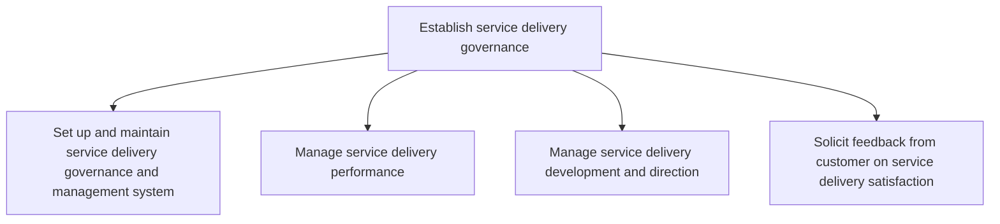
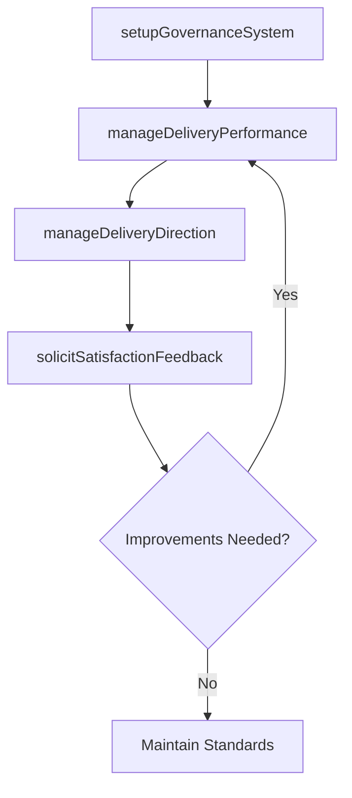

# Establish service delivery governance

> Business-as-Code definition for service delivery governance. Models governance system setup, performance management, development direction, and customer satisfaction feedback as programmable workflows.

## Overview

Establishing service delivery governance through a system that manages performance, development, and direction. Allow for customer feedback on delivery satisfaction.

## Process Hierarchy



## GraphDL

```yaml
establish:
  object: Service Delivery Governance
  actor: ServiceDeliveryDirector
  result: GovernanceSystem
```

## Actions

| Action | Description |
|--------|-------------|
| setupGovernanceSystem | Establish governance structure and management system |
| manageDeliveryPerformance | Implement performance measures for service delivery |
| manageDeliveryDirection | Guide resource development and strategic direction |
| solicitSatisfactionFeedback | Collect and analyze customer satisfaction responses |

## Events

| Event | Description |
|-------|-------------|
| governanceSystemEstablished | Governance management system configured and activated |
| deliveryPerformanceManaged | Performance metrics reviewed and actions identified |
| deliveryDirectionSet | Service delivery development priorities established |
| satisfactionFeedbackCollected | Customer feedback received and analyzed |

## Searches

| Search | Description |
|--------|-------------|
| getGovernanceMetrics | Retrieve governance compliance and maturity metrics |
| getSatisfactionTrends | Query customer satisfaction trends over time |
| getPerformanceDashboard | Retrieve service delivery performance summary |

## Process Flow



## RACI Matrix

| Activity | Responsible | Accountable | Consulted | Informed |
|----------|-------------|-------------|-----------|----------|
| setupGovernanceSystem | DeliveryOperationsManager | ServiceDeliveryDirector | Legal, IT | Executive |
| manageDeliveryPerformance | PerformanceAnalyst | ServiceDeliveryDirector | DeliveryLeads | Finance |
| solicitSatisfactionFeedback | CustomerSuccessManager | ServiceDeliveryDirector | AccountManagement | Sales |

## Sub-Processes

| ID | Name | Description |
|----|------|-------------|
| 5.1.1.1 | Set up and maintain service delivery governance and management system | Providing a system for which to manage customer needs and a structure for which to facilitate servic |
| 5.1.1.2 | Manage service delivery performance | Conducting and implementing performance measures to ensure successful delivery of service to the cus |
| 5.1.1.3 | Manage service delivery development and direction | Providing guidance of resources to ensure that the development and direction of service delivery is  |
| 5.1.1.4 | Solicit feedback from customer on service delivery satisfaction | Engaging the customer post delivery to gauge the effectiveness of services rendered in order to impr |

## Related Processes

| Process | Relationship |
|---------|-------------|
| 5.1.2 Develop service delivery strategies | Downstream - governance directs strategy development |
| 5.2.1 Manage service delivery resource demand | Downstream - governance informs resource requirements |
| 5.3.1 Initiate service delivery | Downstream - governance standards guide delivery initiation |
| 6.0 Manage Customer Service | Parallel - satisfaction feedback shared with customer service |

## Related Departments

| Department | Role |
|-----------|------|
| Service Delivery Operations | Primary owner of governance system and performance management |
| Quality Assurance | Monitors service delivery standards compliance |
| Customer Success | Collects and analyzes customer satisfaction feedback |
| Executive Leadership | Sets governance direction and reviews performance |

## Related Occupations

| Occupation | Involvement |
|-----------|-------------|
| Service Delivery Director | Overall governance accountability and direction |
| Performance Analyst | Delivery performance measurement and reporting |
| Customer Success Manager | Satisfaction feedback collection and analysis |

## KPIs

| KPI | Description | Unit |
|-----|-------------|------|
| Governance Maturity | Level of governance process maturity against framework | Score (1-5) |
| Service Delivery SLA Compliance | Percentage of deliveries meeting SLA targets | % |
| Customer Satisfaction Score | Average customer satisfaction with service delivery | Score (1-10) |
| Performance Review Cadence | Frequency of governance reviews completed on schedule | Per Quarter |

## Usage

```typescript
import { establishServiceDeliveryGovernance } from '@headlessly/establish-service-delivery-governance'

const client = establishServiceDeliveryGovernance()

// Set up governance system
const governance = await client.setupGovernanceSystem({
  framework: 'ITIL',
  reviewCadence: 'monthly',
  performanceThresholds: { slaCompliance: 95, satisfactionTarget: 8.5 }
})

// Solicit customer feedback
const feedback = await client.solicitSatisfactionFeedback({
  deliveryId: 'SD-2025-0120',
  channels: ['survey', 'interview'],
  responseDeadline: '2025-06-15'
})
```
