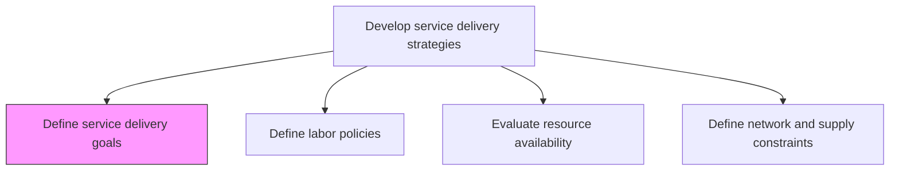
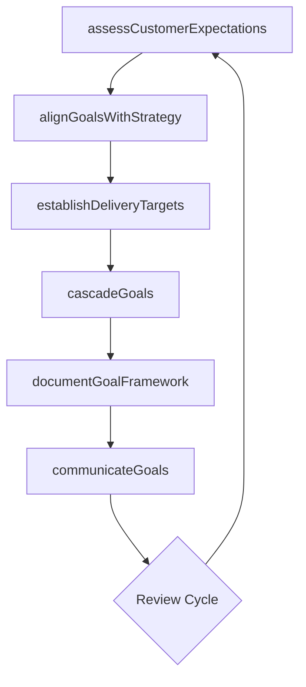

# Define service delivery goals

> Business-as-Code definition for establishing measurable service delivery objectives that align organizational capabilities with customer expectations and strategic priorities.

## Overview

Aligning organization practices to meet the needs of the customer by creating service delivery goals.

## Process Hierarchy



## GraphDL

```yaml
define:
  object: Service Delivery Goals
  actor: ServiceDeliveryManager
  result: GoalFramework
```

## Actions

| Action | Description |
|--------|-------------|
| assessCustomerExpectations | Gather and analyze customer requirements to inform goal setting |
| establishDeliveryTargets | Set specific, measurable targets for service delivery outcomes |
| alignGoalsWithStrategy | Ensure delivery goals support broader organizational strategy |
| cascadeGoals | Distribute goals across service delivery teams and functions |
| documentGoalFramework | Formalize goals into a structured framework with timelines |
| communicateGoals | Share approved goals with all relevant stakeholders |

## Events

| Event | Description |
|-------|-------------|
| customerExpectationsAssessed | Customer requirements analysis completed |
| deliveryTargetsEstablished | Service delivery targets formally set and approved |
| goalsAlignedWithStrategy | Goal alignment with organizational strategy confirmed |
| goalsCascaded | Goals distributed to all service delivery teams |
| goalFrameworkDocumented | Goal framework formalized and published |
| goalsCommunicated | Goals shared with all stakeholders |

## Searches

| Search | Description |
|--------|-------------|
| findDeliveryGoals | Retrieve delivery goals filtered by service line, period, or status |
| getGoalProgress | Get progress tracking data for specific delivery goals |
| findGoalDependencies | Identify dependencies between delivery goals |
| getGoalAlignment | Retrieve alignment mapping between delivery goals and strategy |

## Process Flow



## RACI Matrix

| Activity | Responsible | Accountable | Consulted | Informed |
|----------|-------------|-------------|-----------|----------|
| assessCustomerExpectations | AccountManager | ServiceDeliveryManager | Clients | Operations |
| establishDeliveryTargets | ServiceDeliveryManager | VP Operations | Finance | All Teams |
| alignGoalsWithStrategy | StrategyAnalyst | VP Operations | Executive Team | ServiceDeliveryManager |
| cascadeGoals | ServiceDeliveryManager | VP Operations | Team Leads | All Staff |

## Related Processes

| Process | Relationship |
|---------|-------------|
| 5.1.1.2 Manage service delivery performance | Downstream - goals define performance benchmarks |
| 5.1.2.3 Evaluate resource availability | Parallel - resource constraints shape goal feasibility |
| 5.1.2.5 Define service delivery process | Downstream - goals inform process design |

## Related Departments

| Department | Role |
|-----------|------|
| Service Delivery | Owns goal definition and cascading |
| Strategy | Provides strategic context for goal alignment |
| Finance | Validates financial feasibility of delivery targets |
| Sales | Contributes customer expectation insights |

## Related Occupations

| Occupation | Involvement |
|-----------|-------------|
| Service Delivery Manager | Primary goal-setter and owner |
| Strategy Analyst | Aligns goals with organizational strategy |
| Account Manager | Provides customer perspective |

## KPIs

| KPI | Description | Unit |
|-----|-------------|------|
| Goal Completion Rate | Percentage of delivery goals achieved within target period | % |
| Goal Cascade Coverage | Percentage of teams with formally assigned delivery goals | % |
| Goal-Strategy Alignment | Degree of alignment between delivery goals and strategic plan | Score (1-5) |
| Customer Expectation Fit | Gap between customer expectations and defined goals | Score (1-10) |

## Usage

```typescript
import { defineServiceDeliveryGoals } from '@headlessly/define-service-delivery-goals'

const goals = defineServiceDeliveryGoals()

// Assess customer expectations for the upcoming period
const expectations = await goals.assessCustomerExpectations({
  clientSegment: 'enterprise',
  surveyPeriod: '2025-Q4',
  includeContractualSLAs: true
})

// Establish delivery targets based on expectations
const targets = await goals.establishDeliveryTargets({
  expectationsId: expectations.id,
  targetPeriod: '2026-FY',
  categories: ['quality', 'timeliness', 'cost-efficiency']
})

// Cascade goals to service delivery teams
await goals.cascadeGoals({
  targetFrameworkId: targets.id,
  teams: ['consulting', 'managed-services', 'support']
})
```
