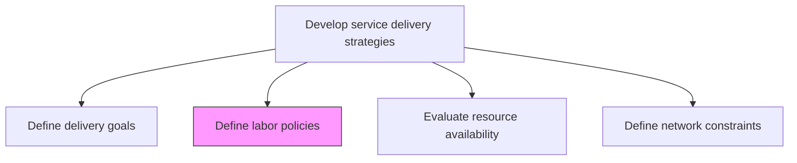
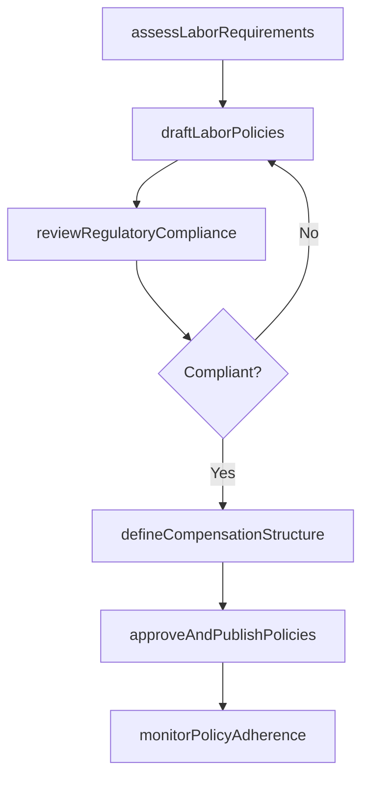

# Define labor policies

> Business-as-Code definition for establishing workforce policies that govern staffing, scheduling, compensation, and compliance for service delivery personnel.

## Overview

Outlining labor policies for resources and ensuring that those policies meet the needs of the organization, the customer, and government regulations.

## Process Hierarchy



## GraphDL

```yaml
define:
  object: Labor Policies
  actor: HRManager
  result: LaborPolicyDocument
```

## Actions

| Action | Description |
|--------|-------------|
| assessLaborRequirements | Determine staffing needs based on service delivery demand |
| draftLaborPolicies | Create policies covering scheduling, overtime, and work arrangements |
| reviewRegulatoryCompliance | Validate labor policies against employment laws and regulations |
| defineCompensationStructure | Establish pay scales and incentive structures for delivery roles |
| approveAndPublishPolicies | Obtain executive approval and distribute finalized labor policies |
| monitorPolicyAdherence | Track compliance with established labor policies across teams |

## Events

| Event | Description |
|-------|-------------|
| laborRequirementsAssessed | Staffing needs analysis completed |
| laborPoliciesDrafted | Labor policy documents created for review |
| regulatoryComplianceReviewed | Policies validated against applicable labor laws |
| compensationStructureDefined | Pay and incentive structures established |
| policiesApprovedAndPublished | Labor policies formally approved and distributed |
| policyAdherenceMonitored | Policy compliance audit completed |

## Searches

| Search | Description |
|--------|-------------|
| findLaborPolicies | Retrieve labor policies filtered by type, region, or effective date |
| getLaborRequirements | Get staffing requirement data for a service line |
| getComplianceStatus | Retrieve regulatory compliance status for labor policies |
| findPolicyViolations | List policy adherence issues by team or region |

## Process Flow



## RACI Matrix

| Activity | Responsible | Accountable | Consulted | Informed |
|----------|-------------|-------------|-----------|----------|
| assessLaborRequirements | ResourceManager | ServiceDeliveryManager | Operations | Finance |
| draftLaborPolicies | HRManager | VP Human Resources | Legal | Service Leads |
| reviewRegulatoryCompliance | LegalCounsel | VP Human Resources | HRManager | Executive Team |
| monitorPolicyAdherence | HRCoordinator | HRManager | Team Leads | VP Operations |

## Related Processes

| Process | Relationship |
|---------|-------------|
| 5.1.2.3 Evaluate resource availability | Downstream - labor policies constrain available resources |
| 5.2.2 Create and manage resource plan | Consumer - resource plans operate within labor policies |
| 5.1.2.1 Define service delivery goals | Upstream - delivery goals inform labor requirements |

## Related Departments

| Department | Role |
|-----------|------|
| Human Resources | Primary owner of labor policy development |
| Legal | Ensures regulatory compliance of labor practices |
| Service Delivery | Provides operational context for staffing policies |
| Finance | Validates compensation and labor cost structures |

## Related Occupations

| Occupation | Involvement |
|-----------|-------------|
| HR Manager | Primary policy author and owner |
| Legal Counsel | Reviews regulatory compliance |
| Resource Manager | Translates policies into staffing plans |

## KPIs

| KPI | Description | Unit |
|-----|-------------|------|
| Policy Compliance Rate | Percentage of teams adhering to labor policies | % |
| Regulatory Audit Pass Rate | Percentage of labor audits passed without findings | % |
| Policy Review Frequency | How often labor policies are reviewed and updated | Per Year |
| Labor Cost Variance | Deviation of actual labor costs from policy-defined budgets | % |

## Usage

```typescript
import { defineLaborPolicies } from '@headlessly/define-labor-policies'

const labor = defineLaborPolicies()

// Assess labor requirements for the service organization
const requirements = await labor.assessLaborRequirements({
  serviceLines: ['consulting', 'implementation'],
  forecastPeriod: '2026-FY',
  includeContractors: true
})

// Draft labor policies based on requirements
const policies = await labor.draftLaborPolicies({
  requirementsId: requirements.id,
  regions: ['north-america', 'europe'],
  coverageAreas: ['scheduling', 'overtime', 'remote-work']
})

// Review regulatory compliance
const compliance = await labor.reviewRegulatoryCompliance({
  policyId: policies.id,
  jurisdictions: ['US-federal', 'US-CA', 'EU']
})
```
