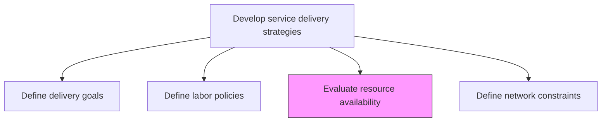
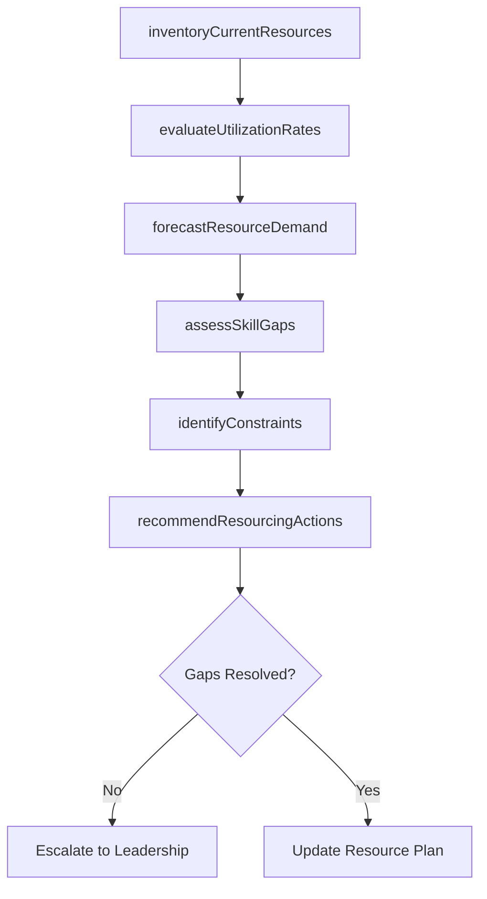

# Evaluate resource availability

> Business-as-Code definition for assessing the capacity, skills, and availability of resources needed to fulfill current and projected service delivery commitments.

## Overview

Understanding the needs of the customer and providing the necessary resources to meet those requirements.

## Process Hierarchy



## GraphDL

```yaml
evaluate:
  object: Resource Availability
  actor: ResourceManager
  result: AvailabilityAssessment
```

## Actions

| Action | Description |
|--------|-------------|
| inventoryCurrentResources | Catalog all available personnel, skills, and capacity |
| assessSkillGaps | Identify mismatches between available skills and demand requirements |
| forecastResourceDemand | Project future resource needs based on pipeline and commitments |
| evaluateUtilizationRates | Analyze current resource utilization against capacity |
| identifyConstraints | Document factors limiting resource availability |
| recommendResourcingActions | Propose hiring, training, or outsourcing to address gaps |

## Events

| Event | Description |
|-------|-------------|
| currentResourcesInventoried | Resource catalog updated with current availability data |
| skillGapsAssessed | Skill gap analysis completed and documented |
| resourceDemandForecasted | Future resource demand projections finalized |
| utilizationRatesEvaluated | Utilization analysis completed across service lines |
| constraintsIdentified | Resource availability constraints documented |
| resourcingActionsRecommended | Gap remediation recommendations submitted |

## Searches

| Search | Description |
|--------|-------------|
| findAvailableResources | List resources filtered by skill, location, or availability window |
| getUtilizationRates | Retrieve utilization data for teams or individuals |
| getSkillGapAnalysis | Get skill gap report for a service line or role |
| findResourceConstraints | List constraints affecting resource availability |

## Process Flow



## RACI Matrix

| Activity | Responsible | Accountable | Consulted | Informed |
|----------|-------------|-------------|-----------|----------|
| inventoryCurrentResources | ResourceCoordinator | ResourceManager | Team Leads | HR |
| assessSkillGaps | ResourceManager | ServiceDeliveryManager | Training | Operations |
| forecastResourceDemand | ResourceManager | VP Operations | Sales, Finance | Executive Team |
| recommendResourcingActions | ResourceManager | VP Operations | HR, Procurement | Finance |

## Related Processes

| Process | Relationship |
|---------|-------------|
| 5.1.2.2 Define labor policies | Upstream - labor policies constrain resource options |
| 5.2.1 Manage service delivery resource demand | Downstream - availability assessment feeds demand planning |
| 5.2.2 Create and manage resource plan | Downstream - availability data informs resource planning |

## Related Departments

| Department | Role |
|-----------|------|
| Resource Management | Primary owner of availability assessment |
| Human Resources | Provides headcount and hiring pipeline data |
| Service Delivery | Communicates resource needs and priorities |
| Finance | Validates budget availability for resourcing actions |

## Related Occupations

| Occupation | Involvement |
|-----------|-------------|
| Resource Manager | Primary executor of availability evaluation |
| Workforce Planner | Forecasts demand and models scenarios |
| HR Business Partner | Supports hiring and redeployment decisions |

## KPIs

| KPI | Description | Unit |
|-----|-------------|------|
| Resource Utilization Rate | Percentage of available resource hours productively used | % |
| Skill Coverage Ratio | Percentage of required skills available in current workforce | % |
| Forecast Accuracy | Accuracy of resource demand predictions versus actuals | % |
| Time to Fill | Average days to fill open resource positions | Days |

## Usage

```typescript
import { evaluateResourceAvailability } from '@headlessly/evaluate-resource-availability'

const resources = evaluateResourceAvailability()

// Inventory current resources across service lines
const inventory = await resources.inventoryCurrentResources({
  serviceLines: ['consulting', 'managed-services'],
  includeContractors: true,
  asOfDate: '2026-01-01'
})

// Assess skill gaps against upcoming demand
const gaps = await resources.assessSkillGaps({
  inventoryId: inventory.id,
  demandPeriod: '2026-Q1',
  criticalSkills: ['cloud-architecture', 'data-engineering', 'project-management']
})

// Recommend resourcing actions to close gaps
const recommendations = await resources.recommendResourcingActions({
  gapAnalysisId: gaps.id,
  budgetConstraint: 500000,
  preferredMethods: ['training', 'hiring', 'subcontracting']
})
```
