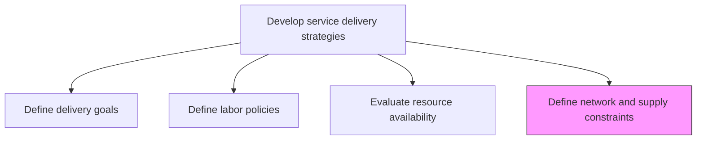
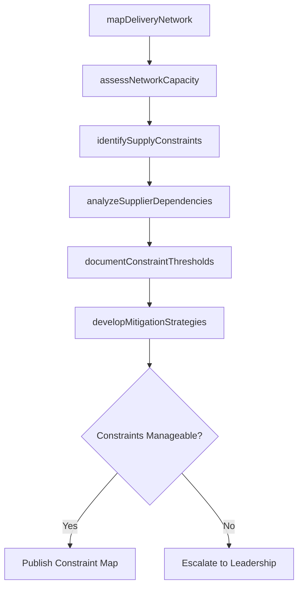

# Define service delivery network and supply constraints

> Business-as-Code definition for mapping and documenting the limitations of service delivery networks, supplier dependencies, and supply chain factors that constrain delivery capacity.

## Overview

Identifying and understanding the limitations imposed upon service delivery network and supply.

## Process Hierarchy



## GraphDL

```yaml
define:
  object: Service Delivery Network And Supply Constraints
  actor: SupplyChainManager
  result: ConstraintMap
```

## Actions

| Action | Description |
|--------|-------------|
| mapDeliveryNetwork | Document the service delivery network including all nodes and dependencies |
| identifySupplyConstraints | Catalog factors that limit supply of materials, tools, or subcontracted services |
| assessNetworkCapacity | Evaluate throughput limits of the delivery network |
| analyzeSupplierDependencies | Identify critical supplier relationships and single-point failures |
| documentConstraintThresholds | Define acceptable limits and triggers for constraint management |
| developMitigationStrategies | Create plans to address identified network and supply constraints |

## Events

| Event | Description |
|-------|-------------|
| deliveryNetworkMapped | Service delivery network documentation completed |
| supplyConstraintsIdentified | Supply limitation factors cataloged |
| networkCapacityAssessed | Network throughput analysis finalized |
| supplierDependenciesAnalyzed | Supplier risk assessment completed |
| constraintThresholdsDocumented | Constraint limits and triggers formally defined |
| mitigationStrategiesDeveloped | Constraint mitigation plans created and approved |

## Searches

| Search | Description |
|--------|-------------|
| findNetworkConstraints | List constraints filtered by type, severity, or network node |
| getSupplierDependencies | Retrieve supplier dependency data for a service delivery area |
| getNetworkCapacity | Get capacity data for delivery network segments |
| findMitigationPlans | List constraint mitigation plans by status or constraint type |

## Process Flow



## RACI Matrix

| Activity | Responsible | Accountable | Consulted | Informed |
|----------|-------------|-------------|-----------|----------|
| mapDeliveryNetwork | OperationsAnalyst | SupplyChainManager | IT, Logistics | ServiceDeliveryManager |
| identifySupplyConstraints | SupplyChainManager | VP Operations | Procurement | Finance |
| analyzeSupplierDependencies | ProcurementManager | SupplyChainManager | Legal | Risk Management |
| developMitigationStrategies | SupplyChainManager | VP Operations | All Stakeholders | Executive Team |

## Related Processes

| Process | Relationship |
|---------|-------------|
| 5.1.2.3 Evaluate resource availability | Parallel - resource constraints complement network constraints |
| 5.2.2.4 Collaborate with suppliers and partners | Downstream - constraint data informs supplier collaboration |
| 5.1.2.1 Define service delivery goals | Upstream - goals must account for network constraints |

## Related Departments

| Department | Role |
|-----------|------|
| Supply Chain | Primary owner of constraint identification and mapping |
| Procurement | Manages supplier relationships and alternatives |
| Operations | Provides network throughput data |
| Risk Management | Assesses impact of constraint scenarios |

## Related Occupations

| Occupation | Involvement |
|-----------|-------------|
| Supply Chain Manager | Primary executor of constraint analysis |
| Procurement Manager | Manages supplier dependency risks |
| Operations Analyst | Maps and models delivery network |

## KPIs

| KPI | Description | Unit |
|-----|-------------|------|
| Constraint Coverage | Percentage of known constraints with documented mitigation plans | % |
| Supplier Concentration Risk | Percentage of delivery capacity dependent on single suppliers | % |
| Network Utilization | Delivery network capacity utilization rate | % |
| Mitigation Plan Currency | Percentage of mitigation plans reviewed in the last 6 months | % |

## Usage

```typescript
import { defineServiceDeliveryNetworkAndSupplyConstraints } from '@headlessly/define-service-delivery-network-and-supply-constraints'

const constraints = defineServiceDeliveryNetworkAndSupplyConstraints()

// Map the delivery network
const network = await constraints.mapDeliveryNetwork({
  scope: 'global',
  includePartners: true,
  includeSubcontractors: true
})

// Identify supply constraints
const supplyConstraints = await constraints.identifySupplyConstraints({
  networkId: network.id,
  categories: ['personnel', 'tooling', 'licensing', 'infrastructure']
})

// Develop mitigation strategies
const mitigations = await constraints.developMitigationStrategies({
  constraintIds: supplyConstraints.map(c => c.id),
  prioritize: 'by-impact',
  budgetLimit: 200000
})
```
