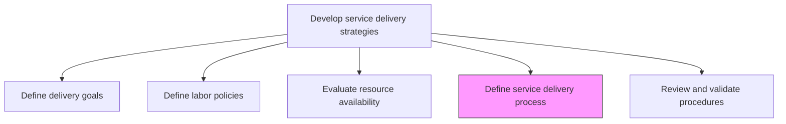
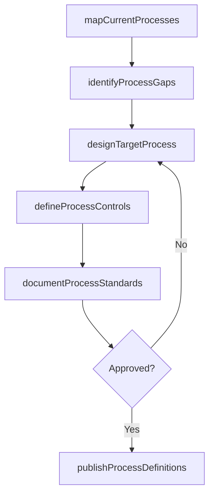

# Define service delivery process

> Business-as-Code definition for designing and documenting the end-to-end processes, procedures, and workflows that govern how services are delivered to customers.

## Overview

Defanging policies and procedures that focus on meeting the needs and expectations of the customer within the working parameters of the organization.

## Process Hierarchy



## GraphDL

```yaml
define:
  object: Service Delivery Process
  actor: ProcessDesigner
  result: ProcessDefinition
```

## Actions

| Action | Description |
|--------|-------------|
| mapCurrentProcesses | Document existing service delivery workflows and handoffs |
| identifyProcessGaps | Analyze current processes against best practices to find improvement opportunities |
| designTargetProcess | Create optimized service delivery process flows and procedures |
| defineProcessControls | Establish quality gates, checkpoints, and escalation paths |
| documentProcessStandards | Formalize process documentation with roles, steps, and templates |
| publishProcessDefinitions | Release approved process definitions to all delivery teams |

## Events

| Event | Description |
|-------|-------------|
| currentProcessesMapped | Existing process documentation completed |
| processGapsIdentified | Gap analysis between current and target state finalized |
| targetProcessDesigned | Optimized service delivery process approved |
| processControlsDefined | Quality gates and escalation procedures established |
| processStandardsDocumented | Process documentation formalized and reviewed |
| processDefinitionsPublished | Process definitions released to delivery organization |

## Searches

| Search | Description |
|--------|-------------|
| findProcessDefinitions | Retrieve process definitions filtered by service type, version, or status |
| getProcessFlow | Get the detailed workflow for a specific delivery process |
| findProcessControls | List quality gates and checkpoints for a delivery process |
| getProcessGapAnalysis | Retrieve gap analysis results between current and target processes |

## Process Flow



## RACI Matrix

| Activity | Responsible | Accountable | Consulted | Informed |
|----------|-------------|-------------|-----------|----------|
| mapCurrentProcesses | ProcessDesigner | ServiceDeliveryManager | Operations | QualityAssurance |
| designTargetProcess | ProcessDesigner | ServiceDeliveryManager | Clients, Operations | All Teams |
| defineProcessControls | QualityManager | ServiceDeliveryManager | Legal, Compliance | Operations |
| publishProcessDefinitions | ProcessDesigner | VP Operations | Training | All Delivery Staff |

## Related Processes

| Process | Relationship |
|---------|-------------|
| 5.1.2.6 Review and validate service delivery procedures | Downstream - defined processes are reviewed and validated |
| 5.1.2.1 Define service delivery goals | Upstream - goals inform process design requirements |
| 5.3.2 Execute service delivery | Consumer - execution follows defined processes |

## Related Departments

| Department | Role |
|-----------|------|
| Service Delivery | Owns process definition and optimization |
| Quality Assurance | Validates process controls and standards |
| Operations | Provides operational input for process design |
| Training | Develops training materials for new processes |

## Related Occupations

| Occupation | Involvement |
|-----------|-------------|
| Process Designer | Primary executor of process definition |
| Quality Manager | Defines controls and validation criteria |
| Service Delivery Manager | Approves and sponsors process changes |

## KPIs

| KPI | Description | Unit |
|-----|-------------|------|
| Process Documentation Coverage | Percentage of delivery services with documented processes | % |
| Process Compliance Rate | Percentage of engagements following defined processes | % |
| Process Cycle Time | Average time to complete defined service delivery process | Hours |
| Process Defect Rate | Frequency of process deviations per engagement | Per 100 Engagements |

## Usage

```typescript
import { defineServiceDeliveryProcess } from '@headlessly/define-service-delivery-process'

const process = defineServiceDeliveryProcess()

// Map current delivery processes
const currentState = await process.mapCurrentProcesses({
  serviceType: 'implementation',
  includeHandoffs: true,
  includeTimings: true
})

// Design target process with improvements
const targetProcess = await process.designTargetProcess({
  currentStateId: currentState.id,
  optimizationGoals: ['reduce-cycle-time', 'improve-quality', 'standardize-handoffs'],
  referenceFramework: 'ITIL'
})

// Publish process definitions
await process.publishProcessDefinitions({
  processId: targetProcess.id,
  effectiveDate: '2026-02-01',
  notifyTeams: ['consulting', 'implementation', 'support']
})
```
