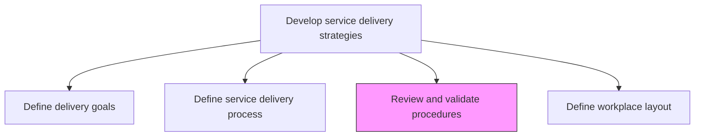
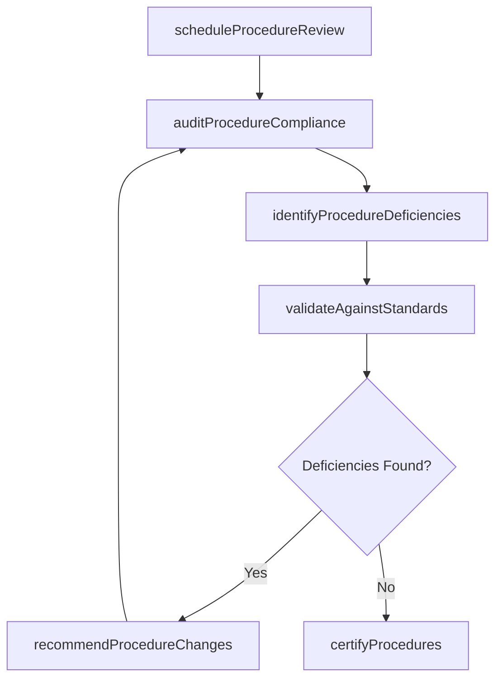

# Review and validate service delivery procedures

> Business-as-Code definition for systematically examining and certifying that service delivery procedures meet quality standards, regulatory requirements, and performance expectations.

## Overview

Revisioning service delivery procedures that fall short of performance parameters. Realign procedures with specified expectations in order to provide successful service delivery.

## Process Hierarchy



## GraphDL

```yaml
review:
  object: And Validate Service Delivery Procedures
  actor: QualityManager
  result: ValidationReport
```

## Actions

| Action | Description |
|--------|-------------|
| scheduleProcedureReview | Plan and schedule periodic reviews of service delivery procedures |
| auditProcedureCompliance | Assess whether current procedures are being followed as documented |
| identifyProcedureDeficiencies | Find gaps, inconsistencies, or inefficiencies in existing procedures |
| validateAgainstStandards | Compare procedures against industry standards and best practices |
| recommendProcedureChanges | Propose modifications to address identified deficiencies |
| certifyProcedures | Formally approve validated procedures for continued use |

## Events

| Event | Description |
|-------|-------------|
| procedureReviewScheduled | Review cycle planned and stakeholders notified |
| procedureComplianceAudited | Compliance audit of delivery procedures completed |
| procedureDeficienciesIdentified | Gaps and issues in procedures documented |
| proceduresValidatedAgainstStandards | Standard conformance check completed |
| procedureChangesRecommended | Improvement recommendations submitted for approval |
| proceduresCertified | Procedures formally validated and approved |

## Searches

| Search | Description |
|--------|-------------|
| findProcedureReviews | List procedure reviews filtered by status, date, or service area |
| getAuditFindings | Retrieve compliance audit findings for specific procedures |
| findDeficiencies | List open procedure deficiencies by severity or category |
| getCertificationStatus | Get the current certification status of delivery procedures |

## Process Flow



## RACI Matrix

| Activity | Responsible | Accountable | Consulted | Informed |
|----------|-------------|-------------|-----------|----------|
| auditProcedureCompliance | QualityAuditor | QualityManager | Operations | ServiceDeliveryManager |
| identifyProcedureDeficiencies | QualityAuditor | QualityManager | ProcessDesigner | Team Leads |
| validateAgainstStandards | QualityManager | VP Operations | Legal, Compliance | All Teams |
| certifyProcedures | QualityManager | VP Operations | ServiceDeliveryManager | All Delivery Staff |

## Related Processes

| Process | Relationship |
|---------|-------------|
| 5.1.2.5 Define service delivery process | Upstream - defined processes are subject to review and validation |
| 5.1.1.2 Manage service delivery performance | Input - performance data highlights procedure issues |
| 5.1.1.1 Set up and maintain governance system | Upstream - governance standards define validation criteria |

## Related Departments

| Department | Role |
|-----------|------|
| Quality Assurance | Primary owner of procedure review and validation |
| Service Delivery | Provides operational context and execution feedback |
| Compliance | Ensures procedures meet regulatory requirements |
| Operations | Implements approved procedure changes |

## Related Occupations

| Occupation | Involvement |
|-----------|-------------|
| Quality Manager | Primary executor of procedure validation |
| Quality Auditor | Conducts compliance audits and gap analysis |
| Process Designer | Supports procedure redesign when deficiencies are found |

## KPIs

| KPI | Description | Unit |
|-----|-------------|------|
| Procedure Review Completion Rate | Percentage of procedures reviewed within scheduled cycle | % |
| Deficiency Resolution Time | Average time to resolve identified procedure deficiencies | Days |
| Certification Rate | Percentage of procedures that pass validation on first review | % |
| Standards Conformance Score | Degree of alignment with industry standards | Score (1-100) |

## Usage

```typescript
import { reviewAndValidateServiceDeliveryProcedures } from '@headlessly/review-and-validate-service-delivery-procedures'

const validation = reviewAndValidateServiceDeliveryProcedures()

// Schedule a procedure review cycle
const reviewCycle = await validation.scheduleProcedureReview({
  scope: 'all-service-lines',
  reviewPeriod: '2026-Q1',
  assignReviewers: ['quality-team-A', 'quality-team-B']
})

// Audit procedure compliance
const audit = await validation.auditProcedureCompliance({
  reviewCycleId: reviewCycle.id,
  procedures: ['onboarding', 'delivery-execution', 'closure'],
  sampleSize: 50
})

// Certify procedures that pass validation
await validation.certifyProcedures({
  auditId: audit.id,
  certificationPeriod: '12-months',
  approver: 'vp-operations'
})
```
