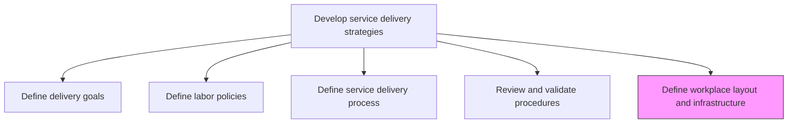
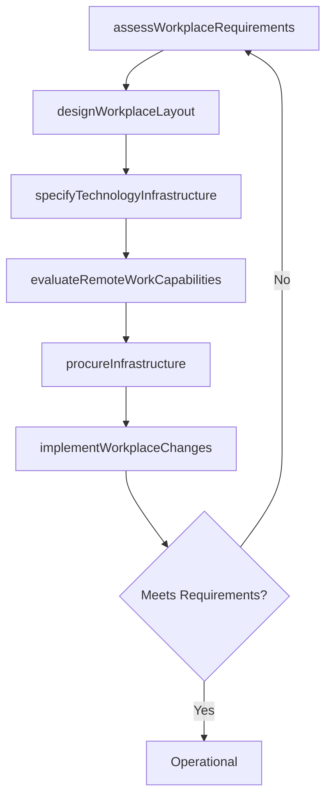

# Define service delivery workplace layout and infrastructure

> Business-as-Code definition for designing the physical and digital workplace environments, tools, and infrastructure required to support efficient service delivery operations.

## Overview

Creating a workplace that best serves the needs of the organization and customer through strategic layout and infrastructure.

## Process Hierarchy



## GraphDL

```yaml
define:
  object: Service Delivery Workplace Layout And Infrastructure
  actor: FacilitiesManager
  result: InfrastructurePlan
```

## Actions

| Action | Description |
|--------|-------------|
| assessWorkplaceRequirements | Evaluate physical and digital infrastructure needs for service delivery |
| designWorkplaceLayout | Create floor plans and workspace configurations for delivery teams |
| specifyTechnologyInfrastructure | Define hardware, software, and networking requirements |
| evaluateRemoteWorkCapabilities | Assess infrastructure needed to support distributed delivery teams |
| procureInfrastructure | Initiate procurement of workplace equipment and technology |
| implementWorkplaceChanges | Execute workplace modifications and infrastructure deployments |

## Events

| Event | Description |
|-------|-------------|
| workplaceRequirementsAssessed | Infrastructure needs analysis completed |
| workplaceLayoutDesigned | Workspace configuration plans approved |
| technologyInfrastructureSpecified | Technology requirements documented and budgeted |
| remoteWorkCapabilitiesEvaluated | Distributed work infrastructure assessment completed |
| infrastructureProcured | Equipment and technology procurement initiated |
| workplaceChangesImplemented | Workplace modifications deployed and operational |

## Searches

| Search | Description |
|--------|-------------|
| findInfrastructurePlans | Retrieve infrastructure plans filtered by location, status, or type |
| getWorkplaceCapacity | Get current workspace capacity data for a delivery location |
| findTechnologyAssets | List technology assets deployed for service delivery |
| getRemoteWorkReadiness | Retrieve distributed work readiness assessment for a team |

## Process Flow



## RACI Matrix

| Activity | Responsible | Accountable | Consulted | Informed |
|----------|-------------|-------------|-----------|----------|
| assessWorkplaceRequirements | FacilitiesManager | VP Operations | IT, ServiceDelivery | Finance |
| designWorkplaceLayout | FacilitiesManager | VP Operations | Health and Safety | All Teams |
| specifyTechnologyInfrastructure | IT Manager | CTO | ServiceDeliveryManager | Procurement |
| implementWorkplaceChanges | FacilitiesCoordinator | FacilitiesManager | IT | All Staff |

## Related Processes

| Process | Relationship |
|---------|-------------|
| 5.1.2.5 Define service delivery process | Upstream - process requirements drive infrastructure needs |
| 5.1.2.3 Evaluate resource availability | Parallel - infrastructure capacity affects resource availability |
| 5.2.3 Enable service delivery resources | Downstream - infrastructure enables resource effectiveness |

## Related Departments

| Department | Role |
|-----------|------|
| Facilities | Primary owner of workplace layout and physical infrastructure |
| IT | Manages technology infrastructure and digital tools |
| Service Delivery | Communicates operational infrastructure requirements |
| Finance | Approves infrastructure investment budgets |
| Health and Safety | Ensures workplace compliance with safety regulations |

## Related Occupations

| Occupation | Involvement |
|-----------|-------------|
| Facilities Manager | Primary executor of workplace planning |
| IT Infrastructure Manager | Specifies and deploys technology systems |
| Workplace Designer | Creates optimized workspace configurations |

## KPIs

| KPI | Description | Unit |
|-----|-------------|------|
| Workspace Utilization | Percentage of available workspace actively used | % |
| Infrastructure Uptime | Availability of critical technology infrastructure | % |
| Employee Satisfaction with Workplace | Staff rating of workplace environment quality | Score (1-5) |
| Infrastructure Cost per Delivery Hour | Total infrastructure cost divided by billable delivery hours | Currency |

## Usage

```typescript
import { defineServiceDeliveryWorkplaceLayoutAndInfrastructure } from '@headlessly/define-service-delivery-workplace-layout-and-infrastructure'

const workplace = defineServiceDeliveryWorkplaceLayoutAndInfrastructure()

// Assess workplace requirements for a delivery center
const requirements = await workplace.assessWorkplaceRequirements({
  location: 'headquarters',
  headcount: 200,
  serviceTypes: ['consulting', 'managed-services'],
  includeRemoteWork: true
})

// Design workplace layout
const layout = await workplace.designWorkplaceLayout({
  requirementsId: requirements.id,
  zones: ['collaboration', 'focused-work', 'client-meeting', 'training'],
  capacityTarget: 250
})

// Specify technology infrastructure
const techSpec = await workplace.specifyTechnologyInfrastructure({
  layoutId: layout.id,
  requirements: ['video-conferencing', 'project-management', 'secure-vpn', 'collaboration-tools']
})
```
