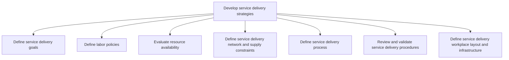
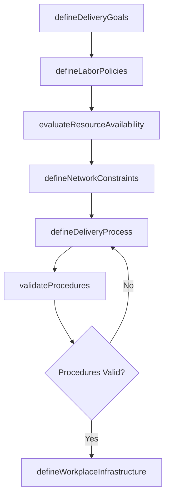

# Develop service delivery strategies

> Business-as-Code definition for service delivery strategy development. Models goal definition, labor policy creation, resource evaluation, network constraint analysis, process design, procedure validation, and workplace infrastructure planning as programmable workflows.

## Overview

Constructing strategies that identify goals, policies, processes, and procedures in relation to service delivery. Review and validate strategies. Define the workplace layout and infrastructure.

## Process Hierarchy



## GraphDL

```yaml
develop:
  object: Service Delivery Strategies
  actor: ServiceDeliveryStrategist
  result: DeliveryStrategy
```

## Actions

| Action | Description |
|--------|-------------|
| defineDeliveryGoals | Establish measurable service delivery objectives |
| defineLaborPolicies | Create labor policies governing resource allocation and scheduling |
| evaluateResourceAvailability | Assess workforce capacity and skill availability |
| defineNetworkConstraints | Identify service delivery network and supply chain limitations |
| defineDeliveryProcess | Design end-to-end service delivery workflows and procedures |
| validateProcedures | Review and validate delivery procedures against performance targets |
| defineWorkplaceInfrastructure | Plan workplace layout and technology infrastructure |

## Events

| Event | Description |
|-------|-------------|
| deliveryGoalsDefined | Service delivery objectives established and approved |
| laborPoliciesDefined | Labor policies documented and communicated |
| resourceAvailabilityEvaluated | Workforce capacity assessment completed |
| networkConstraintsDefined | Delivery network limitations identified and documented |
| deliveryProcessDefined | Service delivery workflows designed and approved |
| proceduresValidated | Delivery procedures reviewed and confirmed compliant |
| workplaceInfrastructureDefined | Workplace layout and infrastructure plan finalized |

## Searches

| Search | Description |
|--------|-------------|
| getDeliveryGoals | Retrieve service delivery goals by period or service line |
| getLaborPolicies | Query labor policies by region, role, or service type |
| getResourceCapacity | Check current resource availability and capacity gaps |
| getNetworkConstraints | Retrieve delivery network constraints and limitations |
| getProcedureCompliance | Query procedure validation status and compliance results |

## Process Flow



## RACI Matrix

| Activity | Responsible | Accountable | Consulted | Informed |
|----------|-------------|-------------|-----------|----------|
| defineDeliveryGoals | ServiceDeliveryStrategist | ServiceDeliveryDirector | Executive, Sales | Operations |
| defineLaborPolicies | HRBusinessPartner | ServiceDeliveryDirector | Legal, UnionReps | Finance |
| evaluateResourceAvailability | ResourcePlanningManager | ServiceDeliveryStrategist | DeliveryLeads | HR |
| defineDeliveryProcess | ProcessDesigner | ServiceDeliveryStrategist | QA, IT | DeliveryTeams |

## Sub-Processes

| ID | Name | Description |
|----|------|-------------|
| 5.1.2.1 | Define service delivery goals | Aligning organization practices to meet the needs of the customer by creating service delivery goals |
| 5.1.2.2 | Define labor policies | Outlining labor policies for resources and ensuring that those policies meet the needs of the organi |
| 5.1.2.3 | Evaluate resource availability | Understanding the needs of the customer and providing the necessary resources to meet those requirem |
| 5.1.2.4 | Define service delivery network and supply constraints | Identifying and understanding the limitations imposed upon service delivery network and supply. |
| 5.1.2.5 | Define service delivery process | Defanging policies and procedures that focus on meeting the needs and expectations of the customer w |
| 5.1.2.6 | Review and validate service delivery procedures | Revisioning service delivery procedures that fall short of performance parameters. Realign procedure |
| 5.1.2.7 | Define service delivery workplace layout and infrastructure | Creating a workplace that best serves the needs of the organization and customer through strategic l |

## Related Processes

| Process | Relationship |
|---------|-------------|
| 5.1.1 Establish service delivery governance | Upstream - governance framework drives strategy development |
| 5.2.2 Create and manage resource plan | Downstream - strategies inform resource planning |
| 5.3.1 Initiate service delivery | Downstream - strategies guide delivery initiation |
| 7.4 Manage employee development | Parallel - labor policies align with HR development |

## Related Departments

| Department | Role |
|-----------|------|
| Service Delivery Strategy | Primary owner of strategy development |
| Human Resources | Provides labor policy guidance and workforce data |
| Facilities | Plans workplace layout and infrastructure |
| Operations | Implements delivery processes and procedures |

## Related Occupations

| Occupation | Involvement |
|-----------|-------------|
| Service Delivery Strategist | Primary strategy design and documentation |
| Process Designer | Workflow and procedure design |
| Facilities Planner | Workplace infrastructure planning |

## KPIs

| KPI | Description | Unit |
|-----|-------------|------|
| Strategy Completion Rate | Percentage of strategy components defined and approved | % |
| Procedure Validation Rate | Percentage of procedures passing validation review | % |
| Resource Capacity Utilization | Actual versus planned resource capacity | % |
| Strategy Refresh Cycle | Time between strategy reviews and updates | Months |

## Usage

```typescript
import { developServiceDeliveryStrategies } from '@headlessly/develop-service-delivery-strategies'

const client = developServiceDeliveryStrategies()

// Define delivery goals
const goals = await client.defineDeliveryGoals({
  serviceLine: 'Professional Services',
  period: 'FY2025',
  targets: { utilization: 80, satisfaction: 9.0, onTimeDelivery: 95 }
})

// Evaluate resource availability
const capacity = await client.evaluateResourceAvailability({
  serviceLine: 'Professional Services',
  skills: ['project-management', 'solution-architecture', 'integration'],
  horizon: '6-months'
})
```
