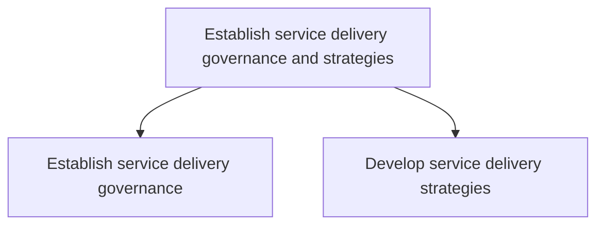
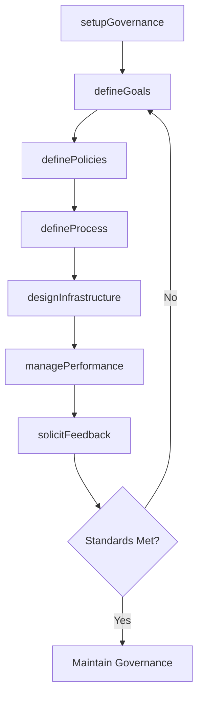

# Establish service delivery governance and strategies

> Business-as-Code definition for service delivery governance and strategy. Models governance frameworks, performance management, satisfaction tracking, and strategic planning as programmable workflows.

## Overview

Creating rules and regulations for service delivery to the customer. Establish a system to manage performance, delivery, and direction of service delivery. Engage with the customer for satisfaction feedback. Define goals, policies, processes, and workplace layout and infrastructure as a part of the service delivery strategy.

## Process Hierarchy



## GraphDL

```yaml
establish:
  object: Service Delivery Governance And Strategies
  actor: ServiceDeliveryDirector
  result: GovernanceFramework
```

## Actions

| Action | Description |
|--------|-------------|
| setupGovernance | Establish service delivery governance and management system |
| managePerformance | Monitor and manage service delivery performance against targets |
| solicitFeedback | Collect customer satisfaction feedback on service delivery |
| defineGoals | Set service delivery objectives and success criteria |
| definePolicies | Establish labor policies and resource allocation rules |
| defineProcess | Document service delivery processes and standard procedures |
| designInfrastructure | Define workplace layout and infrastructure for delivery |

## Events

| Event | Description |
|-------|-------------|
| governanceSetUp | Service delivery governance framework established |
| performanceManaged | Delivery performance reviewed and corrective actions identified |
| feedbackCollected | Customer satisfaction feedback received and analyzed |
| goalsSet | Service delivery goals and success criteria finalized |
| policiesDefined | Labor and resource allocation policies documented |
| processDocumented | Service delivery processes and procedures validated |
| infrastructureDesigned | Workplace layout and delivery infrastructure defined |

## Searches

| Search | Description |
|--------|-------------|
| getPerformanceMetrics | Retrieve service delivery performance against governance targets |
| findSatisfactionScores | Query customer satisfaction ratings by engagement or period |
| getGovernancePolicies | Retrieve current governance policies and compliance status |
| getDeliveryStandards | Query service delivery standards and procedure documentation |

## Process Flow



## RACI Matrix

| Activity | Responsible | Accountable | Consulted | Informed |
|----------|-------------|-------------|-----------|----------|
| setupGovernance | ServiceDeliveryDirector | COO | Legal, Finance | Executive |
| defineGoals | VP Delivery | COO | Sales, CustomerSuccess | PMO |
| managePerformance | DeliveryOperationsManager | VP Delivery | QA, Finance | Executive |
| solicitFeedback | CustomerSuccessManager | VP Delivery | AccountManagement | Sales |

## Sub-Processes

| ID | Name | Description |
|----|------|-------------|
| 5.1.1 | Establish service delivery governance | Establishing service delivery governance through a system that manages performance, development, and |
| 5.1.2 | Develop service delivery strategies | Constructing strategies that identify goals, policies, processes, and procedures in relation to serv |

## Related Processes

| Process | Relationship |
|---------|-------------|
| 5.2 Manage service delivery resources | Downstream - governance policies guide resource management |
| 5.3 Deliver service to customer | Downstream - strategies and standards guide execution |
| 1.0 Develop Vision and Strategy | Upstream - corporate strategy informs service delivery direction |

## Related Departments

| Department | Role |
|-----------|------|
| Service Delivery | Primary owner of governance framework and strategy |
| Quality Assurance | Defines service quality standards and measurement |
| Human Resources | Supports labor policy definition and workforce planning |
| Customer Success | Provides customer satisfaction insights and feedback |
| Finance | Defines budget constraints and cost targets |

## Related Occupations

| Occupation | Involvement |
|-----------|-------------|
| Service Delivery Director | Governance framework ownership and strategic direction |
| Operations Manager | Performance management and process optimization |
| Customer Success Manager | Satisfaction measurement and feedback analysis |

## KPIs

| KPI | Description | Unit |
|-----|-------------|------|
| Governance Compliance | Percentage of engagements following governance standards | % |
| Customer Satisfaction | Average customer satisfaction score across engagements | Score (1-10) |
| Policy Adherence | Percentage of delivery teams following defined policies | % |
| Strategy Execution Rate | Percentage of strategic initiatives completed on schedule | % |

## Usage

```typescript
import { establishServiceDeliveryGovernanceAndStrategies } from '@headlessly/establish-service-delivery-governance-and-strategies'

const client = establishServiceDeliveryGovernanceAndStrategies()

// Set up governance framework
const governance = await client.setupGovernance({
  serviceLines: ['consulting', 'implementation', 'managed-services'],
  complianceFramework: 'ISO-20000',
  reviewCadence: 'quarterly'
})

// Define service delivery goals
const goals = await client.defineGoals({
  governanceId: governance.id,
  targets: {
    customerSatisfaction: 8.5,
    onTimeDelivery: 95,
    firstTimeRight: 90
  }
})

// Collect customer feedback
const feedback = await client.solicitFeedback({
  engagementId: 'ENG-2025-0789',
  surveyType: 'post-delivery',
  channels: ['email', 'in-app']
})
```
