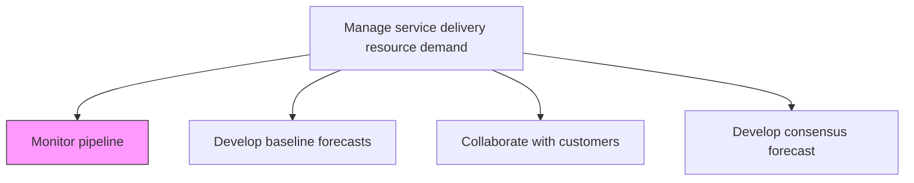
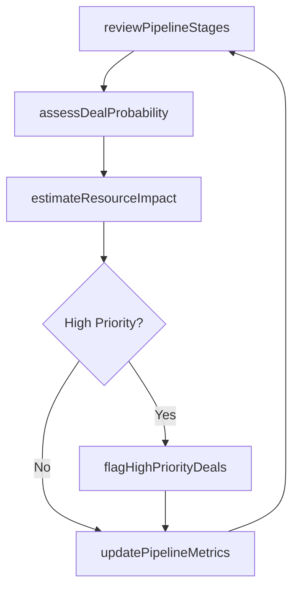

# Monitor pipeline

> Business-as-Code definition for tracking and analyzing the service delivery opportunity pipeline to anticipate resource demand and ensure delivery readiness.

## Overview

Tracking potential opportunities as they move through the various stages of the pipeline.

## Process Hierarchy



## GraphDL

```yaml
monitor:
  object: Pipeline
  actor: ResourceDemandPlanner
  result: PipelineReport
```

## Actions

| Action | Description |
|--------|-------------|
| reviewPipelineStages | Examine opportunities at each stage of the sales-to-delivery pipeline |
| assessDealProbability | Evaluate likelihood of pipeline opportunities converting to active engagements |
| estimateResourceImpact | Calculate expected resource demand for pipeline opportunities |
| flagHighPriorityDeals | Identify deals requiring immediate resource reservation or planning |
| updatePipelineMetrics | Refresh pipeline health indicators and conversion data |

## Events

| Event | Description |
|-------|-------------|
| pipelineStagesReviewed | Pipeline stage analysis completed |
| dealProbabilityAssessed | Opportunity conversion likelihood evaluated |
| resourceImpactEstimated | Resource demand projections for pipeline calculated |
| highPriorityDealsFlagged | Urgent deals identified for resource planning |
| pipelineMetricsUpdated | Pipeline health dashboard refreshed |

## Searches

| Search | Description |
|--------|-------------|
| findPipelineOpportunities | List pipeline opportunities filtered by stage, value, or probability |
| getPipelineHealth | Retrieve pipeline health metrics and conversion rates |
| getResourceDemandProjection | Get projected resource demand from pipeline |
| findHighPriorityDeals | List deals flagged for urgent resource action |

## Process Flow



## RACI Matrix

| Activity | Responsible | Accountable | Consulted | Informed |
|----------|-------------|-------------|-----------|----------|
| reviewPipelineStages | ResourceDemandPlanner | ResourceManager | Sales | ServiceDeliveryManager |
| assessDealProbability | SalesOperations | ResourceManager | AccountManagers | Finance |
| estimateResourceImpact | ResourceDemandPlanner | ResourceManager | ServiceDeliveryManager | HR |

## Related Processes

| Process | Relationship |
|---------|-------------|
| 5.2.1.2 Develop baseline forecasts | Downstream - pipeline data feeds forecast models |
| 5.2.2.1 Define and manage skills taxonomy | Parallel - skills taxonomy maps to pipeline demands |
| 5.2.1.5 Determine availability of skills | Downstream - pipeline signals trigger skill assessments |

## Related Departments

| Department | Role |
|-----------|------|
| Resource Management | Primary owner of pipeline monitoring for delivery |
| Sales | Provides pipeline data and deal intelligence |
| Service Delivery | Consumes pipeline signals for readiness planning |
| Finance | Uses pipeline data for revenue forecasting |

## Related Occupations

| Occupation | Involvement |
|-----------|-------------|
| Resource Demand Planner | Primary pipeline monitor |
| Sales Operations Analyst | Provides deal-level pipeline data |
| Resource Manager | Coordinates resource readiness response |

## KPIs

| KPI | Description | Unit |
|-----|-------------|------|
| Pipeline Visibility | Percentage of expected engagements tracked in pipeline | % |
| Conversion Rate | Percentage of pipeline opportunities converting to active engagements | % |
| Pipeline-to-Resource Lead Time | Average days between pipeline signal and resource assignment | Days |
| Forecast Alignment | Correlation between pipeline projections and actual demand | % |

## Usage

```typescript
import { monitorPipeline } from '@headlessly/monitor-pipeline'

const pipeline = monitorPipeline()

// Review current pipeline stages
const stages = await pipeline.reviewPipelineStages({
  serviceLines: ['consulting', 'implementation'],
  minDealValue: 50000,
  stages: ['qualified', 'proposal', 'negotiation']
})

// Estimate resource impact of pipeline
const impact = await pipeline.estimateResourceImpact({
  pipelineId: stages.id,
  horizonMonths: 6,
  confidenceThreshold: 0.7
})

// Flag high priority deals for resource reservation
const flagged = await pipeline.flagHighPriorityDeals({
  criteria: { startWithin: '30-days', minimumValue: 200000 }
})
```
