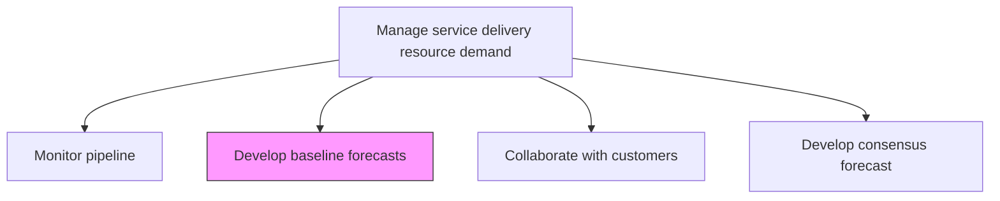
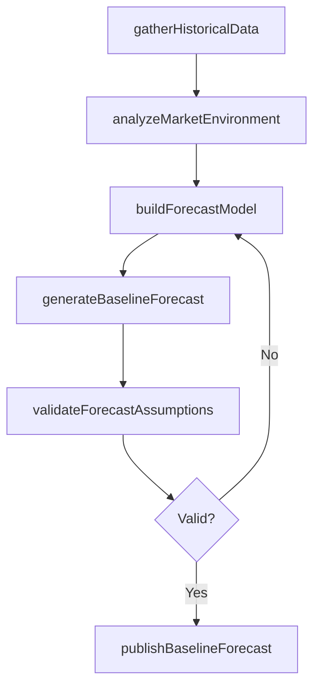

# Develop baseline forecasts

> Business-as-Code definition for creating initial demand forecasts using historical data, market analysis, and statistical models to project future service delivery resource needs.

## Overview

Identifying the demand anticipated for the organization's services. Estimate future demand for services using historical data, analysis of the market environment, and external data.

## Process Hierarchy



## GraphDL

```yaml
develop:
  object: Baseline Forecasts
  actor: DemandPlanner
  result: BaselineForecast
```

## Actions

| Action | Description |
|--------|-------------|
| gatherHistoricalData | Collect past service delivery volumes, trends, and seasonal patterns |
| analyzeMarketEnvironment | Assess external factors influencing future service demand |
| buildForecastModel | Construct statistical models to project service demand |
| generateBaselineForecast | Produce initial demand forecast across service lines and time periods |
| validateForecastAssumptions | Review and confirm the assumptions underlying the baseline forecast |
| publishBaselineForecast | Distribute the approved baseline forecast to planning stakeholders |

## Events

| Event | Description |
|-------|-------------|
| historicalDataGathered | Historical service delivery data compiled |
| marketEnvironmentAnalyzed | External market factor analysis completed |
| forecastModelBuilt | Statistical forecasting model constructed and calibrated |
| baselineForecastGenerated | Initial demand forecast produced |
| forecastAssumptionsValidated | Forecast assumptions reviewed and confirmed |
| baselineForecastPublished | Baseline forecast distributed to stakeholders |

## Searches

| Search | Description |
|--------|-------------|
| getBaselineForecast | Retrieve baseline forecast for a service line and period |
| findHistoricalTrends | Get historical demand patterns for forecasting analysis |
| getForecastAssumptions | List assumptions underlying a specific baseline forecast |
| findForecastVersions | List historical forecast versions for comparison |

## Process Flow



## RACI Matrix

| Activity | Responsible | Accountable | Consulted | Informed |
|----------|-------------|-------------|-----------|----------|
| gatherHistoricalData | DemandPlanner | ResourceManager | IT, Finance | Operations |
| buildForecastModel | DemandPlanner | ResourceManager | Data Analytics | ServiceDeliveryManager |
| generateBaselineForecast | DemandPlanner | ResourceManager | Sales | All Planners |
| publishBaselineForecast | ResourceManager | VP Operations | Finance | Executive Team |

## Related Processes

| Process | Relationship |
|---------|-------------|
| 5.2.1.1 Monitor pipeline | Upstream - pipeline data informs forecast inputs |
| 5.2.1.4 Develop consensus forecast | Downstream - baseline feeds into consensus process |
| 5.2.1.8 Measure forecast accuracy | Downstream - baseline forecasts are measured for accuracy |

## Related Departments

| Department | Role |
|-----------|------|
| Resource Management | Owns baseline forecast development |
| Finance | Provides financial data and revenue projections |
| Sales | Contributes pipeline and market intelligence |
| Data Analytics | Supports statistical modeling and analysis |

## Related Occupations

| Occupation | Involvement |
|-----------|-------------|
| Demand Planner | Primary forecast developer |
| Data Analyst | Builds and calibrates statistical models |
| Resource Manager | Approves and publishes forecasts |

## KPIs

| KPI | Description | Unit |
|-----|-------------|------|
| Forecast Accuracy | Deviation between baseline forecast and actual demand | % |
| Forecast Timeliness | Percentage of forecasts published by scheduled date | % |
| Model Confidence | Statistical confidence level of forecast model | % |
| Data Completeness | Percentage of required historical data available for modeling | % |

## Usage

```typescript
import { developBaselineForecasts } from '@headlessly/develop-baseline-forecasts'

const forecasting = developBaselineForecasts()

// Gather historical data for forecast modeling
const historicalData = await forecasting.gatherHistoricalData({
  serviceLines: ['consulting', 'managed-services'],
  lookbackMonths: 24,
  granularity: 'monthly'
})

// Build and generate baseline forecast
const forecast = await forecasting.generateBaselineForecast({
  dataSetId: historicalData.id,
  forecastHorizon: '12-months',
  methodology: 'time-series-decomposition'
})

// Publish baseline forecast
await forecasting.publishBaselineForecast({
  forecastId: forecast.id,
  audience: ['resource-management', 'finance', 'operations']
})
```
