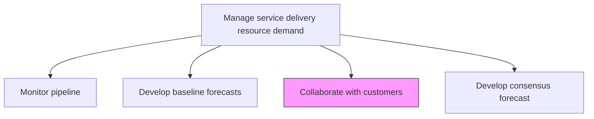
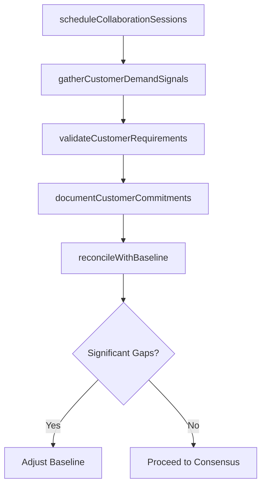

# Collaborate with customers

> Business-as-Code definition for engaging customers in collaborative demand planning to refine resource forecasts and align delivery capabilities with anticipated service needs.

## Overview

Providing a collaborative meeting in which to engage the customer to understand the scope of their needs and constructing solutions based on need and constraints.

## Process Hierarchy



## GraphDL

```yaml
collaborate:
  object: With Customers
  actor: AccountManager
  result: CustomerDemandInput
```

## Actions

| Action | Description |
|--------|-------------|
| scheduleCollaborationSessions | Plan demand planning meetings with key customer stakeholders |
| gatherCustomerDemandSignals | Collect customer projections for upcoming service needs |
| validateCustomerRequirements | Confirm the scope and timing of anticipated customer orders |
| documentCustomerCommitments | Record confirmed and tentative customer service commitments |
| reconcileWithBaseline | Compare customer inputs against baseline forecast assumptions |

## Events

| Event | Description |
|-------|-------------|
| collaborationSessionScheduled | Customer demand planning meeting arranged |
| customerDemandSignalsGathered | Customer service need projections collected |
| customerRequirementsValidated | Customer order scope and timing confirmed |
| customerCommitmentsDocumented | Customer commitments recorded in planning system |
| baselineReconciled | Customer inputs compared with baseline forecast |

## Searches

| Search | Description |
|--------|-------------|
| findCustomerDemandInputs | Retrieve customer demand signals filtered by client, period, or status |
| getCustomerCommitments | List confirmed customer commitments for resource planning |
| findCollaborationSessions | List scheduled or completed collaboration sessions |
| getReconciliationGaps | Identify differences between customer input and baseline forecast |

## Process Flow



## RACI Matrix

| Activity | Responsible | Accountable | Consulted | Informed |
|----------|-------------|-------------|-----------|----------|
| scheduleCollaborationSessions | AccountManager | ResourceManager | Clients | ServiceDeliveryManager |
| gatherCustomerDemandSignals | AccountManager | ResourceManager | Sales | DemandPlanner |
| validateCustomerRequirements | AccountManager | ServiceDeliveryManager | ProjectManagers | Finance |
| reconcileWithBaseline | DemandPlanner | ResourceManager | AccountManager | Operations |

## Related Processes

| Process | Relationship |
|---------|-------------|
| 5.2.1.2 Develop baseline forecasts | Upstream - baseline provides starting point for collaboration |
| 5.2.1.4 Develop consensus forecast | Downstream - customer input feeds consensus process |
| 5.3.1.3 Review customer business objectives | Parallel - customer objectives inform demand signals |

## Related Departments

| Department | Role |
|-----------|------|
| Account Management | Primary customer interface for demand planning |
| Resource Management | Integrates customer input into resource forecasts |
| Sales | Supports customer engagement and relationship context |
| Service Delivery | Consumes customer demand intelligence for planning |

## Related Occupations

| Occupation | Involvement |
|-----------|-------------|
| Account Manager | Primary customer collaborator |
| Demand Planner | Integrates customer signals into forecasts |
| Resource Manager | Oversees demand planning process |

## KPIs

| KPI | Description | Unit |
|-----|-------------|------|
| Customer Engagement Rate | Percentage of key accounts participating in demand planning | % |
| Demand Signal Accuracy | Alignment of customer projections with actual orders | % |
| Collaboration Cadence | Frequency of customer demand planning sessions | Per Quarter |
| Forecast Adjustment Rate | Percentage of baseline forecasts adjusted after customer input | % |

## Usage

```typescript
import { collaborateWithCustomers } from '@headlessly/collaborate-with-customers'

const collaboration = collaborateWithCustomers()

// Schedule collaboration sessions with key accounts
const sessions = await collaboration.scheduleCollaborationSessions({
  accounts: ['enterprise-A', 'enterprise-B'],
  planningHorizon: '2026-H1',
  cadence: 'quarterly'
})

// Gather customer demand signals
const signals = await collaboration.gatherCustomerDemandSignals({
  sessionId: sessions[0].id,
  categories: ['new-projects', 'renewals', 'expansions']
})

// Reconcile customer input with baseline forecast
const reconciliation = await collaboration.reconcileWithBaseline({
  customerInputId: signals.id,
  baselineForecastId: 'forecast-2026-Q1'
})
```
