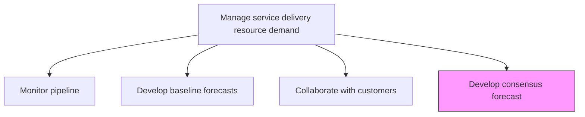
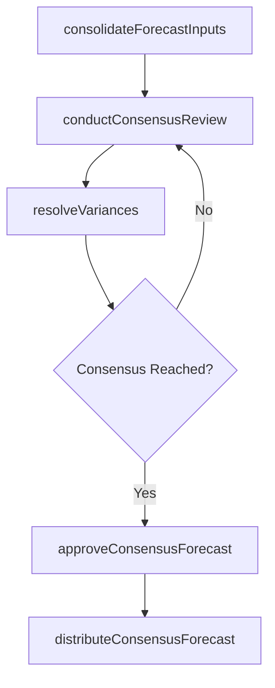

# Develop consensus forecast

> Business-as-Code definition for synthesizing baseline forecasts, customer inputs, and stakeholder perspectives into a unified demand forecast that drives resource planning decisions.

## Overview

Arriving at a consensus over the forecasted levels of demand for services by analyzing baseline forecasts and customer input.

## Process Hierarchy



## GraphDL

```yaml
develop:
  object: Consensus Forecast
  actor: DemandPlanner
  result: ConsensusForecast
```

## Actions

| Action | Description |
|--------|-------------|
| consolidateForecastInputs | Merge baseline forecasts, customer signals, and sales projections |
| conductConsensusReview | Facilitate cross-functional review to align on demand expectations |
| resolveVariances | Address and reconcile discrepancies between forecast sources |
| approveConsensusForecast | Obtain leadership sign-off on the unified demand forecast |
| distributeConsensusForecast | Share approved forecast with resource planning and operations teams |

## Events

| Event | Description |
|-------|-------------|
| forecastInputsConsolidated | All forecast inputs merged into a single dataset |
| consensusReviewConducted | Cross-functional forecast review meeting completed |
| variancesResolved | Discrepancies between forecast sources reconciled |
| consensusForecastApproved | Unified demand forecast approved by leadership |
| consensusForecastDistributed | Approved forecast shared with all planning stakeholders |

## Searches

| Search | Description |
|--------|-------------|
| getConsensusForecast | Retrieve the approved consensus forecast for a period |
| findForecastVariances | List unresolved variances between forecast sources |
| getForecastInputSummary | Get consolidated summary of all forecast input sources |
| findForecastVersionHistory | Retrieve historical consensus forecast versions |

## Process Flow



## RACI Matrix

| Activity | Responsible | Accountable | Consulted | Informed |
|----------|-------------|-------------|-----------|----------|
| consolidateForecastInputs | DemandPlanner | ResourceManager | Sales, AccountManagers | Finance |
| conductConsensusReview | ResourceManager | VP Operations | All Service Leads | Executive Team |
| approveConsensusForecast | VP Operations | COO | Finance, ResourceManager | All Departments |

## Related Processes

| Process | Relationship |
|---------|-------------|
| 5.2.1.2 Develop baseline forecasts | Upstream - baseline is a primary input |
| 5.2.1.3 Collaborate with customers | Upstream - customer inputs are a primary input |
| 5.2.2.2 Create resource plan | Downstream - consensus forecast drives resource planning |

## Related Departments

| Department | Role |
|-----------|------|
| Resource Management | Owns consensus process and forecast consolidation |
| Sales | Provides pipeline-based demand projections |
| Finance | Validates financial implications of consensus forecast |
| Service Delivery | Key participant in consensus review sessions |

## Related Occupations

| Occupation | Involvement |
|-----------|-------------|
| Demand Planner | Consolidates inputs and facilitates consensus |
| Resource Manager | Owns consensus forecast approval |
| Financial Analyst | Validates revenue and cost implications |

## KPIs

| KPI | Description | Unit |
|-----|-------------|------|
| Consensus Cycle Time | Time from input collection to approved consensus forecast | Days |
| Stakeholder Participation | Percentage of required stakeholders participating in consensus review | % |
| Variance Resolution Rate | Percentage of forecast variances resolved during consensus process | % |
| Consensus Accuracy | Accuracy of consensus forecast versus actual demand | % |

## Usage

```typescript
import { developConsensusForecast } from '@headlessly/develop-consensus-forecast'

const consensus = developConsensusForecast()

// Consolidate all forecast inputs
const consolidated = await consensus.consolidateForecastInputs({
  baselineForecastId: 'baseline-2026-Q1',
  customerInputIds: ['customer-A-input', 'customer-B-input'],
  salesProjectionId: 'sales-pipeline-2026'
})

// Conduct consensus review
const review = await consensus.conductConsensusReview({
  consolidatedId: consolidated.id,
  participants: ['vp-operations', 'sales-director', 'finance-director'],
  meetingDate: '2026-01-15'
})

// Approve and distribute consensus forecast
await consensus.approveConsensusForecast({
  reviewId: review.id,
  approver: 'vp-operations',
  effectivePeriod: '2026-Q1'
})
```
