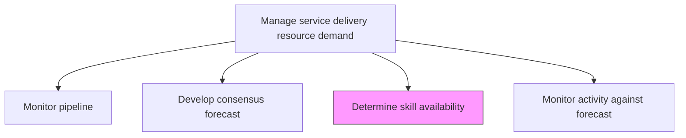
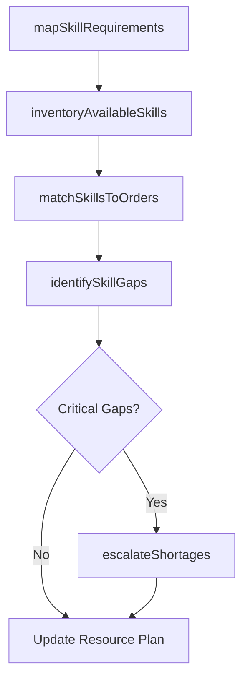

# Determine availability of skills to deliver on current and forecast customer orders

> Business-as-Code definition for assessing the current and projected skill inventory against confirmed and forecasted service delivery demands to identify fulfillment gaps.

## Overview

Identifying what skillset is necessary for the delivery of opportunities. Determine the forecast of customer orders based upon those skillsets and the resources available.

## Process Hierarchy



## GraphDL

```yaml
determine:
  object: Availability Of Skills To Deliver On Current And Forecast Customer Orders
  actor: ResourceManager
  result: SkillAvailabilityReport
```

## Actions

| Action | Description |
|--------|-------------|
| mapSkillRequirements | Identify skills needed for current and forecasted customer orders |
| inventoryAvailableSkills | Catalog the current skill pool across delivery teams |
| matchSkillsToOrders | Map available skills to specific customer order requirements |
| identifySkillGaps | Highlight mismatches between required and available skills |
| escalateShortages | Raise critical skill shortages for immediate action |

## Events

| Event | Description |
|-------|-------------|
| skillRequirementsMapped | Skill needs for current and forecast orders documented |
| availableSkillsInventoried | Current workforce skill inventory completed |
| skillsMatchedToOrders | Skill-to-order mapping analysis completed |
| skillGapsIdentified | Skill shortage areas documented and quantified |
| shortagesEscalated | Critical skill shortages communicated to leadership |

## Searches

| Search | Description |
|--------|-------------|
| findSkillAvailability | List available skills filtered by type, level, or location |
| getSkillGapReport | Retrieve skill gap analysis for a service line or period |
| findUnassignedResources | List resources with matching skills not yet assigned to orders |
| getOrderSkillRequirements | Get skill requirements for specific customer orders |

## Process Flow



## RACI Matrix

| Activity | Responsible | Accountable | Consulted | Informed |
|----------|-------------|-------------|-----------|----------|
| mapSkillRequirements | ResourceCoordinator | ResourceManager | ProjectManagers | Sales |
| inventoryAvailableSkills | ResourceCoordinator | ResourceManager | Team Leads | HR |
| identifySkillGaps | ResourceManager | VP Operations | Training, HR | Executive Team |
| escalateShortages | ResourceManager | VP Operations | Procurement | Finance |

## Related Processes

| Process | Relationship |
|---------|-------------|
| 5.2.1.4 Develop consensus forecast | Upstream - consensus forecast defines demand baseline |
| 5.2.2.1 Define and manage skills taxonomy | Parallel - taxonomy provides skill classification framework |
| 5.2.2.3 Match resource demand with capacity | Downstream - skill availability feeds capacity matching |

## Related Departments

| Department | Role |
|-----------|------|
| Resource Management | Primary owner of skill availability assessment |
| Human Resources | Provides workforce data and supports gap remediation |
| Service Delivery | Communicates order-specific skill requirements |
| Training | Addresses skill gaps through development programs |

## Related Occupations

| Occupation | Involvement |
|-----------|-------------|
| Resource Manager | Primary executor of skill assessment |
| Resource Coordinator | Performs skill inventory and matching |
| Workforce Planner | Models skill supply-demand scenarios |

## KPIs

| KPI | Description | Unit |
|-----|-------------|------|
| Skill Match Rate | Percentage of customer orders with fully matched skill requirements | % |
| Skill Gap Severity | Number of critical skill gaps identified per planning cycle | Count |
| Time to Fill Skill Gap | Average time to close an identified skill shortage | Days |
| Order Fulfillment Readiness | Percentage of forecast orders with confirmed skill availability | % |

## Usage

```typescript
import { determineAvailabilityOfSkillsToDeliverOnCurrentAndForecastCustomerOrders } from '@headlessly/determine-availability-of-skills-to-deliver-on-current-and-forecast-customer-orders'

const skills = determineAvailabilityOfSkillsToDeliverOnCurrentAndForecastCustomerOrders()

// Map skill requirements for upcoming orders
const requirements = await skills.mapSkillRequirements({
  orderIds: ['order-101', 'order-102'],
  forecastPeriod: '2026-Q1',
  includeProjectedOrders: true
})

// Identify skill gaps
const gaps = await skills.identifySkillGaps({
  requirementsId: requirements.id,
  criticalThreshold: 'high',
  includeContractors: true
})

// Escalate critical shortages
await skills.escalateShortages({
  gapReportId: gaps.id,
  severity: 'critical',
  notifyRoles: ['vp-operations', 'hr-director']
})
```
