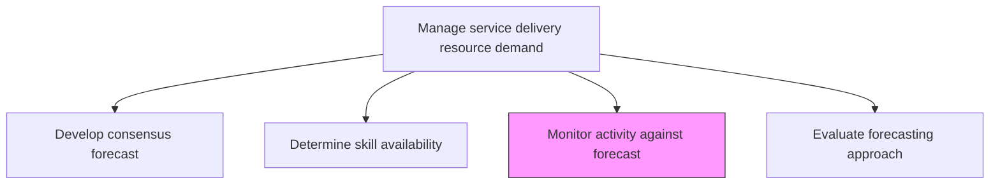
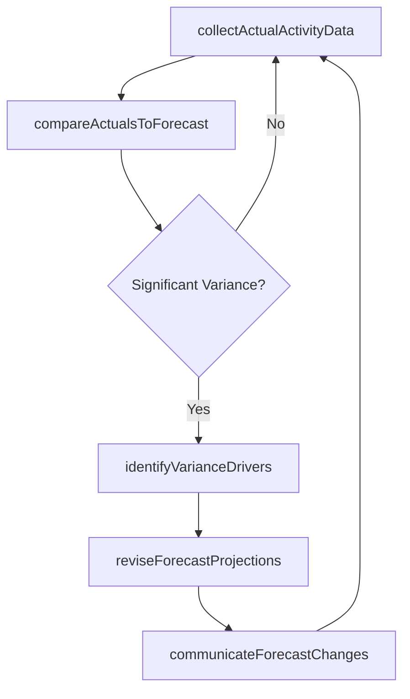

# Monitor activity against forecast and revise forecast

> Business-as-Code definition for continuously comparing actual service delivery activity against forecast projections and making real-time adjustments to maintain forecast relevance.

## Overview

Overseeing all activities necessary to deliver services to customer. Revise forecast to account for any issues that may arise. This could be changes in market trend, resource changes, etc.

## Process Hierarchy



## GraphDL

```yaml
monitor:
  object: Activity Against Forecast And Revise Forecast
  actor: DemandPlanner
  result: RevisedForecast
```

## Actions

| Action | Description |
|--------|-------------|
| collectActualActivityData | Gather real-time service delivery activity metrics |
| compareActualsToForecast | Analyze deviations between actual demand and forecast projections |
| identifyVarianceDrivers | Determine root causes of forecast-to-actual discrepancies |
| reviseForecastProjections | Update forecast numbers based on observed trends and variances |
| communicateForecastChanges | Notify stakeholders of forecast revisions and implications |

## Events

| Event | Description |
|-------|-------------|
| actualActivityDataCollected | Real-time delivery activity data gathered |
| actualsComparedToForecast | Variance analysis between actuals and forecast completed |
| varianceDriversIdentified | Root causes of forecast discrepancies documented |
| forecastProjectionsRevised | Forecast updated with revised projections |
| forecastChangesCommunicated | Stakeholders notified of forecast adjustments |

## Searches

| Search | Description |
|--------|-------------|
| getForecastVariance | Retrieve variance data between forecast and actuals for a period |
| findVarianceDrivers | List identified root causes of forecast discrepancies |
| getForecastRevisionHistory | Get timeline of forecast revisions and their triggers |
| getActivityTrends | Retrieve actual activity trends over a specified period |

## Process Flow



## RACI Matrix

| Activity | Responsible | Accountable | Consulted | Informed |
|----------|-------------|-------------|-----------|----------|
| collectActualActivityData | OperationsAnalyst | DemandPlanner | IT | ResourceManager |
| compareActualsToForecast | DemandPlanner | ResourceManager | Finance | ServiceDeliveryManager |
| reviseForecastProjections | DemandPlanner | ResourceManager | Sales, Operations | Executive Team |
| communicateForecastChanges | ResourceManager | VP Operations | All Planners | All Stakeholders |

## Related Processes

| Process | Relationship |
|---------|-------------|
| 5.2.1.4 Develop consensus forecast | Upstream - consensus forecast is the baseline being monitored |
| 5.2.1.8 Measure forecast accuracy | Downstream - monitoring data feeds accuracy measurement |
| 5.2.2.6 Monitor and manage resource capacity | Parallel - forecast revisions trigger capacity adjustments |

## Related Departments

| Department | Role |
|-----------|------|
| Resource Management | Owns forecast monitoring and revision process |
| Operations | Provides actual activity data |
| Finance | Monitors financial impact of forecast changes |
| Sales | Contributes market intelligence affecting demand |

## Related Occupations

| Occupation | Involvement |
|-----------|-------------|
| Demand Planner | Primary monitor and forecast reviser |
| Operations Analyst | Collects and reports actual activity data |
| Resource Manager | Approves forecast revisions |

## KPIs

| KPI | Description | Unit |
|-----|-------------|------|
| Forecast Variance | Percentage deviation of actuals from forecast | % |
| Revision Frequency | Number of forecast revisions per planning period | Count |
| Variance Detection Time | Average time to identify a significant forecast variance | Days |
| Revised Forecast Accuracy | Accuracy of revised forecasts versus subsequent actuals | % |

## Usage

```typescript
import { monitorActivityAgainstForecastAndReviseForecast } from '@headlessly/monitor-activity-against-forecast-and-revise-forecast'

const monitoring = monitorActivityAgainstForecastAndReviseForecast()

// Compare actuals to forecast
const variance = await monitoring.compareActualsToForecast({
  forecastId: 'consensus-2026-Q1',
  actualPeriod: '2026-01',
  varianceThreshold: 0.1
})

// Identify variance drivers
const drivers = await monitoring.identifyVarianceDrivers({
  varianceReportId: variance.id,
  categories: ['market-shift', 'resource-change', 'client-delay']
})

// Revise forecast projections
const revised = await monitoring.reviseForecastProjections({
  forecastId: 'consensus-2026-Q1',
  driverIds: drivers.map(d => d.id),
  adjustmentPeriods: ['2026-02', '2026-03']
})
```
