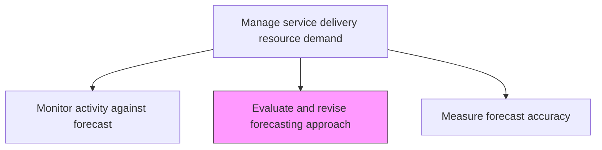
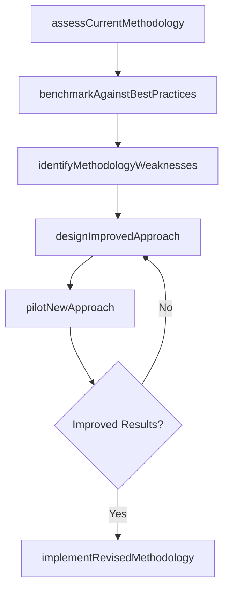

# Evaluate and revise forecasting approach

> Business-as-Code definition for assessing the effectiveness of current forecasting methodologies and models, then refining them to improve prediction accuracy and planning outcomes.

## Overview

Recognizing potential problems in the current forecast and making the necessary changes to align the forecast meet demand.

## Process Hierarchy



## GraphDL

```yaml
evaluate:
  object: And Revise Forecasting Approach
  actor: DemandPlanner
  result: RevisedMethodology
```

## Actions

| Action | Description |
|--------|-------------|
| assessCurrentMethodology | Review the effectiveness of existing forecasting models and techniques |
| benchmarkAgainstBestPractices | Compare current forecasting approach to industry best practices |
| identifyMethodologyWeaknesses | Document areas where the current approach produces poor predictions |
| designImprovedApproach | Create enhanced forecasting methodology to address identified weaknesses |
| pilotNewApproach | Test revised forecasting methodology on a subset of data |
| implementRevisedMethodology | Deploy the approved forecasting approach across the organization |

## Events

| Event | Description |
|-------|-------------|
| currentMethodologyAssessed | Existing forecasting approach effectiveness review completed |
| bestPracticesBenchmarked | Industry comparison analysis finalized |
| methodologyWeaknessesIdentified | Forecasting approach deficiencies documented |
| improvedApproachDesigned | Enhanced forecasting methodology created |
| newApproachPiloted | Revised methodology tested against historical data |
| revisedMethodologyImplemented | Updated forecasting approach deployed organization-wide |

## Searches

| Search | Description |
|--------|-------------|
| getForecastingMethodology | Retrieve current forecasting methodology documentation |
| findMethodologyWeaknesses | List identified weaknesses in the current approach |
| getBenchmarkResults | Get industry best practice comparison results |
| getPilotResults | Retrieve results from methodology pilot testing |

## Process Flow



## RACI Matrix

| Activity | Responsible | Accountable | Consulted | Informed |
|----------|-------------|-------------|-----------|----------|
| assessCurrentMethodology | DemandPlanner | ResourceManager | Data Analytics | Operations |
| benchmarkAgainstBestPractices | DemandPlanner | ResourceManager | External Consultants | VP Operations |
| designImprovedApproach | DemandPlanner | ResourceManager | Data Science | Finance |
| implementRevisedMethodology | DemandPlanner | VP Operations | All Planners | Executive Team |

## Related Processes

| Process | Relationship |
|---------|-------------|
| 5.2.1.8 Measure forecast accuracy | Upstream - accuracy data triggers methodology review |
| 5.2.1.2 Develop baseline forecasts | Downstream - revised methodology improves baseline forecasts |
| 5.2.1.6 Monitor activity against forecast | Input - monitoring insights inform methodology evaluation |

## Related Departments

| Department | Role |
|-----------|------|
| Resource Management | Owns forecasting methodology and revision process |
| Data Analytics | Provides technical expertise on modeling techniques |
| Finance | Validates financial impact of improved forecasting |
| Operations | Provides feedback on forecast usability |

## Related Occupations

| Occupation | Involvement |
|-----------|-------------|
| Demand Planner | Primary methodology evaluator and designer |
| Data Scientist | Supports advanced modeling techniques |
| Resource Manager | Approves and sponsors methodology changes |

## KPIs

| KPI | Description | Unit |
|-----|-------------|------|
| Methodology Improvement Rate | Improvement in forecast accuracy after methodology revision | % |
| Best Practice Alignment | Degree of alignment with industry forecasting standards | Score (1-5) |
| Pilot Success Rate | Percentage of piloted methodologies showing improved accuracy | % |
| Revision Cycle Time | Time from methodology assessment to implementation | Weeks |

## Usage

```typescript
import { evaluateAndReviseForecastingApproach } from '@headlessly/evaluate-and-revise-forecasting-approach'

const methodology = evaluateAndReviseForecastingApproach()

// Assess current forecasting methodology
const assessment = await methodology.assessCurrentMethodology({
  evaluationPeriod: '2025-FY',
  includeAccuracyMetrics: true,
  includeStakeholderFeedback: true
})

// Benchmark against industry best practices
const benchmark = await methodology.benchmarkAgainstBestPractices({
  assessmentId: assessment.id,
  industrySegment: 'professional-services',
  frameworks: ['S&OP', 'IBP']
})

// Pilot improved approach
const pilot = await methodology.pilotNewApproach({
  newMethodology: 'machine-learning-enhanced',
  testDataSet: 'historical-24-months',
  comparisonBaseline: assessment.id
})
```
