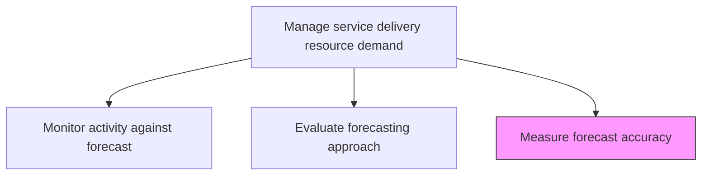
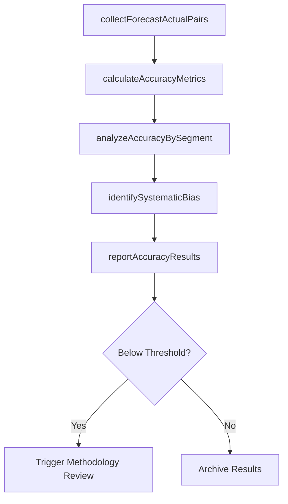

# Measure forecast accuracy

> Business-as-Code definition for quantifying the precision of demand forecasts by comparing predictions against actual outcomes and computing statistical accuracy metrics.

## Overview

Analyzing forecasting against actuals to determine accuracy. Modify forecasting to align with actual need.

## Process Hierarchy



## GraphDL

```yaml
measure:
  object: Forecast Accuracy
  actor: DemandPlanner
  result: AccuracyReport
```

## Actions

| Action | Description |
|--------|-------------|
| collectForecastActualPairs | Gather matched sets of forecasted and actual demand data |
| calculateAccuracyMetrics | Compute statistical measures of forecast precision |
| analyzeAccuracyBySegment | Break down accuracy results by service line, region, or period |
| identifySystematicBias | Detect consistent over- or under-forecasting patterns |
| reportAccuracyResults | Compile and present forecast accuracy findings to stakeholders |

## Events

| Event | Description |
|-------|-------------|
| forecastActualPairsCollected | Matched forecast and actual data sets assembled |
| accuracyMetricsCalculated | Statistical accuracy measures computed |
| accuracyBySegmentAnalyzed | Segmented accuracy analysis completed |
| systematicBiasIdentified | Forecasting bias patterns documented |
| accuracyResultsReported | Forecast accuracy findings presented to stakeholders |

## Searches

| Search | Description |
|--------|-------------|
| getAccuracyMetrics | Retrieve forecast accuracy metrics for a period or service line |
| findBiasPatterns | List identified systematic bias patterns in forecasting |
| getAccuracyTrends | Get forecast accuracy trend data over multiple periods |
| findAccuracyBySegment | Retrieve segmented accuracy breakdowns |

## Process Flow



## RACI Matrix

| Activity | Responsible | Accountable | Consulted | Informed |
|----------|-------------|-------------|-----------|----------|
| collectForecastActualPairs | OperationsAnalyst | DemandPlanner | IT | ResourceManager |
| calculateAccuracyMetrics | DemandPlanner | ResourceManager | Data Analytics | Finance |
| identifySystematicBias | DemandPlanner | ResourceManager | Operations | VP Operations |
| reportAccuracyResults | DemandPlanner | VP Operations | All Stakeholders | Executive Team |

## Related Processes

| Process | Relationship |
|---------|-------------|
| 5.2.1.6 Monitor activity against forecast | Upstream - monitoring data provides actuals for accuracy measurement |
| 5.2.1.7 Evaluate and revise forecasting approach | Downstream - accuracy results trigger methodology revisions |
| 5.2.1.2 Develop baseline forecasts | Feedback - accuracy data improves future baseline forecasts |

## Related Departments

| Department | Role |
|-----------|------|
| Resource Management | Owns forecast accuracy measurement |
| Data Analytics | Supports statistical analysis and modeling |
| Finance | Consumes accuracy data for financial planning improvements |
| Operations | Provides actual demand data for comparison |

## Related Occupations

| Occupation | Involvement |
|-----------|-------------|
| Demand Planner | Primary accuracy analyst |
| Data Analyst | Computes statistical accuracy measures |
| Resource Manager | Reviews accuracy results and decides on actions |

## KPIs

| KPI | Description | Unit |
|-----|-------------|------|
| Mean Absolute Percentage Error | Average percentage error between forecast and actuals | % |
| Forecast Bias | Systematic tendency to over- or under-forecast | % |
| Weighted Accuracy Score | Accuracy weighted by service line revenue contribution | Score (0-100) |
| Accuracy Improvement Trend | Change in accuracy over consecutive measurement periods | % per Period |

## Usage

```typescript
import { measureForecastAccuracy } from '@headlessly/measure-forecast-accuracy'

const accuracy = measureForecastAccuracy()

// Collect forecast-actual pairs for measurement
const pairs = await accuracy.collectForecastActualPairs({
  forecastId: 'consensus-2025-Q4',
  actualPeriod: '2025-Q4',
  granularity: 'monthly'
})

// Calculate accuracy metrics
const metrics = await accuracy.calculateAccuracyMetrics({
  dataSetId: pairs.id,
  measures: ['MAPE', 'RMSE', 'bias', 'tracking-signal']
})

// Analyze accuracy by segment
const segmented = await accuracy.analyzeAccuracyBySegment({
  metricsId: metrics.id,
  segments: ['service-line', 'region', 'client-tier']
})
```
