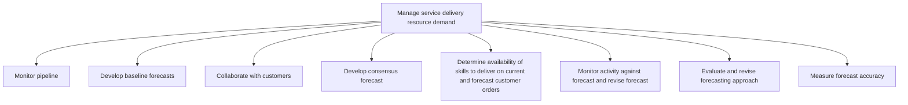
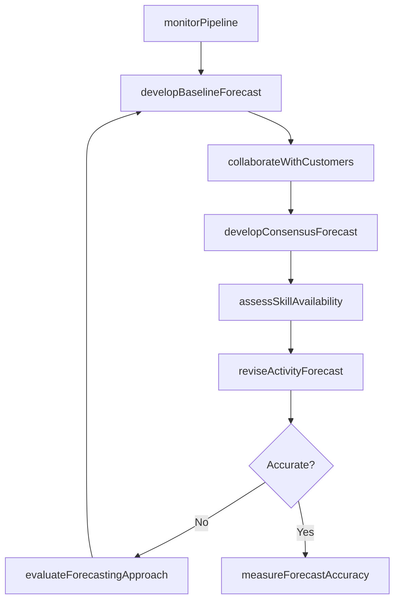

# Manage service delivery resource demand

> Business-as-Code definition for service delivery resource demand management. Models pipeline monitoring, baseline forecasting, customer collaboration, consensus forecasting, skills assessment, forecast revision, and accuracy measurement as programmable workflows.

## Overview

Ensuring necessary resources are maintained through monitoring pipeline, developing forecasts, and collaborating with customers. Determine skills needed for service deliver and forecast customer orders. Monitor forecasted orders and modify if where needed. Measure forecast accuracy.

## Process Hierarchy



## GraphDL

```yaml
manage:
  object: Service Delivery Resource Demand
  actor: DemandPlanningManager
  result: DemandForecast
```

## Actions

| Action | Description |
|--------|-------------|
| monitorPipeline | Track opportunities moving through sales and delivery pipeline stages |
| developBaselineForecast | Create initial demand forecast from historical data and trends |
| collaborateWithCustomers | Engage customers to understand upcoming service requirements |
| developConsensusForecast | Reconcile baseline forecast with customer and market inputs |
| assessSkillAvailability | Determine availability of required skills for current and forecast orders |
| reviseActivityForecast | Monitor actuals against forecast and adjust projections |
| evaluateForecastingApproach | Review and improve forecasting methodology |
| measureForecastAccuracy | Compare forecast predictions against actual demand outcomes |

## Events

| Event | Description |
|-------|-------------|
| pipelineMonitored | Pipeline opportunities reviewed and stage updates recorded |
| baselineForecastDeveloped | Initial demand forecast generated from historical data |
| customerCollaborationCompleted | Customer requirements gathered and demand signals captured |
| consensusForecastDeveloped | Cross-functional consensus on demand forecast achieved |
| skillAvailabilityAssessed | Skills gap analysis for forecast demand completed |
| forecastRevised | Demand forecast updated based on actual activity variance |
| forecastingApproachEvaluated | Forecasting methodology reviewed and improvements identified |
| forecastAccuracyMeasured | Forecast versus actuals comparison completed |

## Searches

| Search | Description |
|--------|-------------|
| getPipelineStatus | Retrieve pipeline opportunities by stage, value, or probability |
| getForecastByPeriod | Query demand forecasts by time period and service line |
| getSkillsGapAnalysis | Retrieve skills availability versus forecast demand |
| getForecastAccuracy | Query forecast accuracy metrics over time |
| getCustomerDemandSignals | Retrieve customer-provided demand signals and commitments |

## Process Flow



## RACI Matrix

| Activity | Responsible | Accountable | Consulted | Informed |
|----------|-------------|-------------|-----------|----------|
| monitorPipeline | DemandPlanner | DemandPlanningManager | Sales, DeliveryLeads | Finance |
| developConsensusForecast | DemandPlanner | DemandPlanningManager | Sales, Operations | Executive |
| assessSkillAvailability | ResourceAnalyst | DemandPlanningManager | HR, DeliveryLeads | Recruitment |
| measureForecastAccuracy | ForecastAnalyst | DemandPlanningManager | Finance | Operations |

## Sub-Processes

| ID | Name | Description |
|----|------|-------------|
| 5.2.1.1 | Monitor pipeline | Tracking potential opportunities as they move through the various stages of the pipeline. |
| 5.2.1.2 | Develop baseline forecasts | Identifying the demand anticipated for the organization's services. Estimate future demand for servi |
| 5.2.1.3 | Collaborate with customers | Providing a collaborative meeting in which to engage the customer to understand the scope of their n |
| 5.2.1.4 | Develop consensus forecast | Arriving at a consensus over the forecasted levels of demand for services by analyzing baseline fore |
| 5.2.1.5 | Determine availability of skills to deliver on current and forecast customer orders | Identifying what skillset is necessary for the delivery of opportunities. Determine the forecast of  |
| 5.2.1.6 | Monitor activity against forecast and revise forecast | Overseeing all activities necessary to deliver services to customer. Revise forecast to account for  |
| 5.2.1.7 | Evaluate and revise forecasting approach | Recognizing potential problems in the current forecast and making the necessary changes to align the |
| 5.2.1.8 | Measure forecast accuracy | Analyzing forecasting against actuals to determine accuracy. Modify forecasting to align with actual |

## Related Processes

| Process | Relationship |
|---------|-------------|
| 5.1.2 Develop service delivery strategies | Upstream - strategies drive demand planning parameters |
| 5.2.2 Create and manage resource plan | Downstream - demand forecast feeds resource planning |
| 5.3.1 Initiate service delivery | Downstream - demand forecast informs delivery scheduling |
| 3.5 Forecast sales | Parallel - sales forecasts contribute to demand signals |

## Related Departments

| Department | Role |
|-----------|------|
| Demand Planning | Primary owner of demand forecasting and pipeline monitoring |
| Sales | Provides pipeline data and customer demand signals |
| Service Delivery | Supplies actuals data and capacity constraints |
| Finance | Validates forecast financial implications |

## Related Occupations

| Occupation | Involvement |
|-----------|-------------|
| Demand Planning Manager | Overall demand forecasting accountability |
| Demand Planner | Forecast creation and consensus development |
| Resource Analyst | Skills availability assessment |

## KPIs

| KPI | Description | Unit |
|-----|-------------|------|
| Forecast Accuracy | Percentage variance between forecast and actual demand | % |
| Pipeline Conversion Rate | Percentage of pipeline opportunities converting to orders | % |
| Demand Signal Lead Time | Average lead time from demand signal to confirmed order | Weeks |
| Consensus Forecast Cycle Time | Time to produce consensus forecast each planning period | Days |

## Usage

```typescript
import { manageServiceDeliveryResourceDemand } from '@headlessly/manage-service-delivery-resource-demand'

const client = manageServiceDeliveryResourceDemand()

// Monitor pipeline
const pipeline = await client.monitorPipeline({
  stages: ['qualified', 'proposal', 'negotiation'],
  minDealValue: 50000,
  closeDateRange: { start: '2025-07-01', end: '2025-09-30' }
})

// Develop consensus forecast
const forecast = await client.developConsensusForecast({
  period: 'Q3-2025',
  serviceLines: ['consulting', 'implementation', 'managed-services'],
  includeCustomerSignals: true
})
```
