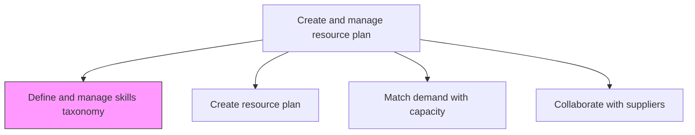
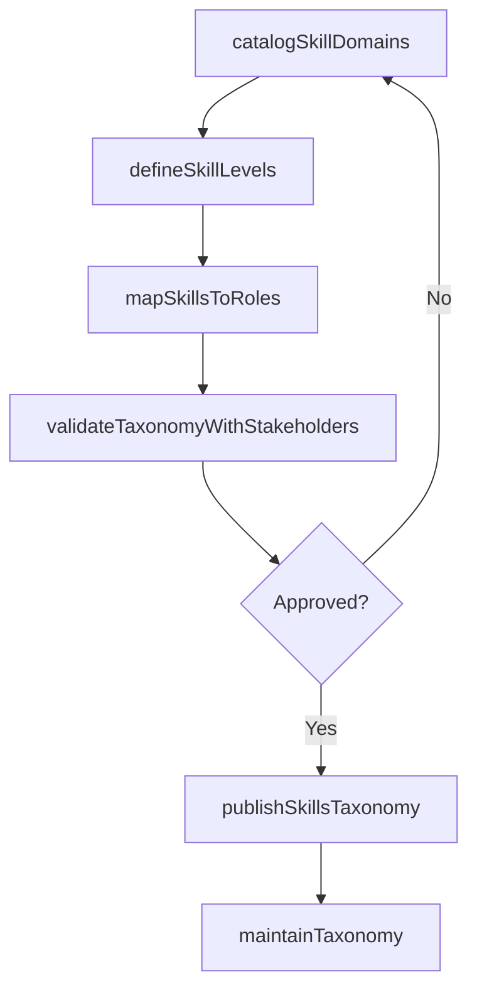

# Define and manage skills taxonomy

> Business-as-Code definition for creating and maintaining a structured classification of skills, competencies, and proficiency levels used to categorize and plan service delivery resources.

## Overview

Analyzing the skills needed to perform services to be delivered. Classify and organize these skills requirements.

## Process Hierarchy



## GraphDL

```yaml
define:
  object: And Manage Skills Taxonomy
  actor: TalentManager
  result: SkillsTaxonomy
```

## Actions

| Action | Description |
|--------|-------------|
| catalogSkillDomains | Define top-level skill categories aligned with service offerings |
| defineSkillLevels | Establish proficiency levels for each skill in the taxonomy |
| mapSkillsToRoles | Associate skills and proficiency requirements with delivery roles |
| validateTaxonomyWithStakeholders | Review taxonomy with service leads to ensure completeness |
| publishSkillsTaxonomy | Release the approved taxonomy for use in resource planning |
| maintainTaxonomy | Update taxonomy to reflect new services, technologies, or market needs |

## Events

| Event | Description |
|-------|-------------|
| skillDomainsCataloged | Top-level skill categories defined and organized |
| skillLevelsDefined | Proficiency levels established for taxonomy skills |
| skillsMappedToRoles | Skill-to-role associations documented |
| taxonomyValidated | Stakeholder review and confirmation completed |
| skillsTaxonomyPublished | Approved taxonomy released for organizational use |
| taxonomyMaintained | Taxonomy updated with new skills or revised classifications |

## Searches

| Search | Description |
|--------|-------------|
| findSkills | Search skills taxonomy by domain, level, or keyword |
| getSkillsByRole | Retrieve required skills for a specific delivery role |
| findSkillGaps | Identify skills in taxonomy not covered by current workforce |
| getTaxonomyVersionHistory | Get change history for the skills taxonomy |

## Process Flow



## RACI Matrix

| Activity | Responsible | Accountable | Consulted | Informed |
|----------|-------------|-------------|-----------|----------|
| catalogSkillDomains | TalentManager | ResourceManager | Service Leads | HR |
| defineSkillLevels | TalentManager | ResourceManager | Training | Team Leads |
| mapSkillsToRoles | TalentManager | ResourceManager | ProjectManagers | All Staff |
| publishSkillsTaxonomy | ResourceManager | VP Operations | HR | All Departments |

## Related Processes

| Process | Relationship |
|---------|-------------|
| 5.2.1.5 Determine availability of skills | Downstream - taxonomy provides classification framework for skill assessment |
| 5.2.2.3 Match resource demand with capacity | Downstream - taxonomy enables skill-based matching |
| 5.2.3 Enable service delivery resources | Downstream - taxonomy informs training needs |

## Related Departments

| Department | Role |
|-----------|------|
| Talent Management | Primary owner of skills taxonomy |
| Resource Management | Consumes taxonomy for resource planning |
| Training | Uses taxonomy to design skill development programs |
| Service Delivery | Provides input on emerging skill requirements |

## Related Occupations

| Occupation | Involvement |
|-----------|-------------|
| Talent Manager | Primary taxonomy author and maintainer |
| Resource Manager | Integrates taxonomy into planning processes |
| Training Manager | Maps training programs to taxonomy skills |

## KPIs

| KPI | Description | Unit |
|-----|-------------|------|
| Taxonomy Coverage | Percentage of delivery services with fully mapped skill requirements | % |
| Taxonomy Currency | Percentage of taxonomy entries reviewed within the last 12 months | % |
| Role-Skill Mapping Completeness | Percentage of delivery roles with complete skill profiles | % |
| Stakeholder Adoption Rate | Percentage of resource planners actively using the taxonomy | % |

## Usage

```typescript
import { defineAndManageSkillsTaxonomy } from '@headlessly/define-and-manage-skills-taxonomy'

const taxonomy = defineAndManageSkillsTaxonomy()

// Catalog skill domains for service delivery
const domains = await taxonomy.catalogSkillDomains({
  serviceLines: ['consulting', 'implementation', 'managed-services'],
  includeEmergingTech: true
})

// Define skill levels
const levels = await taxonomy.defineSkillLevels({
  taxonomyId: domains.id,
  proficiencyScale: ['foundational', 'intermediate', 'advanced', 'expert'],
  assessmentCriteria: true
})

// Map skills to delivery roles
await taxonomy.mapSkillsToRoles({
  taxonomyId: domains.id,
  roles: ['solution-architect', 'project-manager', 'technical-consultant']
})
```
