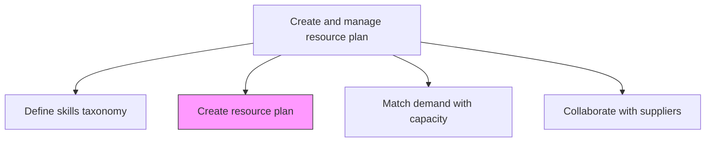
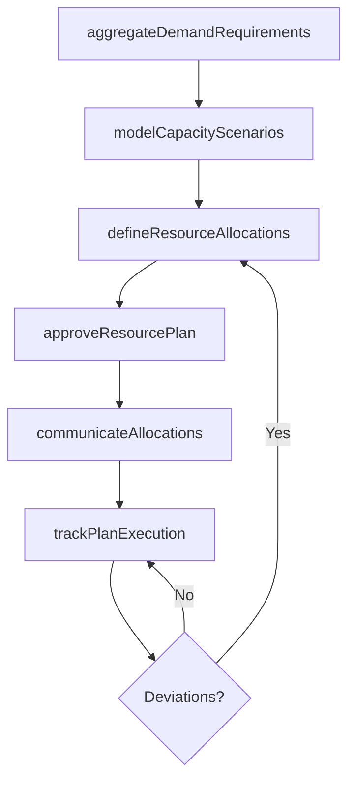

# Create resource plan

> Business-as-Code definition for developing comprehensive resource allocation plans that ensure personnel, tools, and capacity are available to meet service delivery commitments.

## Overview

Creating a plan to ensure that all resources are available to carry out services required for the customer. This can include physical resources and personnel.

## Process Hierarchy



## GraphDL

```yaml
create:
  object: Resource Plan
  actor: ResourceManager
  result: ResourcePlan
```

## Actions

| Action | Description |
|--------|-------------|
| aggregateDemandRequirements | Consolidate all resource demand inputs from forecasts and confirmed orders |
| defineResourceAllocations | Assign specific resources to planned engagements and projects |
| modelCapacityScenarios | Create scenarios to evaluate different resource allocation strategies |
| approveResourcePlan | Obtain leadership approval for the finalized resource plan |
| communicateAllocations | Notify teams and individuals of their planned assignments |
| trackPlanExecution | Monitor adherence to the resource plan and flag deviations |

## Events

| Event | Description |
|-------|-------------|
| demandRequirementsAggregated | All resource demand inputs consolidated |
| resourceAllocationsDefined | Resource assignments documented in the plan |
| capacityScenariosModeled | Alternative allocation scenarios evaluated |
| resourcePlanApproved | Resource plan formally approved by leadership |
| allocationsCommunicated | Teams notified of planned assignments |
| planExecutionTracked | Resource plan adherence monitoring activated |

## Searches

| Search | Description |
|--------|-------------|
| getResourcePlan | Retrieve the current resource plan for a service line or period |
| findResourceAllocations | List resource allocations filtered by team, project, or skill |
| getCapacityScenarios | Retrieve modeled capacity scenarios and their outcomes |
| findPlanDeviations | List deviations between planned and actual resource utilization |

## Process Flow



## RACI Matrix

| Activity | Responsible | Accountable | Consulted | Informed |
|----------|-------------|-------------|-----------|----------|
| aggregateDemandRequirements | ResourceCoordinator | ResourceManager | DemandPlanner | Finance |
| defineResourceAllocations | ResourceManager | VP Operations | ProjectManagers | Team Leads |
| approveResourcePlan | VP Operations | COO | Finance | Executive Team |
| trackPlanExecution | ResourceCoordinator | ResourceManager | Operations | ServiceDeliveryManager |

## Related Processes

| Process | Relationship |
|---------|-------------|
| 5.2.1.4 Develop consensus forecast | Upstream - consensus forecast drives resource demand inputs |
| 5.2.2.3 Match resource demand with capacity | Downstream - resource plan enables capacity matching |
| 5.3.1.6 Identify, select, and assign resources | Consumer - project resource assignment uses the plan |

## Related Departments

| Department | Role |
|-----------|------|
| Resource Management | Owns resource plan creation and maintenance |
| Finance | Validates budget alignment of resource allocations |
| Service Delivery | Provides engagement-level resource requirements |
| Human Resources | Supports hiring plans for identified gaps |

## Related Occupations

| Occupation | Involvement |
|-----------|-------------|
| Resource Manager | Primary plan creator and owner |
| Resource Coordinator | Supports plan development and tracking |
| Workforce Planner | Models capacity scenarios |

## KPIs

| KPI | Description | Unit |
|-----|-------------|------|
| Plan Adherence | Percentage of resource allocations executed as planned | % |
| Resource Utilization | Percentage of planned hours actually utilized | % |
| Plan Cycle Time | Time from demand aggregation to approved resource plan | Days |
| Unplanned Resource Requests | Number of resource requests outside the approved plan | Count per Month |

## Usage

```typescript
import { createResourcePlan } from '@headlessly/create-resource-plan'

const planning = createResourcePlan()

// Aggregate demand requirements
const demand = await planning.aggregateDemandRequirements({
  forecastId: 'consensus-2026-Q1',
  confirmedOrders: true,
  tentativeOrders: true
})

// Model capacity scenarios
const scenarios = await planning.modelCapacityScenarios({
  demandId: demand.id,
  strategies: ['optimize-utilization', 'buffer-capacity', 'hybrid'],
  includeContractorPool: true
})

// Approve and communicate the resource plan
await planning.approveResourcePlan({
  scenarioId: scenarios.recommended.id,
  approver: 'vp-operations',
  effectivePeriod: '2026-Q1'
})
```
