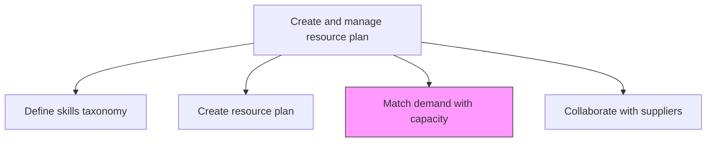
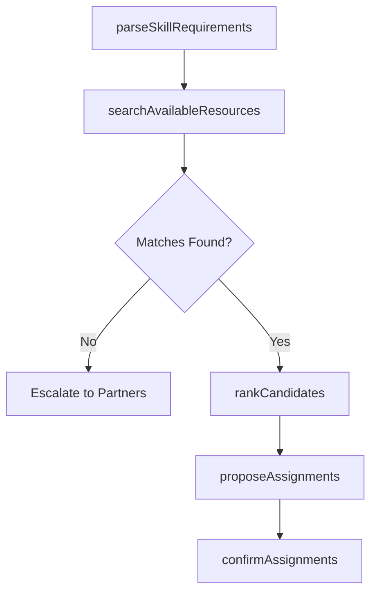

# Match resource demand with capacity, skills, and capabilities

> Business-as-Code definition for aligning specific resource demand with available capacity by matching required skills, proficiency levels, and capabilities to qualified personnel.

## Overview

Matching demand with skills and capability. Enlisting suppliers and partners to help with demand when needed.

## Process Hierarchy



## GraphDL

```yaml
match:
  object: Resource Demand With Capacity, Skills, And Capabilities
  actor: ResourceCoordinator
  result: ResourceAssignment
```

## Actions

| Action | Description |
|--------|-------------|
| parseSkillRequirements | Extract required skills and proficiency levels from engagement requests |
| searchAvailableResources | Query the resource pool for candidates matching skill criteria |
| rankCandidates | Score and rank available resources based on fit, availability, and cost |
| proposeAssignments | Submit recommended resource-to-engagement matches for approval |
| confirmAssignments | Finalize and lock resource assignments for service delivery |

## Events

| Event | Description |
|-------|-------------|
| skillRequirementsParsed | Engagement skill requirements extracted and standardized |
| availableResourcesSearched | Resource pool queried for matching candidates |
| candidatesRanked | Available resources scored and ranked by fit |
| assignmentsProposed | Resource match recommendations submitted |
| assignmentsConfirmed | Resource assignments finalized and communicated |

## Searches

| Search | Description |
|--------|-------------|
| findMatchingResources | Search for resources matching specific skill and availability criteria |
| getAssignmentProposals | Retrieve pending resource assignment proposals |
| findUnmatchedDemand | List demand requests with no available resource matches |
| getResourceMatchScore | Get the fit score between a resource and a demand request |

## Process Flow



## RACI Matrix

| Activity | Responsible | Accountable | Consulted | Informed |
|----------|-------------|-------------|-----------|----------|
| parseSkillRequirements | ResourceCoordinator | ResourceManager | ProjectManagers | Operations |
| searchAvailableResources | ResourceCoordinator | ResourceManager | Team Leads | HR |
| rankCandidates | ResourceCoordinator | ResourceManager | ServiceDeliveryManager | Finance |
| confirmAssignments | ResourceManager | VP Operations | ProjectManagers | Assigned Resources |

## Related Processes

| Process | Relationship |
|---------|-------------|
| 5.2.2.1 Define and manage skills taxonomy | Upstream - taxonomy provides matching criteria |
| 5.2.2.4 Collaborate with suppliers and partners | Downstream - unmatched demand triggers supplier engagement |
| 5.3.1.6 Identify, select, and assign resources | Consumer - project-level assignments use matching results |

## Related Departments

| Department | Role |
|-----------|------|
| Resource Management | Owns the matching and assignment process |
| Service Delivery | Provides demand requirements and approves matches |
| Human Resources | Provides resource availability and skill data |
| Procurement | Engaged when external resources are needed |

## Related Occupations

| Occupation | Involvement |
|-----------|-------------|
| Resource Coordinator | Primary executor of matching and proposal |
| Resource Manager | Approves and confirms assignments |
| Project Manager | Validates skill fit for engagement needs |

## KPIs

| KPI | Description | Unit |
|-----|-------------|------|
| Match Rate | Percentage of demand requests matched with internal resources | % |
| Time to Match | Average time from demand request to confirmed assignment | Days |
| Match Quality Score | Average fit score of confirmed resource assignments | Score (1-10) |
| Unmatched Demand Rate | Percentage of demand requests requiring external resources | % |

## Usage

```typescript
import { matchResourceDemandWithCapacitySkillsAndCapabilities } from '@headlessly/match-resource-demand-with-capacity-skills-and-capabilities'

const matching = matchResourceDemandWithCapacitySkillsAndCapabilities()

// Parse skill requirements from an engagement request
const requirements = await matching.parseSkillRequirements({
  engagementId: 'eng-456',
  requiredSkills: ['cloud-migration', 'aws', 'project-management'],
  minProficiency: 'advanced'
})

// Search and rank available resources
const candidates = await matching.rankCandidates({
  requirementsId: requirements.id,
  startDate: '2026-03-01',
  durationWeeks: 12,
  includePartTimeAvailability: true
})

// Confirm top-ranked assignment
await matching.confirmAssignments({
  proposalIds: [candidates[0].proposalId],
  notifyResource: true,
  notifyProjectManager: true
})
```
