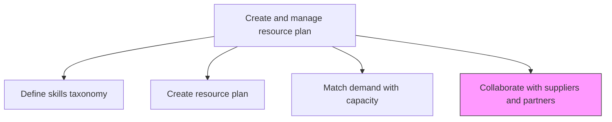
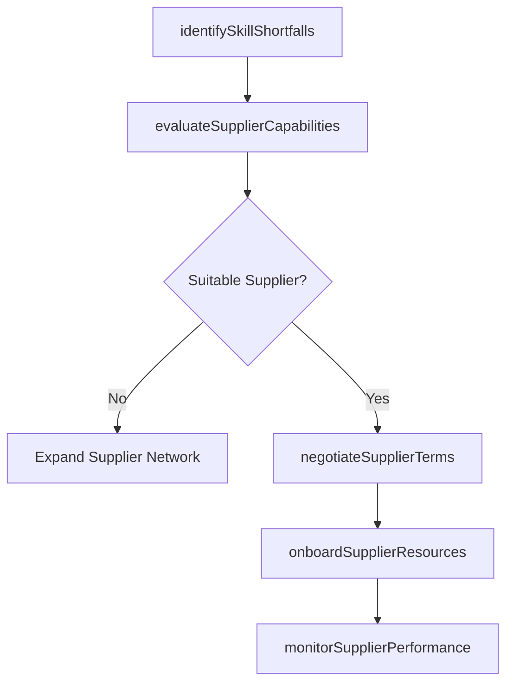

# Collaborate with suppliers and partners to supplement skills and capabilities

> Business-as-Code definition for engaging third-party suppliers and delivery partners to fill skill gaps and augment internal delivery capacity for customer engagements.

## Overview

Understanding organizational need to enlist suppliers to provide resources for gaps in skills and capabilities. Identify where additional skills are needed and collaborate with third parties to fill those demands.

## Process Hierarchy



## GraphDL

```yaml
collaborate:
  object: With Suppliers And Partners To Supplement Skills And Capabilities
  actor: VendorManager
  result: SupplierEngagement
```

## Actions

| Action | Description |
|--------|-------------|
| identifySkillShortfalls | Determine which skill gaps cannot be filled internally |
| evaluateSupplierCapabilities | Assess third-party partners for skill coverage and capacity |
| negotiateSupplierTerms | Agree on rates, terms, and engagement conditions with suppliers |
| onboardSupplierResources | Integrate supplier personnel into delivery teams and systems |
| monitorSupplierPerformance | Track quality and effectiveness of supplier-provided resources |

## Events

| Event | Description |
|-------|-------------|
| skillShortfallsIdentified | Internal skill gaps requiring external resources documented |
| supplierCapabilitiesEvaluated | Partner skill assessments completed |
| supplierTermsNegotiated | Commercial terms with suppliers finalized |
| supplierResourcesOnboarded | External resources integrated into delivery teams |
| supplierPerformanceMonitored | Supplier resource quality assessment completed |

## Searches

| Search | Description |
|--------|-------------|
| findQualifiedSuppliers | List suppliers matching specific skill and capacity requirements |
| getSupplierPerformance | Retrieve performance data for supplier-provided resources |
| findActiveSupplierEngagements | List current supplier resource engagements |
| getSupplierCapacity | Get available capacity data from approved suppliers |

## Process Flow



## RACI Matrix

| Activity | Responsible | Accountable | Consulted | Informed |
|----------|-------------|-------------|-----------|----------|
| identifySkillShortfalls | ResourceManager | VP Operations | ServiceDeliveryManager | HR |
| evaluateSupplierCapabilities | VendorManager | ResourceManager | Procurement | Legal |
| negotiateSupplierTerms | VendorManager | VP Operations | Finance, Legal | Procurement |
| monitorSupplierPerformance | ProjectManager | ResourceManager | QualityAssurance | VendorManager |

## Related Processes

| Process | Relationship |
|---------|-------------|
| 5.2.2.3 Match resource demand with capacity | Upstream - unmatched demand triggers supplier collaboration |
| 5.2.2.5 Identify critical resources and supplier capacity | Parallel - critical resource analysis informs supplier engagement |
| 5.1.2.4 Define service delivery network and supply constraints | Upstream - constraint data shapes supplier strategy |

## Related Departments

| Department | Role |
|-----------|------|
| Vendor Management | Primary owner of supplier relationships |
| Procurement | Manages commercial terms and contracts |
| Resource Management | Identifies skill gaps and demand |
| Legal | Reviews supplier agreements and compliance |

## Related Occupations

| Occupation | Involvement |
|-----------|-------------|
| Vendor Manager | Primary executor of supplier collaboration |
| Procurement Specialist | Manages contracting and commercial terms |
| Resource Manager | Defines skill requirements and priorities |

## KPIs

| KPI | Description | Unit |
|-----|-------------|------|
| Supplier Fill Rate | Percentage of external resource requests fulfilled by suppliers | % |
| Supplier Onboarding Time | Average time to integrate supplier resources into delivery | Days |
| Supplier Quality Score | Average performance rating of supplier-provided resources | Score (1-5) |
| External Resource Cost Ratio | Cost of supplier resources relative to internal resource costs | Ratio |

## Usage

```typescript
import { collaborateWithSuppliersAndPartnersToSupplementSkillsAndCapabilities } from '@headlessly/collaborate-with-suppliers-and-partners-to-supplement-skills-and-capabilities'

const suppliers = collaborateWithSuppliersAndPartnersToSupplementSkillsAndCapabilities()

// Identify skill shortfalls requiring external resources
const shortfalls = await suppliers.identifySkillShortfalls({
  resourcePlanId: 'plan-2026-Q1',
  unmatchedOnly: true,
  criticalSkills: ['kubernetes', 'data-engineering']
})

// Evaluate supplier capabilities
const evaluations = await suppliers.evaluateSupplierCapabilities({
  shortfallIds: shortfalls.map(s => s.id),
  preferredSuppliers: ['partner-A', 'partner-B'],
  maxRatePerHour: 200
})

// Monitor supplier performance
const performance = await suppliers.monitorSupplierPerformance({
  engagementId: 'supplier-eng-789',
  metrics: ['quality', 'timeliness', 'collaboration']
})
```
