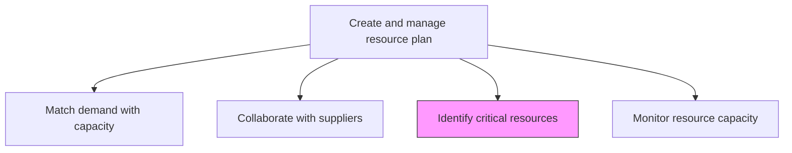
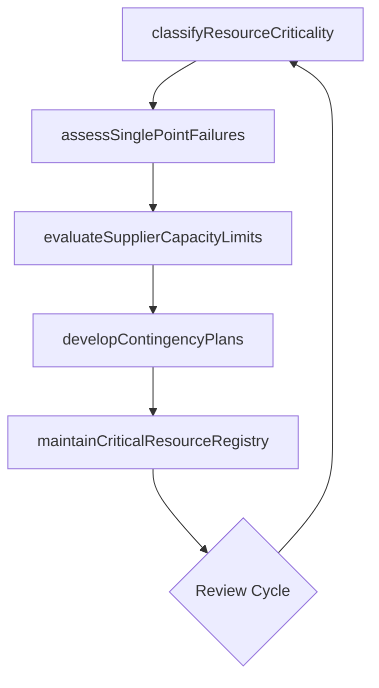

# Identify critical resources and supplier capacity

> Business-as-Code definition for pinpointing essential resources and assessing supplier capacity thresholds to ensure continuity of service delivery under varying demand conditions.

## Overview

Realizing critical resources required to perform and carry out customer needs. Engage with suppliers to fulfill those needs, if necessary. Identify supplier threshold for performing those needs.

## Process Hierarchy



## GraphDL

```yaml
identify:
  object: Critical Resources And Supplier Capacity
  actor: ResourceManager
  result: CriticalResourceReport
```

## Actions

| Action | Description |
|--------|-------------|
| classifyResourceCriticality | Categorize resources by their importance to service delivery continuity |
| assessSinglePointFailures | Identify resources where loss would critically impact delivery |
| evaluateSupplierCapacityLimits | Determine maximum throughput and constraints of supplier resources |
| developContingencyPlans | Create backup plans for critical resource scenarios |
| maintainCriticalResourceRegistry | Keep an updated registry of critical resources and their backup options |

## Events

| Event | Description |
|-------|-------------|
| resourceCriticalityClassified | Resources categorized by delivery criticality level |
| singlePointFailuresAssessed | Single-point-of-failure resource risks identified |
| supplierCapacityLimitsEvaluated | Supplier throughput constraints documented |
| contingencyPlansDeveloped | Backup plans for critical resource loss created |
| criticalResourceRegistryMaintained | Registry of critical resources updated |

## Searches

| Search | Description |
|--------|-------------|
| findCriticalResources | List resources classified as critical to delivery |
| getSupplierCapacityLimits | Retrieve capacity constraints for specific suppliers |
| findContingencyPlans | List contingency plans for critical resource scenarios |
| getSinglePointFailures | Get resources identified as single points of failure |

## Process Flow



## RACI Matrix

| Activity | Responsible | Accountable | Consulted | Informed |
|----------|-------------|-------------|-----------|----------|
| classifyResourceCriticality | ResourceManager | VP Operations | ServiceDeliveryManager | HR |
| assessSinglePointFailures | ResourceManager | VP Operations | Team Leads | Risk Management |
| evaluateSupplierCapacityLimits | VendorManager | ResourceManager | Procurement | Finance |
| developContingencyPlans | ResourceManager | VP Operations | All Stakeholders | Executive Team |

## Related Processes

| Process | Relationship |
|---------|-------------|
| 5.2.2.4 Collaborate with suppliers and partners | Parallel - supplier capacity data informs collaboration strategy |
| 5.2.2.6 Monitor and manage resource capacity | Downstream - critical resource data feeds capacity monitoring |
| 5.1.2.4 Define service delivery network constraints | Upstream - network constraints identify critical dependencies |

## Related Departments

| Department | Role |
|-----------|------|
| Resource Management | Owns critical resource identification and planning |
| Vendor Management | Assesses supplier capacity and constraints |
| Risk Management | Evaluates impact of critical resource scenarios |
| Service Delivery | Communicates delivery-critical skill requirements |

## Related Occupations

| Occupation | Involvement |
|-----------|-------------|
| Resource Manager | Primary executor of critical resource analysis |
| Vendor Manager | Assesses supplier capacity thresholds |
| Risk Analyst | Evaluates contingency plan adequacy |

## KPIs

| KPI | Description | Unit |
|-----|-------------|------|
| Critical Resource Coverage | Percentage of critical resources with documented contingency plans | % |
| Single Point Failure Count | Number of resources identified as single points of failure | Count |
| Supplier Capacity Headroom | Available supplier capacity above current utilization | % |
| Contingency Plan Freshness | Percentage of contingency plans reviewed in the last 6 months | % |

## Usage

```typescript
import { identifyCriticalResourcesAndSupplierCapacity } from '@headlessly/identify-critical-resources-and-supplier-capacity'

const critical = identifyCriticalResourcesAndSupplierCapacity()

// Classify resource criticality
const classification = await critical.classifyResourceCriticality({
  scope: 'all-service-lines',
  criteria: ['revenue-impact', 'client-dependency', 'skill-scarcity']
})

// Assess single point failures
const failures = await critical.assessSinglePointFailures({
  classificationId: classification.id,
  includeSupplierResources: true
})

// Develop contingency plans
const contingency = await critical.developContingencyPlans({
  criticalResourceIds: failures.highRisk.map(r => r.id),
  strategies: ['cross-training', 'backup-supplier', 'knowledge-transfer']
})
```
