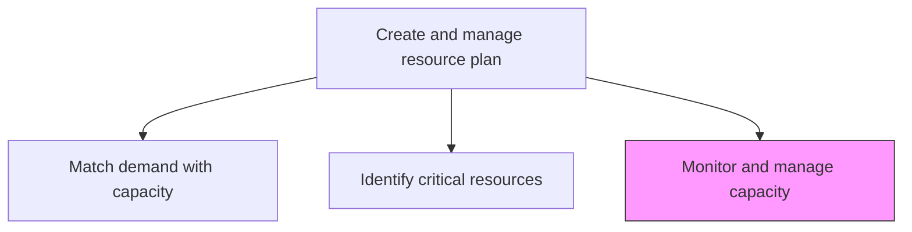
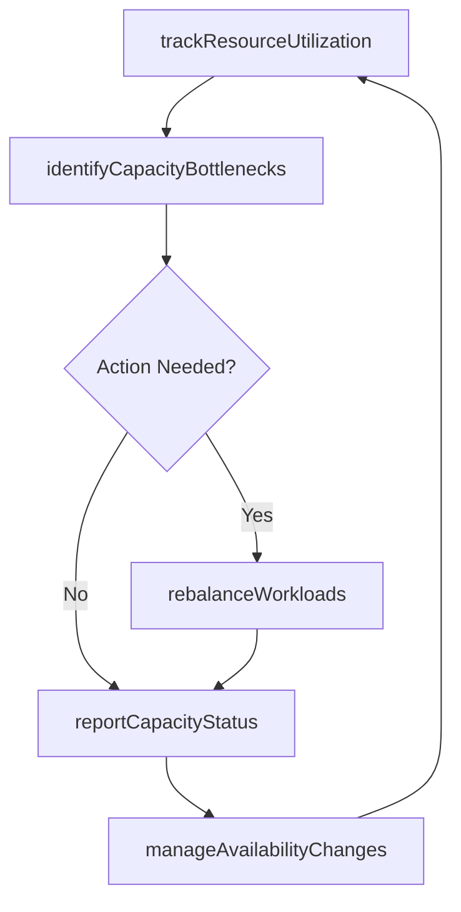

# Monitor and manage resource capacity and availability

> Business-as-Code definition for continuously tracking workforce capacity and availability in real-time, enabling proactive adjustments to maintain optimal resource utilization.

## Overview

Directing and managing workforce needs. Ensure that resources are at full capacity. Monitor that all resources are able to skilled in their respective rolls. Make sure that necessary resources are available to provide the needed services.

## Process Hierarchy



## GraphDL

```yaml
monitor:
  object: And Manage Resource Capacity And Availability
  actor: ResourceManager
  result: CapacityDashboard
```

## Actions

| Action | Description |
|--------|-------------|
| trackResourceUtilization | Monitor real-time utilization rates across delivery teams |
| identifyCapacityBottlenecks | Detect resource areas approaching or exceeding capacity limits |
| rebalanceWorkloads | Redistribute assignments to optimize utilization and prevent burnout |
| manageAvailabilityChanges | Process leave requests, attrition, and other availability changes |
| reportCapacityStatus | Generate capacity and availability dashboards for leadership |

## Events

| Event | Description |
|-------|-------------|
| resourceUtilizationTracked | Utilization data refreshed across all teams |
| capacityBottlenecksIdentified | Over-capacity or under-capacity areas flagged |
| workloadsRebalanced | Resource assignments redistributed to optimize capacity |
| availabilityChangesManaged | Leave, attrition, or schedule changes processed |
| capacityStatusReported | Capacity dashboard published to stakeholders |

## Searches

| Search | Description |
|--------|-------------|
| getCapacityDashboard | Retrieve real-time capacity and utilization dashboard |
| findBottlenecks | List resource areas at or above capacity thresholds |
| getAvailabilityForecast | Get projected resource availability for upcoming periods |
| findUnderutilizedResources | List resources with utilization below target thresholds |

## Process Flow



## RACI Matrix

| Activity | Responsible | Accountable | Consulted | Informed |
|----------|-------------|-------------|-----------|----------|
| trackResourceUtilization | ResourceCoordinator | ResourceManager | Team Leads | Operations |
| identifyCapacityBottlenecks | ResourceManager | VP Operations | ServiceDeliveryManager | Finance |
| rebalanceWorkloads | ResourceManager | VP Operations | ProjectManagers | Affected Resources |
| reportCapacityStatus | ResourceCoordinator | ResourceManager | Finance | Executive Team |

## Related Processes

| Process | Relationship |
|---------|-------------|
| 5.2.2.2 Create resource plan | Upstream - resource plan defines capacity targets |
| 5.2.1.6 Monitor activity against forecast | Parallel - capacity data supports forecast monitoring |
| 5.2.2.5 Identify critical resources | Input - critical resource data informs monitoring priorities |

## Related Departments

| Department | Role |
|-----------|------|
| Resource Management | Primary owner of capacity monitoring |
| Service Delivery | Provides engagement-level utilization data |
| Human Resources | Processes availability changes and attrition |
| Finance | Monitors cost implications of capacity decisions |

## Related Occupations

| Occupation | Involvement |
|-----------|-------------|
| Resource Manager | Primary capacity manager and decision-maker |
| Resource Coordinator | Tracks utilization and availability data |
| Operations Analyst | Supports capacity analytics and reporting |

## KPIs

| KPI | Description | Unit |
|-----|-------------|------|
| Overall Utilization Rate | Percentage of total available hours productively utilized | % |
| Capacity Buffer | Available capacity above current demand | % |
| Attrition Impact | Percentage of capacity lost to unplanned attrition | % |
| Rebalancing Frequency | Number of workload rebalancing actions per period | Count per Month |

## Usage

```typescript
import { monitorAndManageResourceCapacityAndAvailability } from '@headlessly/monitor-and-manage-resource-capacity-and-availability'

const capacity = monitorAndManageResourceCapacityAndAvailability()

// Track resource utilization in real-time
const utilization = await capacity.trackResourceUtilization({
  scope: 'all-service-lines',
  period: '2026-01',
  granularity: 'weekly'
})

// Identify capacity bottlenecks
const bottlenecks = await capacity.identifyCapacityBottlenecks({
  utilizationId: utilization.id,
  threshold: 0.9,
  includeProjectedDemand: true
})

// Rebalance workloads to resolve bottlenecks
await capacity.rebalanceWorkloads({
  bottleneckIds: bottlenecks.map(b => b.id),
  strategy: 'minimize-reassignment',
  preserveClientContinuity: true
})
```
