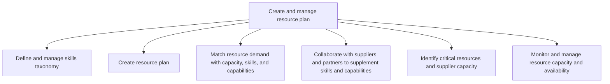
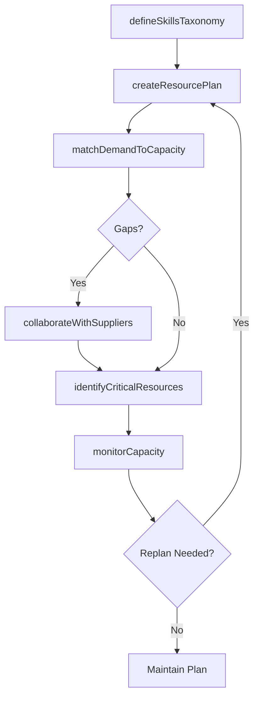

# Create and manage resource plan

> Business-as-Code definition for resource plan creation and management. Models skills taxonomy, resource planning, demand-capacity matching, supplier collaboration, critical resource identification, and capacity monitoring as programmable workflows.

## Overview

Identifying the need for and creating a resource plan. Understand resource demand and align with capacity, skills, and capabilities. Enlist suppliers and partners to supplement needed skills and capabilities. Monitor and manage capabilities and skills with an eye on critical resources and supplier capacity.

## Process Hierarchy



## GraphDL

```yaml
create:
  object: And Manage Resource Plan
  actor: ResourcePlanningManager
  result: ResourcePlan
```

## Actions

| Action | Description |
|--------|-------------|
| defineSkillsTaxonomy | Classify and organize skills required for service delivery |
| createResourcePlan | Build resource allocation plan aligned to demand forecast |
| matchDemandToCapacity | Align resource demand with available capacity, skills, and capabilities |
| collaborateWithSuppliers | Engage suppliers and partners to fill capacity and skill gaps |
| identifyCriticalResources | Flag key resources and constrained supplier capacity |
| monitorCapacity | Track resource capacity and availability in real time |

## Events

| Event | Description |
|-------|-------------|
| skillsTaxonomyDefined | Skills classification framework created and published |
| resourcePlanCreated | Resource allocation plan documented and approved |
| demandMatchedToCapacity | Demand-capacity alignment completed with gap analysis |
| supplierCollaborationCompleted | Partner agreements established for supplemental capacity |
| criticalResourcesIdentified | Key resource constraints flagged and mitigation planned |
| capacityMonitored | Resource utilization and availability metrics updated |

## Searches

| Search | Description |
|--------|-------------|
| getSkillsTaxonomy | Retrieve skills classification by domain or service line |
| getResourcePlan | Query resource plan details by period or project |
| getCapacityGaps | Identify unmet demand by skill, region, or time period |
| getSupplierCapacity | Retrieve partner and supplier available capacity |
| getCriticalResourceStatus | Query critical resource availability and risk status |

## Process Flow



## RACI Matrix

| Activity | Responsible | Accountable | Consulted | Informed |
|----------|-------------|-------------|-----------|----------|
| defineSkillsTaxonomy | ResourceAnalyst | ResourcePlanningManager | HR, DeliveryLeads | Training |
| createResourcePlan | ResourcePlanner | ResourcePlanningManager | DemandPlanning, Finance | Executive |
| matchDemandToCapacity | ResourcePlanner | ResourcePlanningManager | DeliveryManagers | Sales |
| collaborateWithSuppliers | VendorManager | ResourcePlanningManager | Procurement, Legal | Finance |

## Sub-Processes

| ID | Name | Description |
|----|------|-------------|
| 5.2.2.1 | Define and manage skills taxonomy | Analyzing the skills needed to perform services to be delivered. Classify and organize these skills  |
| 5.2.2.2 | Create resource plan | Creating a plan to ensure that all resources are available to carry out services required for the cu |
| 5.2.2.3 | Match resource demand with capacity, skills, and capabilities | Matching demand with skills and capability. Enlisting suppliers and partners to help with demand whe |
| 5.2.2.4 | Collaborate with suppliers and partners to supplement skills and capabilities | Understanding organizational need to enlist suppliers to provide resources for gaps in skills and ca |
| 5.2.2.5 | Identify critical resources and supplier capacity | Realizing critical resources required to perform and carry out customer needs. Engage with suppliers |
| 5.2.2.6 | Monitor and manage resource capacity and availability | Directing and managing workforce needs. Ensure that resources are at full capacity. Monitor that all |

## Related Processes

| Process | Relationship |
|---------|-------------|
| 5.2.1 Manage service delivery resource demand | Upstream - demand forecast drives resource planning |
| 5.2.3 Enable service-delivery resources | Downstream - resource plan identifies training needs |
| 5.3.1 Initiate service delivery | Downstream - resource assignments feed delivery initiation |
| 7.2 Recruit, source, and select employees | Parallel - hiring addresses identified capacity gaps |

## Related Departments

| Department | Role |
|-----------|------|
| Resource Management | Primary owner of resource planning and allocation |
| Human Resources | Manages skills taxonomy and workforce data |
| Procurement | Coordinates supplier and partner engagements |
| Service Delivery | Consumes resource plan for project staffing |

## Related Occupations

| Occupation | Involvement |
|-----------|-------------|
| Resource Planning Manager | Overall resource plan ownership and optimization |
| Resource Planner | Demand-capacity matching and plan creation |
| Vendor Manager | Supplier collaboration for supplemental resources |

## KPIs

| KPI | Description | Unit |
|-----|-------------|------|
| Resource Utilization Rate | Percentage of available resource capacity assigned to work | % |
| Capacity Gap Closure Rate | Percentage of identified gaps resolved within target time | % |
| Plan Accuracy | Variance between planned and actual resource consumption | % |
| Bench Time | Average time resources remain unassigned between engagements | Days |

## Usage

```typescript
import { createAndManageResourcePlan } from '@headlessly/create-and-manage-resource-plan'

const client = createAndManageResourcePlan()

// Create resource plan
const plan = await client.createResourcePlan({
  period: 'Q3-2025',
  demandForecastId: 'DF-2025-Q3',
  serviceLine: 'Implementation',
  includePartnerCapacity: true
})

// Match demand to capacity
const alignment = await client.matchDemandToCapacity({
  planId: plan.id,
  skills: ['java-development', 'cloud-architecture', 'data-migration'],
  tolerancePercent: 10
})
```
