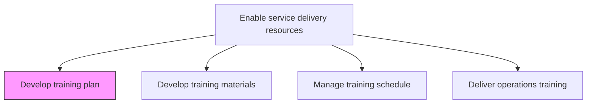
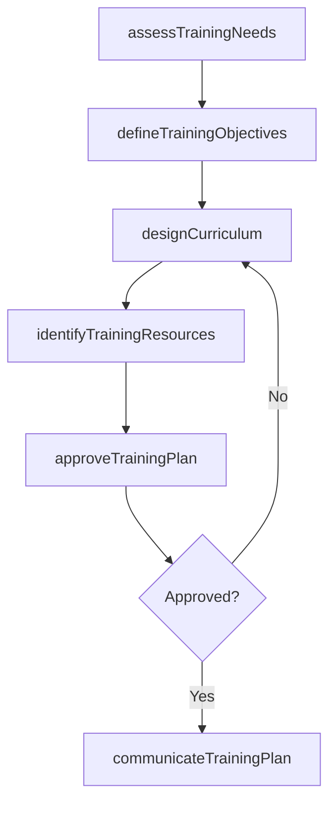

# Develop service delivery training plan

> Business-as-Code definition for creating structured training plans that prepare service delivery personnel with the skills, knowledge, and competencies required for effective engagement execution.

## Overview

Creating a detailed summary of all the actions relevant to teaching a person a particular skill or type of behavior. Determine who will deliver the training. Determine when and where the apprentice or trainee needs to go to receive the structured component of the training.

## Process Hierarchy



## GraphDL

```yaml
develop:
  object: Service Delivery Training Plan
  actor: TrainingManager
  result: TrainingPlan
```

## Actions

| Action | Description |
|--------|-------------|
| assessTrainingNeeds | Identify skill gaps and training requirements across delivery teams |
| defineTrainingObjectives | Establish learning outcomes aligned with service delivery competencies |
| designCurriculum | Structure training modules, sequences, and delivery methods |
| identifyTrainingResources | Determine instructors, facilities, and tools needed for training |
| approveTrainingPlan | Obtain leadership sign-off on the finalized training plan |
| communicateTrainingPlan | Distribute the approved plan to all affected personnel |

## Events

| Event | Description |
|-------|-------------|
| trainingNeedsAssessed | Skill gap and training needs analysis completed |
| trainingObjectivesDefined | Learning outcomes formally documented |
| curriculumDesigned | Training curriculum structure and content approved |
| trainingResourcesIdentified | Instructors, facilities, and tools assigned |
| trainingPlanApproved | Training plan approved by leadership |
| trainingPlanCommunicated | Training plan shared with all stakeholders |

## Searches

| Search | Description |
|--------|-------------|
| findTrainingPlans | Retrieve training plans filtered by service line, skill, or period |
| getTrainingNeeds | Get training needs assessment for a team or role |
| findCurriculumModules | List curriculum modules by skill area or proficiency level |
| getTrainingResources | Retrieve available training resources and instructors |

## Process Flow



## RACI Matrix

| Activity | Responsible | Accountable | Consulted | Informed |
|----------|-------------|-------------|-----------|----------|
| assessTrainingNeeds | TrainingManager | ResourceManager | Team Leads | HR |
| designCurriculum | InstructionalDesigner | TrainingManager | SubjectMatterExperts | Operations |
| approveTrainingPlan | TrainingManager | VP Operations | Finance | All Delivery Staff |

## Related Processes

| Process | Relationship |
|---------|-------------|
| 5.2.3.2 Develop training materials | Downstream - training plan drives material development |
| 5.2.2.1 Define and manage skills taxonomy | Upstream - taxonomy defines training skill targets |
| 5.2.3.7 Evaluate training effectiveness | Downstream - effectiveness data informs plan revisions |

## Related Departments

| Department | Role |
|-----------|------|
| Training and Development | Primary owner of training plan creation |
| Service Delivery | Provides skill gap data and delivery context |
| Human Resources | Supports learning and development strategy |
| Finance | Approves training budgets |

## Related Occupations

| Occupation | Involvement |
|-----------|-------------|
| Training Manager | Primary plan developer and owner |
| Instructional Designer | Designs curriculum and learning paths |
| Subject Matter Expert | Provides technical content guidance |

## KPIs

| KPI | Description | Unit |
|-----|-------------|------|
| Training Plan Coverage | Percentage of delivery roles with documented training plans | % |
| Plan Completion Rate | Percentage of planned training activities executed | % |
| Training Budget Utilization | Percentage of training budget spent versus allocated | % |
| Skill Gap Closure Rate | Percentage of identified skill gaps addressed by training plan | % |

## Usage

```typescript
import { developServiceDeliveryTrainingPlan } from '@headlessly/develop-service-delivery-training-plan'

const training = developServiceDeliveryTrainingPlan()

// Assess training needs across delivery teams
const needs = await training.assessTrainingNeeds({
  teams: ['consulting', 'implementation'],
  skillTaxonomyVersion: 'v3.2',
  includeNewHires: true
})

// Design curriculum based on identified needs
const curriculum = await training.designCurriculum({
  needsAssessmentId: needs.id,
  deliveryMethods: ['instructor-led', 'e-learning', 'mentoring'],
  durationWeeks: 8
})

// Approve and communicate the training plan
await training.approveTrainingPlan({
  curriculumId: curriculum.id,
  approver: 'vp-operations',
  effectiveDate: '2026-03-01'
})
```
