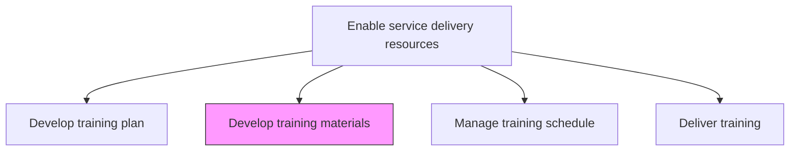
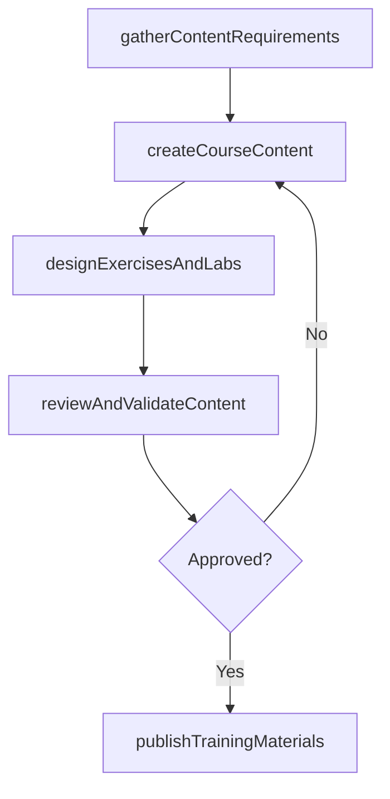

# Develop training materials

> Business-as-Code definition for creating instructional content, courseware, and learning resources that support the delivery of service delivery training programs.

## Overview

Developing materials necessary to provide comprehensive training for the skills or behavior needed to deliver services. This can be any number for formats such as classroom or computer based training.

## Process Hierarchy



## GraphDL

```yaml
develop:
  object: Training Materials
  actor: InstructionalDesigner
  result: TrainingCourseware
```

## Actions

| Action | Description |
|--------|-------------|
| gatherContentRequirements | Collect subject matter requirements for training materials |
| createCourseContent | Develop instructional text, presentations, and multimedia |
| designExercisesAndLabs | Build hands-on exercises, case studies, and practical labs |
| reviewAndValidateContent | Conduct peer and SME review of training materials |
| publishTrainingMaterials | Release approved materials to the learning management system |

## Events

| Event | Description |
|-------|-------------|
| contentRequirementsGathered | Subject matter requirements for materials collected |
| courseContentCreated | Instructional content developed and formatted |
| exercisesAndLabsDesigned | Practical exercises and labs created |
| contentReviewedAndValidated | Training materials reviewed by SMEs and approved |
| trainingMaterialsPublished | Approved materials released for training delivery |

## Searches

| Search | Description |
|--------|-------------|
| findTrainingMaterials | List training materials filtered by skill, format, or version |
| getMaterialsByModule | Retrieve materials for a specific curriculum module |
| findMaterialReviewStatus | Get review and approval status of training materials |
| getContentVersionHistory | Retrieve version history for training content |

## Process Flow



## RACI Matrix

| Activity | Responsible | Accountable | Consulted | Informed |
|----------|-------------|-------------|-----------|----------|
| gatherContentRequirements | InstructionalDesigner | TrainingManager | SubjectMatterExperts | Operations |
| createCourseContent | InstructionalDesigner | TrainingManager | Graphic Designer | ServiceDelivery |
| reviewAndValidateContent | SubjectMatterExpert | TrainingManager | QualityAssurance | Instructors |
| publishTrainingMaterials | TrainingCoordinator | TrainingManager | IT | All Trainers |

## Related Processes

| Process | Relationship |
|---------|-------------|
| 5.2.3.1 Develop service delivery training plan | Upstream - training plan defines material requirements |
| 5.2.3.4 Deliver operations training | Downstream - materials used in operations training sessions |
| 5.2.3.5 Deliver technical training | Downstream - materials used in technical training sessions |

## Related Departments

| Department | Role |
|-----------|------|
| Training and Development | Primary owner of material creation |
| Service Delivery | Provides domain expertise and content validation |
| IT | Manages learning management system for material distribution |
| Marketing | Supports design and branding of materials |

## Related Occupations

| Occupation | Involvement |
|-----------|-------------|
| Instructional Designer | Primary creator of training materials |
| Subject Matter Expert | Validates technical accuracy of content |
| Training Coordinator | Manages material distribution and versioning |

## KPIs

| KPI | Description | Unit |
|-----|-------------|------|
| Material Completion Rate | Percentage of planned materials developed on schedule | % |
| Content Review Pass Rate | Percentage of materials passing SME review on first submission | % |
| Material Currency | Percentage of training materials updated within the last 12 months | % |
| Learner Material Rating | Average trainee rating of material quality | Score (1-5) |

## Usage

```typescript
import { developTrainingMaterials } from '@headlessly/develop-training-materials'

const materials = developTrainingMaterials()

// Gather content requirements from SMEs
const requirements = await materials.gatherContentRequirements({
  curriculumModuleId: 'module-cloud-migration',
  subjectMatterExperts: ['sme-001', 'sme-002'],
  targetAudience: 'intermediate-consultants'
})

// Create course content
const content = await materials.createCourseContent({
  requirementsId: requirements.id,
  formats: ['slides', 'lab-guide', 'reference-document'],
  estimatedDuration: '8-hours'
})

// Publish to learning management system
await materials.publishTrainingMaterials({
  contentId: content.id,
  platform: 'LMS',
  availabilityDate: '2026-03-01'
})
```
