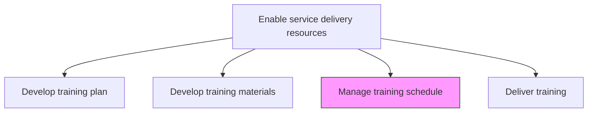
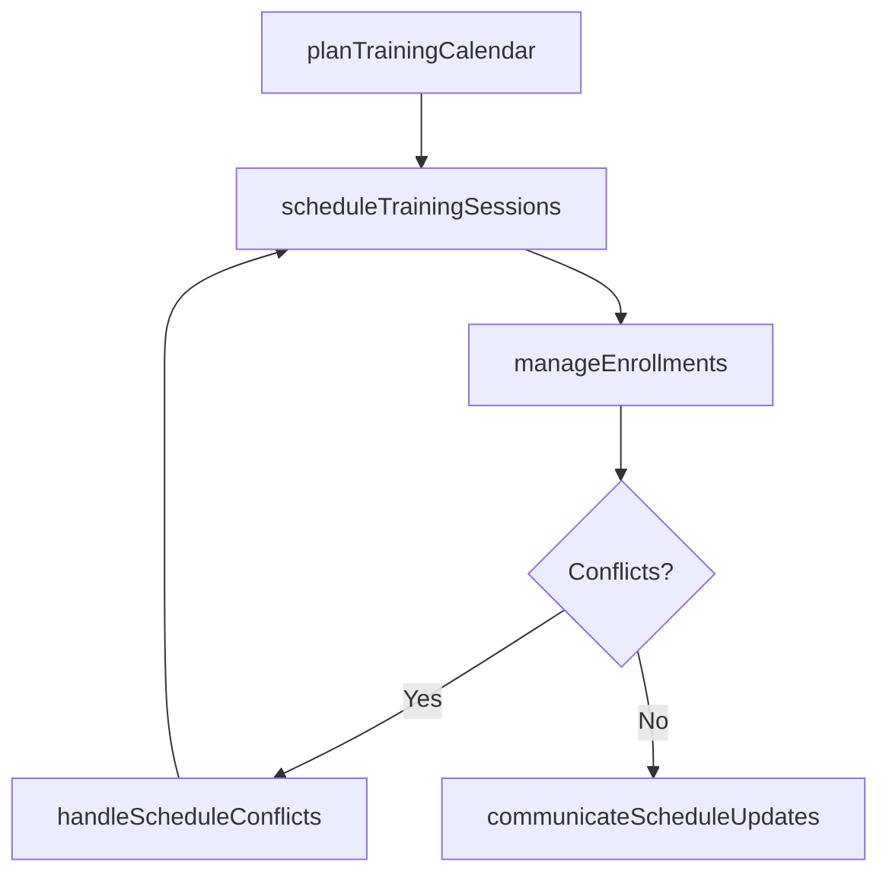

# Manage training schedule

> Business-as-Code definition for planning, coordinating, and maintaining the training calendar to ensure delivery personnel receive required training within optimal timeframes.

## Overview

Providing training to the employee within a manageable timeframe to meet the needs of both the individual and the organization.

## Process Hierarchy



## GraphDL

```yaml
manage:
  object: Training Schedule
  actor: TrainingCoordinator
  result: TrainingCalendar
```

## Actions

| Action | Description |
|--------|-------------|
| planTrainingCalendar | Create the overall training schedule aligned with delivery capacity |
| scheduleTrainingSessions | Book specific sessions with instructors, rooms, and participants |
| manageEnrollments | Process participant registrations and manage waitlists |
| handleScheduleConflicts | Resolve conflicts between training dates and delivery commitments |
| communicateScheduleUpdates | Notify participants and managers of schedule changes |

## Events

| Event | Description |
|-------|-------------|
| trainingCalendarPlanned | Annual or quarterly training calendar published |
| trainingSessionsScheduled | Specific training sessions booked and confirmed |
| enrollmentsManaged | Participant registrations processed |
| scheduleConflictsHandled | Training schedule conflicts resolved |
| scheduleUpdatesCommunicated | Schedule changes communicated to stakeholders |

## Searches

| Search | Description |
|--------|-------------|
| findTrainingSessions | List upcoming training sessions filtered by skill, date, or location |
| getEnrollmentStatus | Retrieve enrollment status for a participant or session |
| findScheduleConflicts | Identify conflicts between training and delivery schedules |
| getTrainingCalendar | Get the full training calendar for a period |

## Process Flow



## RACI Matrix

| Activity | Responsible | Accountable | Consulted | Informed |
|----------|-------------|-------------|-----------|----------|
| planTrainingCalendar | TrainingCoordinator | TrainingManager | ResourceManager | Operations |
| scheduleTrainingSessions | TrainingCoordinator | TrainingManager | Instructors | Participants |
| handleScheduleConflicts | TrainingCoordinator | TrainingManager | ProjectManagers | ResourceManager |

## Related Processes

| Process | Relationship |
|---------|-------------|
| 5.2.3.1 Develop service delivery training plan | Upstream - training plan defines schedule requirements |
| 5.2.3.4 Deliver operations training | Downstream - schedule drives training session delivery |
| 5.2.2.6 Monitor and manage resource capacity | Parallel - training schedule impacts resource availability |

## Related Departments

| Department | Role |
|-----------|------|
| Training and Development | Primary owner of training schedule |
| Resource Management | Coordinates training with delivery commitments |
| Facilities | Provides training venues and logistics |
| IT | Supports virtual training infrastructure |

## Related Occupations

| Occupation | Involvement |
|-----------|-------------|
| Training Coordinator | Primary schedule manager |
| Training Manager | Approves and oversees schedule |
| Resource Coordinator | Manages participant availability |

## KPIs

| KPI | Description | Unit |
|-----|-------------|------|
| Schedule Adherence | Percentage of training sessions delivered as scheduled | % |
| Enrollment Fill Rate | Percentage of available training seats filled | % |
| Conflict Resolution Time | Average time to resolve training schedule conflicts | Days |
| Schedule Lead Time | Average advance notice for scheduled training sessions | Weeks |

## Usage

```typescript
import { manageTrainingSchedule } from '@headlessly/manage-training-schedule'

const schedule = manageTrainingSchedule()

// Plan quarterly training calendar
const calendar = await schedule.planTrainingCalendar({
  period: '2026-Q1',
  trainingPlanId: 'plan-2026',
  maxConcurrentSessions: 3
})

// Schedule specific training sessions
const sessions = await schedule.scheduleTrainingSessions({
  calendarId: calendar.id,
  modules: ['cloud-fundamentals', 'project-management', 'client-communication'],
  preferredDays: ['Tuesday', 'Thursday']
})

// Manage enrollments
await schedule.manageEnrollments({
  sessionId: sessions[0].id,
  participants: ['emp-101', 'emp-102', 'emp-103'],
  waitlistEnabled: true
})
```
