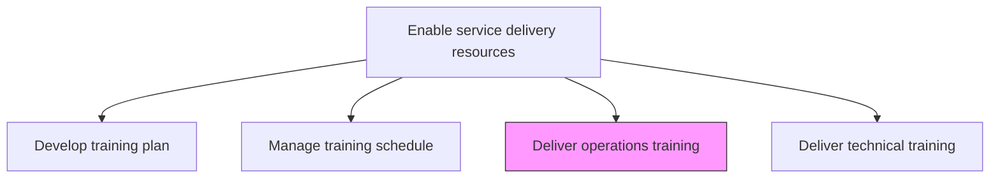
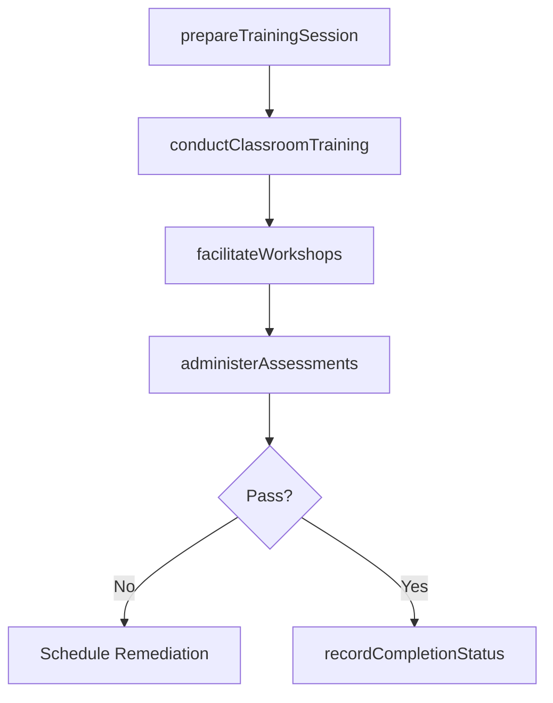

# Deliver operations training

> Business-as-Code definition for executing training programs that educate service delivery personnel on operational processes, procedures, tools, and best practices.

## Overview

Educating service delivery personnel on all aspects of the operations process of the organization.

## Process Hierarchy



## GraphDL

```yaml
deliver:
  object: Operations Training
  actor: TrainingInstructor
  result: TrainingCompletionRecord
```

## Actions

| Action | Description |
|--------|-------------|
| prepareTrainingSession | Set up materials, environment, and logistics for the training session |
| conductClassroomTraining | Deliver instructor-led training sessions on operations topics |
| facilitateWorkshops | Run interactive workshops and group exercises on delivery processes |
| administerAssessments | Conduct quizzes and evaluations to gauge participant learning |
| recordCompletionStatus | Document training completion and assessment results for participants |

## Events

| Event | Description |
|-------|-------------|
| trainingSessionPrepared | Training session materials and environment ready |
| classroomTrainingConducted | Instructor-led operations training delivered |
| workshopsFacilitated | Interactive workshops and exercises completed |
| assessmentsAdministered | Participant learning assessments conducted |
| completionStatusRecorded | Training completion data logged in the system |

## Searches

| Search | Description |
|--------|-------------|
| findCompletedTraining | List completed training sessions filtered by topic, date, or instructor |
| getParticipantProgress | Retrieve training progress for a specific participant |
| findAssessmentResults | Get assessment scores filtered by session or participant |
| getTrainingAttendance | Retrieve attendance records for training sessions |

## Process Flow



## RACI Matrix

| Activity | Responsible | Accountable | Consulted | Informed |
|----------|-------------|-------------|-----------|----------|
| prepareTrainingSession | TrainingCoordinator | TrainingManager | Instructors | Participants |
| conductClassroomTraining | TrainingInstructor | TrainingManager | SubjectMatterExperts | ResourceManager |
| administerAssessments | TrainingInstructor | TrainingManager | QualityAssurance | HR |

## Related Processes

| Process | Relationship |
|---------|-------------|
| 5.2.3.2 Develop training materials | Upstream - materials used for operations training delivery |
| 5.2.3.3 Manage training schedule | Upstream - schedule determines when training is delivered |
| 5.2.3.6 Perform skill and capability testing | Downstream - operations skills verified through testing |

## Related Departments

| Department | Role |
|-----------|------|
| Training and Development | Delivers operations training content |
| Operations | Provides subject matter expertise and validates content |
| Service Delivery | Primary audience for operations training |
| Quality Assurance | Reviews training standards and assessment criteria |

## Related Occupations

| Occupation | Involvement |
|-----------|-------------|
| Training Instructor | Primary training deliverer |
| Operations Manager | Subject matter expert for operations content |
| Training Coordinator | Manages logistics and enrollment |

## KPIs

| KPI | Description | Unit |
|-----|-------------|------|
| Training Completion Rate | Percentage of enrolled participants completing training | % |
| Assessment Pass Rate | Percentage of participants passing post-training assessments | % |
| Participant Satisfaction | Average trainee satisfaction rating for operations training | Score (1-5) |
| Knowledge Retention | Assessment score improvement from pre-test to post-test | % |

## Usage

```typescript
import { deliverOperationsTraining } from '@headlessly/deliver-operations-training'

const opsTraining = deliverOperationsTraining()

// Prepare a training session
const session = await opsTraining.prepareTrainingSession({
  module: 'engagement-lifecycle-management',
  instructor: 'instructor-005',
  date: '2026-03-15',
  format: 'hybrid'
})

// Conduct classroom training
await opsTraining.conductClassroomTraining({
  sessionId: session.id,
  participants: ['emp-201', 'emp-202', 'emp-203'],
  duration: '4-hours'
})

// Administer post-training assessment
const results = await opsTraining.administerAssessments({
  sessionId: session.id,
  assessmentType: 'post-training',
  passingScore: 80
})
```
