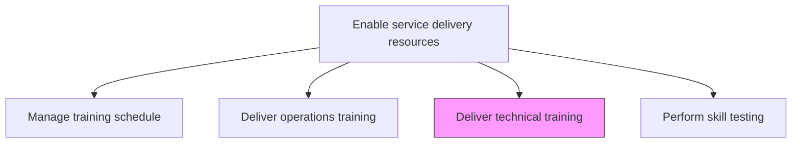
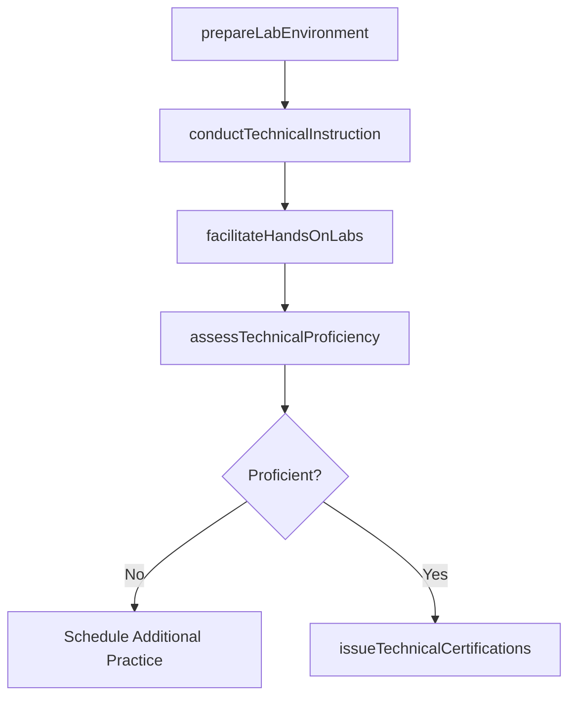

# Deliver technical training

> Business-as-Code definition for executing training programs focused on technical skills, tools, platforms, and methodologies required for service delivery engagements.

## Overview

Ensuring that all personnel are trained on all technical aspects of service delivery.

## Process Hierarchy



## GraphDL

```yaml
deliver:
  object: Technical Training
  actor: TechnicalTrainer
  result: TechnicalCertification
```

## Actions

| Action | Description |
|--------|-------------|
| prepareLabEnvironment | Set up technical lab environments and sandboxes for hands-on training |
| conductTechnicalInstruction | Deliver instructor-led sessions on technical topics and tools |
| facilitateHandsOnLabs | Guide participants through practical exercises and lab scenarios |
| assessTechnicalProficiency | Evaluate technical skill acquisition through tests and demonstrations |
| issueTechnicalCertifications | Grant certifications for participants meeting proficiency standards |

## Events

| Event | Description |
|-------|-------------|
| labEnvironmentPrepared | Technical lab and sandbox environments ready for training |
| technicalInstructionConducted | Instructor-led technical sessions delivered |
| handsOnLabsFacilitated | Practical lab exercises completed by participants |
| technicalProficiencyAssessed | Technical skill assessments conducted and scored |
| technicalCertificationsIssued | Certifications granted to qualifying participants |

## Searches

| Search | Description |
|--------|-------------|
| findTechnicalCourses | List available technical training courses by technology or skill |
| getCertificationStatus | Retrieve certification status for a participant or technology |
| findLabEnvironments | List available lab environments for technical training |
| getTechnicalAssessmentResults | Get assessment results for technical training sessions |

## Process Flow



## RACI Matrix

| Activity | Responsible | Accountable | Consulted | Informed |
|----------|-------------|-------------|-----------|----------|
| prepareLabEnvironment | IT Operations | TechnicalTrainer | TrainingManager | Participants |
| conductTechnicalInstruction | TechnicalTrainer | TrainingManager | SubjectMatterExperts | ResourceManager |
| assessTechnicalProficiency | TechnicalTrainer | TrainingManager | QualityAssurance | HR |
| issueTechnicalCertifications | TrainingManager | VP Operations | HR | Participants |

## Related Processes

| Process | Relationship |
|---------|-------------|
| 5.2.3.2 Develop training materials | Upstream - technical materials used for training delivery |
| 5.2.3.6 Perform skill and capability testing | Downstream - technical skills verified through formal testing |
| 5.2.2.1 Define and manage skills taxonomy | Upstream - taxonomy defines technical skill targets |

## Related Departments

| Department | Role |
|-----------|------|
| Training and Development | Delivers technical training programs |
| IT | Provides lab environments and technical infrastructure |
| Service Delivery | Primary audience and subject matter contributors |
| Human Resources | Tracks certifications and professional development |

## Related Occupations

| Occupation | Involvement |
|-----------|-------------|
| Technical Trainer | Primary instructor for technical content |
| Solution Architect | Subject matter expert for advanced topics |
| Lab Administrator | Manages technical training environments |

## KPIs

| KPI | Description | Unit |
|-----|-------------|------|
| Certification Pass Rate | Percentage of participants earning technical certifications | % |
| Lab Utilization Rate | Percentage of available lab time utilized for training | % |
| Technical Skill Improvement | Average proficiency score improvement pre- to post-training | Points |
| Training-to-Project Readiness | Average time from training completion to project assignment | Days |

## Usage

```typescript
import { deliverTechnicalTraining } from '@headlessly/deliver-technical-training'

const techTraining = deliverTechnicalTraining()

// Prepare lab environment for cloud training
const lab = await techTraining.prepareLabEnvironment({
  technology: 'aws-cloud-migration',
  participants: 12,
  sandboxAccounts: true,
  duration: '3-days'
})

// Conduct technical instruction
await techTraining.conductTechnicalInstruction({
  labId: lab.id,
  modules: ['vpc-networking', 'ec2-management', 'migration-strategies'],
  instructor: 'tech-trainer-003'
})

// Issue certifications to qualifying participants
const certifications = await techTraining.issueTechnicalCertifications({
  labId: lab.id,
  minimumScore: 85,
  certificationName: 'Cloud Migration Specialist'
})
```
