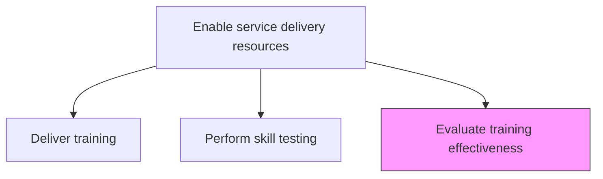
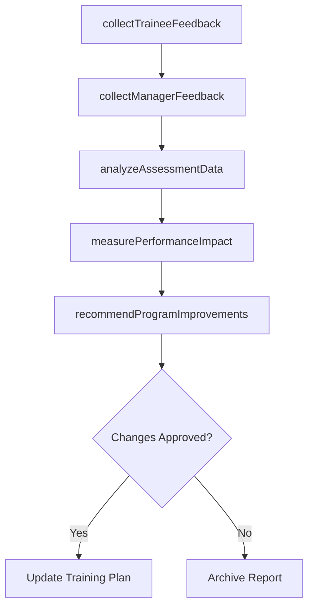

# Evaluate training effectiveness

> Business-as-Code definition for assessing the impact and outcomes of training programs to determine whether learning objectives were met and delivery performance improved.

## Overview

Eliciting feedback from various sources to evaluate the training provided. This can be achieved through testing and the practical application of skills. Additionally, manager or student feedback can be garnered to evaluate training effectiveness.

## Process Hierarchy



## GraphDL

```yaml
evaluate:
  object: Training Effectiveness
  actor: TrainingManager
  result: EffectivenessReport
```

## Actions

| Action | Description |
|--------|-------------|
| collectTraineeFeedback | Gather participant satisfaction and learning experience data |
| collectManagerFeedback | Obtain manager observations on post-training skill application |
| analyzeAssessmentData | Review test scores and competency certification outcomes |
| measurePerformanceImpact | Assess whether training improved delivery performance metrics |
| recommendProgramImprovements | Propose changes to training programs based on effectiveness data |

## Events

| Event | Description |
|-------|-------------|
| traineeFeedbackCollected | Participant satisfaction surveys completed |
| managerFeedbackCollected | Manager post-training evaluations submitted |
| assessmentDataAnalyzed | Test score and certification outcome analysis completed |
| performanceImpactMeasured | Training impact on delivery metrics quantified |
| programImprovementsRecommended | Training program enhancement proposals submitted |

## Searches

| Search | Description |
|--------|-------------|
| getEffectivenessReport | Retrieve training effectiveness analysis for a program or period |
| findTraineeFeedback | List trainee feedback filtered by course, instructor, or rating |
| getPerformanceImpact | Get delivery performance change data attributed to training |
| findImprovementRecommendations | List recommended training program improvements |

## Process Flow



## RACI Matrix

| Activity | Responsible | Accountable | Consulted | Informed |
|----------|-------------|-------------|-----------|----------|
| collectTraineeFeedback | TrainingCoordinator | TrainingManager | Participants | Instructors |
| collectManagerFeedback | TrainingCoordinator | TrainingManager | Delivery Managers | HR |
| measurePerformanceImpact | TrainingManager | VP Operations | PerformanceAnalyst | Executive Team |
| recommendProgramImprovements | TrainingManager | VP Operations | Instructional Designer | All Stakeholders |

## Related Processes

| Process | Relationship |
|---------|-------------|
| 5.2.3.6 Perform skill and capability testing | Upstream - test results are key effectiveness inputs |
| 5.2.3.1 Develop service delivery training plan | Downstream - effectiveness findings inform plan revisions |
| 5.1.1.2 Manage service delivery performance | Parallel - delivery performance data validates training impact |

## Related Departments

| Department | Role |
|-----------|------|
| Training and Development | Owns effectiveness evaluation process |
| Service Delivery | Provides post-training performance data |
| Human Resources | Tracks development outcomes and career impact |
| Quality Assurance | Validates evaluation methodology |

## Related Occupations

| Occupation | Involvement |
|-----------|-------------|
| Training Manager | Primary evaluator of training effectiveness |
| Performance Analyst | Measures delivery performance impact |
| Instructional Designer | Implements program improvements |

## KPIs

| KPI | Description | Unit |
|-----|-------------|------|
| Trainee Satisfaction Score | Average participant satisfaction rating | Score (1-5) |
| Knowledge Transfer Rate | Percentage of training knowledge applied on the job | % |
| Performance Improvement | Delivery performance improvement attributable to training | % |
| Training ROI | Return on investment for training programs | Ratio |

## Usage

```typescript
import { evaluateTrainingEffectiveness } from '@headlessly/evaluate-training-effectiveness'

const effectiveness = evaluateTrainingEffectiveness()

// Collect trainee feedback for a completed program
const feedback = await effectiveness.collectTraineeFeedback({
  programId: 'cloud-migration-cert-2026',
  surveyType: 'kirkpatrick-level-1',
  deadline: '2026-04-01'
})

// Measure performance impact
const impact = await effectiveness.measurePerformanceImpact({
  programId: 'cloud-migration-cert-2026',
  preTrainingPeriod: '2025-Q4',
  postTrainingPeriod: '2026-Q1',
  metrics: ['delivery-quality', 'on-time-completion', 'client-satisfaction']
})

// Recommend program improvements
const recommendations = await effectiveness.recommendProgramImprovements({
  feedbackId: feedback.id,
  impactId: impact.id,
  prioritize: 'by-impact'
})
```
