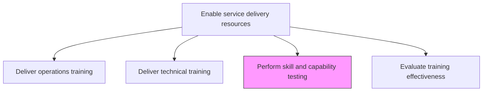
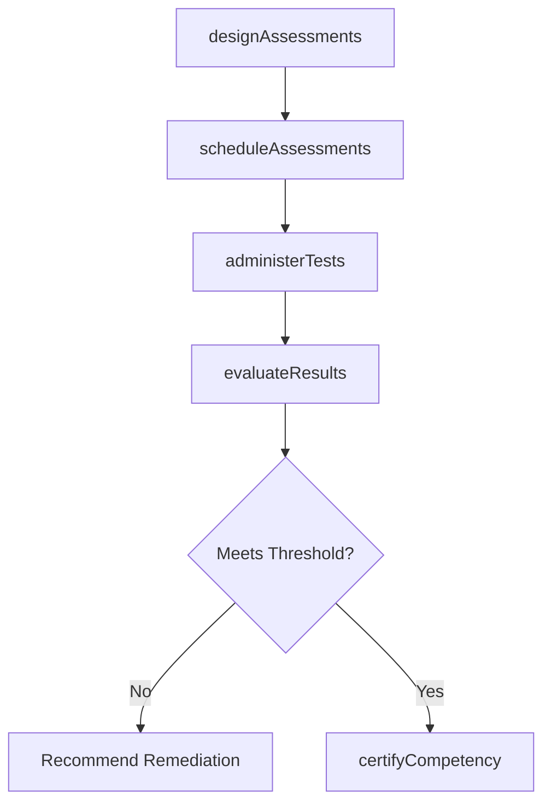

# Perform skill and capability testing

> Business-as-Code definition for administering formal assessments to verify that service delivery personnel have acquired the required skills and competencies for their roles.

## Overview

Verifying that training provided to the person was successful through the administration testing and the application of skills for practical use.

## Process Hierarchy



## GraphDL

```yaml
perform:
  object: Skill And Capability Testing
  actor: AssessmentCoordinator
  result: SkillAssessmentReport
```

## Actions

| Action | Description |
|--------|-------------|
| designAssessments | Create skill tests aligned with training objectives and role requirements |
| scheduleAssessments | Plan and coordinate assessment sessions with participants |
| administerTests | Execute formal skill assessments in controlled conditions |
| evaluateResults | Score and analyze assessment outcomes against proficiency thresholds |
| certifyCompetency | Formally confirm skill competency for participants meeting standards |

## Events

| Event | Description |
|-------|-------------|
| assessmentsDesigned | Skill assessment instruments created and validated |
| assessmentsScheduled | Assessment sessions planned and participants notified |
| testsAdministered | Formal skill assessments conducted |
| resultsEvaluated | Assessment scores analyzed and competency determined |
| competencyCertified | Participant skill competency formally confirmed |

## Searches

| Search | Description |
|--------|-------------|
| findAssessments | List assessments filtered by skill, date, or status |
| getAssessmentResults | Retrieve test results for a participant or session |
| findCompetencyGaps | List participants who did not meet proficiency thresholds |
| getCertifiedPersonnel | Get list of personnel with certified competencies |

## Process Flow



## RACI Matrix

| Activity | Responsible | Accountable | Consulted | Informed |
|----------|-------------|-------------|-----------|----------|
| designAssessments | AssessmentCoordinator | TrainingManager | SubjectMatterExperts | Instructors |
| administerTests | AssessmentCoordinator | TrainingManager | IT | Participants |
| evaluateResults | AssessmentCoordinator | TrainingManager | QualityAssurance | ResourceManager |
| certifyCompetency | TrainingManager | VP Operations | HR | Participants |

## Related Processes

| Process | Relationship |
|---------|-------------|
| 5.2.3.4 Deliver operations training | Upstream - operations training precedes skill testing |
| 5.2.3.5 Deliver technical training | Upstream - technical training precedes skill testing |
| 5.2.3.7 Evaluate training effectiveness | Downstream - test results feed effectiveness evaluation |

## Related Departments

| Department | Role |
|-----------|------|
| Training and Development | Owns assessment design and administration |
| Quality Assurance | Validates assessment methodology and standards |
| Service Delivery | Defines proficiency requirements for delivery roles |
| Human Resources | Records competency certifications |

## Related Occupations

| Occupation | Involvement |
|-----------|-------------|
| Assessment Coordinator | Primary test administrator |
| Training Manager | Oversees assessment program |
| Quality Assurance Analyst | Validates assessment rigor |

## KPIs

| KPI | Description | Unit |
|-----|-------------|------|
| Assessment Pass Rate | Percentage of participants meeting proficiency thresholds | % |
| Average Assessment Score | Mean score across all participants and assessments | Score (0-100) |
| Remediation Rate | Percentage of participants requiring additional training | % |
| Certification Throughput | Number of competency certifications issued per quarter | Count |

## Usage

```typescript
import { performSkillAndCapabilityTesting } from '@headlessly/perform-skill-and-capability-testing'

const testing = performSkillAndCapabilityTesting()

// Design assessments for cloud migration skills
const assessment = await testing.designAssessments({
  skills: ['aws-migration', 'infrastructure-as-code', 'data-migration'],
  format: 'practical-plus-written',
  proficiencyThreshold: 80
})

// Administer tests to trained participants
const results = await testing.administerTests({
  assessmentId: assessment.id,
  participants: ['emp-301', 'emp-302', 'emp-303'],
  testDate: '2026-03-20'
})

// Certify competency for qualifying participants
await testing.certifyCompetency({
  resultsId: results.id,
  certificationLevel: 'advanced',
  validityPeriod: '24-months'
})
```
