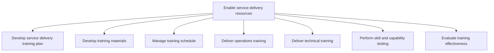
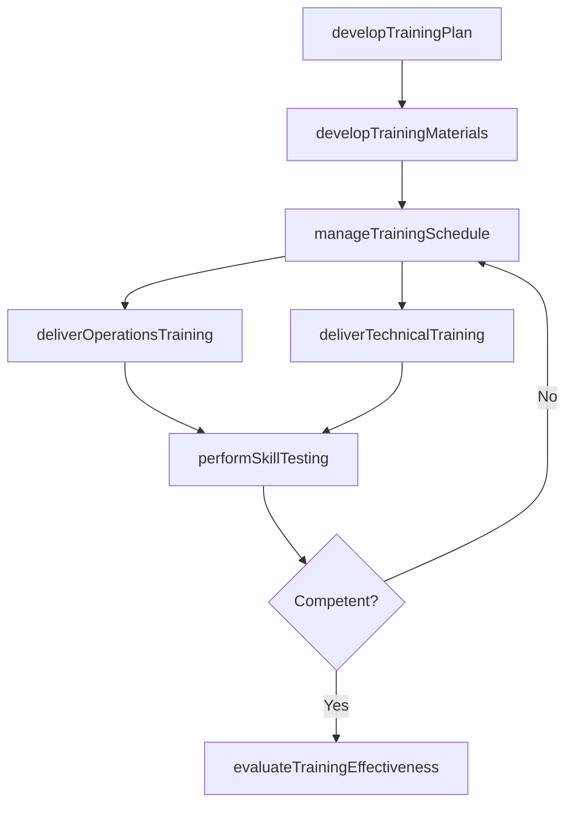

# Enable service-delivery resources

> Business-as-Code definition for service delivery resource enablement. Models training plan development, materials creation, schedule management, operations and technical training delivery, skill testing, and effectiveness evaluation as programmable workflows.

## Overview

Instituting training to enable resources to provide service delivery to the customer. Develop a training plan. Create materials that provide for operation and technical training. Schedule, perform, and evaluate training.

## Process Hierarchy



## GraphDL

```yaml
enable:
  object: Service-delivery Resources
  actor: TrainingManager
  result: EnabledResource
```

## Actions

| Action | Description |
|--------|-------------|
| developTrainingPlan | Create comprehensive training plan for service delivery skills |
| developTrainingMaterials | Build courseware and materials for operations and technical training |
| manageTrainingSchedule | Coordinate training sessions within resource availability windows |
| deliverOperationsTraining | Conduct training on service delivery operational processes |
| deliverTechnicalTraining | Conduct training on technical tools, systems, and methodologies |
| performSkillTesting | Administer assessments to verify skill and capability acquisition |
| evaluateTrainingEffectiveness | Measure training outcomes against learning objectives |

## Events

| Event | Description |
|-------|-------------|
| trainingPlanDeveloped | Training plan created and approved for delivery cycle |
| trainingMaterialsDeveloped | Course materials created and reviewed for quality |
| trainingScheduleManaged | Training sessions scheduled and resources confirmed |
| operationsTrainingDelivered | Operations training session completed |
| technicalTrainingDelivered | Technical training session completed |
| skillTestingPerformed | Skill assessments administered and results recorded |
| trainingEffectivenessEvaluated | Training outcomes measured and improvement areas identified |

## Searches

| Search | Description |
|--------|-------------|
| getTrainingPlan | Retrieve training plan by period, role, or service line |
| getTrainingSchedule | Query upcoming training sessions and availability |
| getSkillTestResults | Retrieve assessment scores by resource or skill area |
| getTrainingEffectiveness | Query training effectiveness metrics and trends |
| getCertificationStatus | Check resource certification and qualification status |

## Process Flow



## RACI Matrix

| Activity | Responsible | Accountable | Consulted | Informed |
|----------|-------------|-------------|-----------|----------|
| developTrainingPlan | TrainingCoordinator | TrainingManager | DeliveryLeads, HR | ResourcePlanning |
| developTrainingMaterials | InstructionalDesigner | TrainingManager | SubjectMatterExperts | QA |
| deliverTechnicalTraining | TechnicalTrainer | TrainingManager | Engineering, IT | DeliveryManagers |
| performSkillTesting | AssessmentSpecialist | TrainingManager | HR, DeliveryLeads | ResourcePlanning |

## Sub-Processes

| ID | Name | Description |
|----|------|-------------|
| 5.2.3.1 | Develop service delivery training plan | Creating a detailed summary of all the actions relevant to teaching a person a particular skill or t |
| 5.2.3.2 | Develop training materials | Developing materials necessary to provide comprehensive training for the skills or behavior needed t |
| 5.2.3.3 | Manage training schedule | Providing training to the employee within a manageable timeframe to meet the needs of both the indiv |
| 5.2.3.4 | Deliver operations training | Educating service delivery personnel on all aspects of the operations process of the organization. |
| 5.2.3.5 | Deliver technical training | Ensuring that all personnel are trained on all technical aspects of service delivery. |
| 5.2.3.6 | Perform skill and capability testing | Verifying that training provided to the person was successful through the administration testing and |
| 5.2.3.7 | Evaluate training effectiveness | Eliciting feedback from various sources to evaluate the training provided. This can be achieved thro |

## Related Processes

| Process | Relationship |
|---------|-------------|
| 5.2.2 Create and manage resource plan | Upstream - resource plan identifies training needs and gaps |
| 5.3.1 Initiate service delivery | Downstream - enabled resources are assigned to engagements |
| 7.4 Manage employee development | Parallel - training programs align with career development |
| 7.6 Manage employee information and analytics | Parallel - skill records updated after training |

## Related Departments

| Department | Role |
|-----------|------|
| Learning and Development | Primary owner of training content and delivery |
| Service Delivery | Provides subject matter experts and validates training relevance |
| Human Resources | Tracks certifications and manages learning management system |
| Quality Assurance | Reviews training materials and assessment standards |

## Related Occupations

| Occupation | Involvement |
|-----------|-------------|
| Training Manager | Overall training program management and effectiveness |
| Instructional Designer | Course material and assessment development |
| Technical Trainer | Hands-on technical skill delivery |

## KPIs

| KPI | Description | Unit |
|-----|-------------|------|
| Training Completion Rate | Percentage of assigned training completed on time | % |
| Skill Assessment Pass Rate | Percentage of resources passing skill assessments on first attempt | % |
| Training Satisfaction Score | Average trainee satisfaction rating | Score (1-5) |
| Time to Competency | Average time from training start to certification | Days |

## Usage

```typescript
import { enableServiceDeliveryResources } from '@headlessly/enable-service-delivery-resources'

const client = enableServiceDeliveryResources()

// Develop training plan
const plan = await client.developTrainingPlan({
  role: 'Solution Architect',
  skills: ['cloud-architecture', 'integration-patterns', 'client-presentation'],
  targetCompletionDate: '2025-08-01'
})

// Perform skill testing
const results = await client.performSkillTesting({
  resourceId: 'EMP-4520',
  assessmentType: 'technical-certification',
  skillArea: 'cloud-architecture',
  passingScore: 80
})
```
