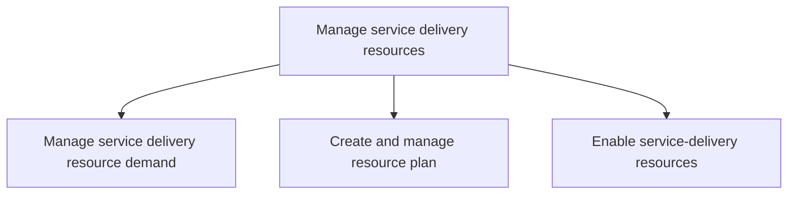
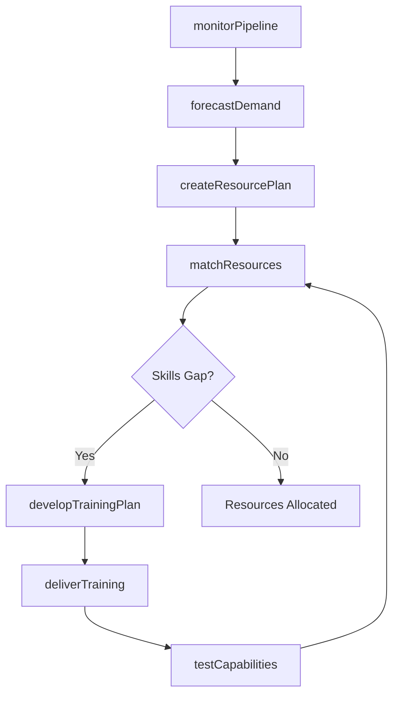

# Manage service delivery resources

> Business-as-Code definition for service delivery resource management. Models demand forecasting, capacity planning, skills taxonomy, resource allocation, and training enablement as programmable workflows.

## Overview

Understanding the demands on resources and creating a plan to enable the delivery of services via those resources.

## Process Hierarchy



## GraphDL

```yaml
manage:
  object: Service Delivery Resources
  actor: ResourcePlanner
  result: ResourcePlan
```

## Actions

| Action | Description |
|--------|-------------|
| forecastDemand | Develop baseline and consensus resource demand forecasts |
| monitorPipeline | Track sales pipeline to anticipate future resource needs |
| createResourcePlan | Build resource plan matching demand with capacity and skills |
| matchResources | Align resource demand with available skills and capabilities |
| developTrainingPlan | Design training programs to close skill gaps |
| deliverTraining | Execute operations and technical training for delivery staff |
| evaluateTraining | Assess training effectiveness and competency improvements |
| testCapabilities | Perform skill and capability testing of delivery resources |

## Events

| Event | Description |
|-------|-------------|
| demandForecasted | Resource demand forecast created and validated |
| pipelineMonitored | Sales pipeline reviewed and resource implications assessed |
| resourcePlanCreated | Resource plan generated matching capacity to demand |
| resourcesMatched | Available skills and capabilities mapped to engagement needs |
| trainingPlanDeveloped | Training curriculum and schedule designed |
| trainingDelivered | Training sessions executed for delivery team members |
| trainingEvaluated | Training effectiveness measured and gaps identified |
| capabilitiesTested | Skill assessments completed and certifications updated |

## Searches

| Search | Description |
|--------|-------------|
| findAvailableResources | Query resources by skill, availability, and location |
| getDemandForecast | Retrieve resource demand projections by service line |
| getSkillsGap | Identify gaps between required and available competencies |
| getTrainingStatus | Query training completion rates and certification status |
| getUtilizationRates | Retrieve resource utilization and bench data |

## Process Flow



## RACI Matrix

| Activity | Responsible | Accountable | Consulted | Informed |
|----------|-------------|-------------|-----------|----------|
| forecastDemand | ResourcePlanner | VP Delivery | Sales, AccountManagement | Finance |
| createResourcePlan | ResourceManager | VP Delivery | HR, Recruiting | PMO |
| matchResources | StaffingCoordinator | ResourceManager | EngagementManagers | DeliveryLeads |
| developTrainingPlan | LearningManager | VP Delivery | SubjectMatterExperts | HR |
| deliverTraining | TrainingInstructor | LearningManager | DeliveryLeads | ResourceManager |

## Sub-Processes

| ID | Name | Description |
|----|------|-------------|
| 5.2.1 | Manage service delivery resource demand | Ensuring necessary resources are maintained through monitoring pipeline, developing forecasts, and c |
| 5.2.2 | Create and manage resource plan | Identifying the need for and creating a resource plan. Understand resource demand and align with cap |
| 5.2.3 | Enable service-delivery resources | Instituting training to enable resources to provide service delivery to the customer. Develop a trai |

## Related Processes

| Process | Relationship |
|---------|-------------|
| 5.1 Establish service delivery governance and strategies | Upstream - governance policies guide resource planning |
| 5.3 Deliver service to customer | Downstream - resources are consumed during delivery |
| 7.3 Manage human capital development | Parallel - training and development of delivery staff |

## Related Departments

| Department | Role |
|-----------|------|
| Resource Management | Primary owner of capacity planning and allocation |
| Professional Services | Provides delivery resources and skill profiles |
| Human Resources | Supports recruiting, training, and workforce planning |
| Learning and Development | Designs and delivers training programs |
| Sales | Provides pipeline data for demand forecasting |

## Related Occupations

| Occupation | Involvement |
|-----------|-------------|
| Resource Planner | Demand forecasting and capacity management |
| Staffing Coordinator | Resource matching and assignment |
| Learning and Development Manager | Training program design and delivery |
| Workforce Analyst | Utilization analysis and bench management |

## KPIs

| KPI | Description | Unit |
|-----|-------------|------|
| Resource Utilization | Percentage of billable time versus available time | % |
| Bench Rate | Percentage of delivery resources without active assignments | % |
| Forecast Accuracy | Variance between forecasted and actual resource demand | % |
| Training Completion Rate | Percentage of required training completed on schedule | % |
| Skill Coverage | Percentage of demand-critical skills available in-house | % |

## Usage

```typescript
import { manageServiceDeliveryResources } from '@headlessly/manage-service-delivery-resources'

const client = manageServiceDeliveryResources()

// Forecast resource demand
const forecast = await client.forecastDemand({
  serviceLine: 'cloud-implementation',
  horizon: { months: 6 },
  pipelineSource: 'CRM'
})

// Match resources to engagement needs
const assignments = await client.matchResources({
  engagementId: 'ENG-2025-0456',
  requiredSkills: ['AWS', 'terraform', 'project-management'],
  startDate: '2025-05-01',
  duration: { weeks: 8 }
})

// Evaluate training effectiveness
const evaluation = await client.evaluateTraining({
  programId: 'TRN-cloud-cert',
  cohort: '2025-Q2',
  metrics: ['pass-rate', 'skill-improvement', 'time-to-productivity']
})
```
