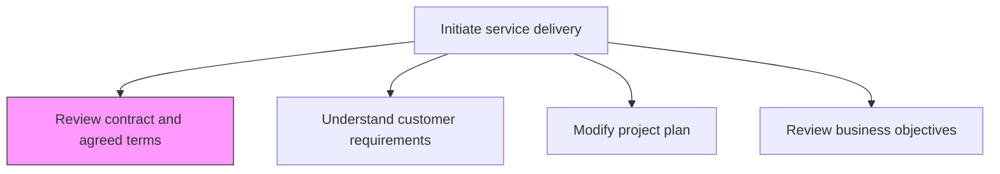
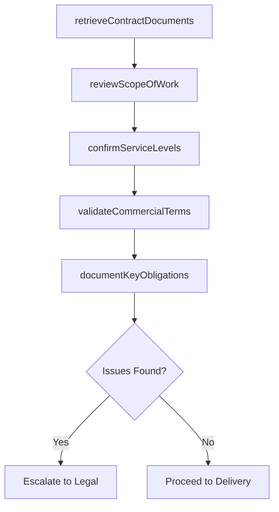

# Review contract and agreed terms

> Business-as-Code definition for examining the contractual agreement, scope of work, service levels, and commercial terms prior to initiating service delivery.

## Overview

Meeting with the customer, partner, and/or supplier to review the terms of the solutions contract and agree on the terms set forth.

## Process Hierarchy



## GraphDL

```yaml
review:
  object: Contract And Agreed Terms
  actor: EngagementManager
  result: ContractReviewSummary
```

## Actions

| Action | Description |
|--------|-------------|
| retrieveContractDocuments | Gather the executed contract and all associated amendments |
| reviewScopeOfWork | Examine deliverables, milestones, and acceptance criteria |
| confirmServiceLevels | Verify agreed SLAs, response times, and quality standards |
| validateCommercialTerms | Review pricing, payment schedules, and penalty clauses |
| documentKeyObligations | Summarize critical contractual obligations for the delivery team |

## Events

| Event | Description |
|-------|-------------|
| contractDocumentsRetrieved | All contract documents collected and organized |
| scopeOfWorkReviewed | Deliverables and milestones confirmed |
| serviceLevelsConfirmed | SLAs and quality standards verified |
| commercialTermsValidated | Pricing and payment terms reviewed |
| keyObligationsDocumented | Critical obligations summarized for delivery team |

## Searches

| Search | Description |
|--------|-------------|
| findContractTerms | Retrieve contract terms filtered by engagement, clause type, or date |
| getServiceLevelAgreements | Get SLAs associated with a specific contract |
| findContractObligations | List key obligations for a service delivery engagement |
| getContractAmendments | Retrieve amendment history for a contract |

## Process Flow



## RACI Matrix

| Activity | Responsible | Accountable | Consulted | Informed |
|----------|-------------|-------------|-----------|----------|
| reviewScopeOfWork | EngagementManager | ServiceDeliveryManager | ProjectManager | DeliveryTeam |
| confirmServiceLevels | EngagementManager | ServiceDeliveryManager | QualityAssurance | Operations |
| validateCommercialTerms | EngagementManager | VP Operations | Finance, Legal | AccountManager |

## Related Processes

| Process | Relationship |
|---------|-------------|
| 5.3.1.2 Understand customer requirements | Downstream - contract review informs requirements refinement |
| 5.3.1.3 Modify/revise and approve project plan | Downstream - contract terms constrain project planning |
| 5.3.3.4 Confirm delivery according to contract terms | Downstream - contract terms are basis for delivery confirmation |

## Related Departments

| Department | Role |
|-----------|------|
| Service Delivery | Owns contract review for delivery initiation |
| Legal | Provides contract interpretation guidance |
| Finance | Validates commercial terms and billing structure |
| Account Management | Facilitates client communication on contract matters |

## Related Occupations

| Occupation | Involvement |
|-----------|-------------|
| Engagement Manager | Primary contract reviewer |
| Legal Counsel | Advises on contractual obligations |
| Project Manager | Translates contract terms into project constraints |

## KPIs

| KPI | Description | Unit |
|-----|-------------|------|
| Contract Review Completion Time | Average time to complete contract review before delivery start | Days |
| Issue Detection Rate | Percentage of contracts with issues identified during review | % |
| SLA Clarity Score | Rating of how clearly SLAs are defined and understood | Score (1-5) |

## Usage

```typescript
import { reviewContractAndAgreedTerms } from '@headlessly/review-contract-and-agreed-terms'

const contract = reviewContractAndAgreedTerms()

// Retrieve and review contract documents
const documents = await contract.retrieveContractDocuments({
  engagementId: 'eng-789',
  includeAmendments: true
})

// Confirm service levels
const slas = await contract.confirmServiceLevels({
  contractId: documents.contractId,
  categories: ['response-time', 'uptime', 'delivery-milestones']
})

// Document key obligations
await contract.documentKeyObligations({
  contractId: documents.contractId,
  audience: 'delivery-team',
  format: 'summary-checklist'
})
```
