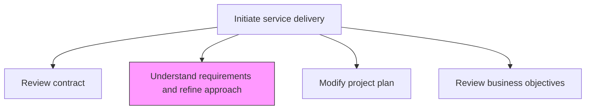
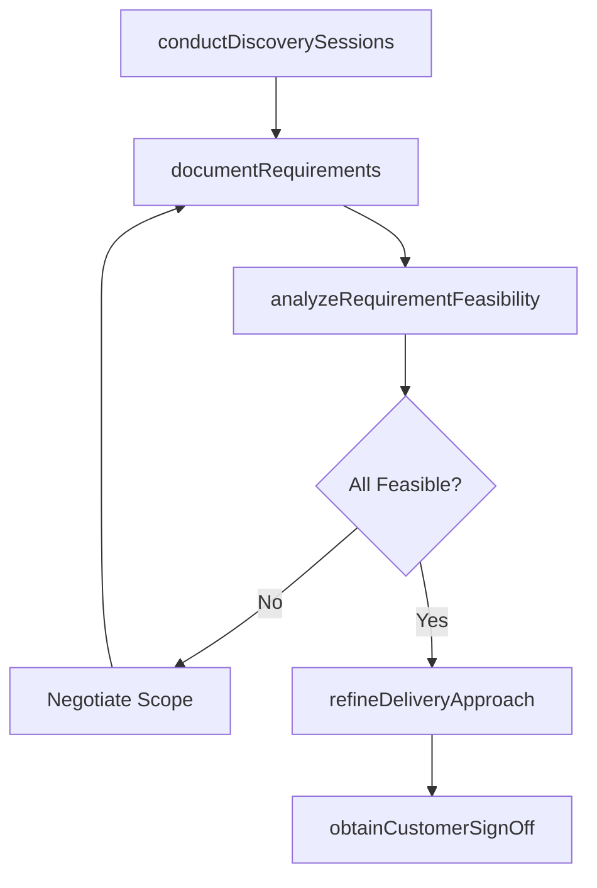

# Understand customer requirements and define refine approach

> Business-as-Code definition for deeply analyzing customer requirements and refining the service delivery approach to ensure alignment between customer expectations and the proposed solution.

## Overview

Taking the customer requirements for a solution and applying those requirements to a refined approach for service.

## Process Hierarchy



## GraphDL

```yaml
understand:
  object: Customer Requirements And Define Refine Approach
  actor: SolutionArchitect
  result: RefinedApproach
```

## Actions

| Action | Description |
|--------|-------------|
| conductDiscoverySessions | Facilitate workshops with the customer to elicit detailed requirements |
| documentRequirements | Record and structure all gathered requirements in a formal document |
| analyzeRequirementFeasibility | Assess whether requirements can be met within scope and constraints |
| refineDeliveryApproach | Adjust the service delivery methodology based on requirements analysis |
| obtainCustomerSignOff | Secure customer agreement on the refined approach |

## Events

| Event | Description |
|-------|-------------|
| discoverySessionsConducted | Customer requirements workshops completed |
| requirementsDocumented | Formal requirements document created and reviewed |
| requirementFeasibilityAnalyzed | Feasibility assessment of requirements completed |
| deliveryApproachRefined | Service delivery methodology updated |
| customerSignOffObtained | Customer approved the refined approach |

## Searches

| Search | Description |
|--------|-------------|
| findRequirements | Retrieve requirements filtered by engagement, priority, or category |
| getApproachDocumentation | Get the refined delivery approach for an engagement |
| findFeasibilityIssues | List requirements with identified feasibility concerns |
| getSignOffStatus | Retrieve customer sign-off status for the refined approach |

## Process Flow



## RACI Matrix

| Activity | Responsible | Accountable | Consulted | Informed |
|----------|-------------|-------------|-----------|----------|
| conductDiscoverySessions | SolutionArchitect | EngagementManager | Clients | DeliveryTeam |
| analyzeRequirementFeasibility | SolutionArchitect | EngagementManager | TechnicalLead | Finance |
| refineDeliveryApproach | SolutionArchitect | EngagementManager | ProjectManager | ResourceManager |

## Related Processes

| Process | Relationship |
|---------|-------------|
| 5.3.1.1 Review contract and agreed terms | Upstream - contract defines scope boundaries |
| 5.3.1.3 Modify/revise and approve project plan | Downstream - refined approach informs project plan updates |
| 5.3.2.1 Analyze environment and customer needs | Downstream - requirements feed into solution analysis |

## Related Departments

| Department | Role |
|-----------|------|
| Service Delivery | Owns requirements analysis and approach refinement |
| Solution Architecture | Provides technical feasibility expertise |
| Account Management | Facilitates customer access and communication |

## Related Occupations

| Occupation | Involvement |
|-----------|-------------|
| Solution Architect | Primary requirements analyst |
| Engagement Manager | Oversees approach refinement process |
| Business Analyst | Documents and structures requirements |

## KPIs

| KPI | Description | Unit |
|-----|-------------|------|
| Requirements Clarity Score | Rating of how well requirements are defined and understood | Score (1-5) |
| Discovery Completion Time | Time from engagement start to finalized requirements | Days |
| Scope Change Rate | Percentage of requirements changed after initial sign-off | % |

## Usage

```typescript
import { understandCustomerRequirementsAndDefineRefineApproach } from '@headlessly/understand-customer-requirements-and-define-refine-approach'

const requirements = understandCustomerRequirementsAndDefineRefineApproach()

// Conduct discovery sessions with the customer
const discovery = await requirements.conductDiscoverySessions({
  engagementId: 'eng-789',
  participants: ['client-cto', 'client-pm', 'solution-architect'],
  topics: ['business-processes', 'technical-landscape', 'success-criteria']
})

// Analyze requirement feasibility
const feasibility = await requirements.analyzeRequirementFeasibility({
  discoveryId: discovery.id,
  constraints: ['timeline', 'budget', 'technology']
})

// Refine delivery approach
const approach = await requirements.refineDeliveryApproach({
  feasibilityId: feasibility.id,
  methodology: 'agile-hybrid',
  deliveryModel: 'onsite-offshore'
})
```
