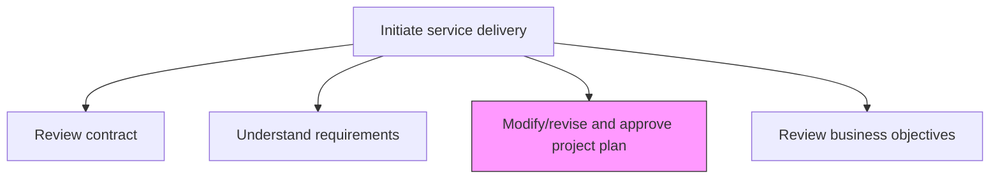
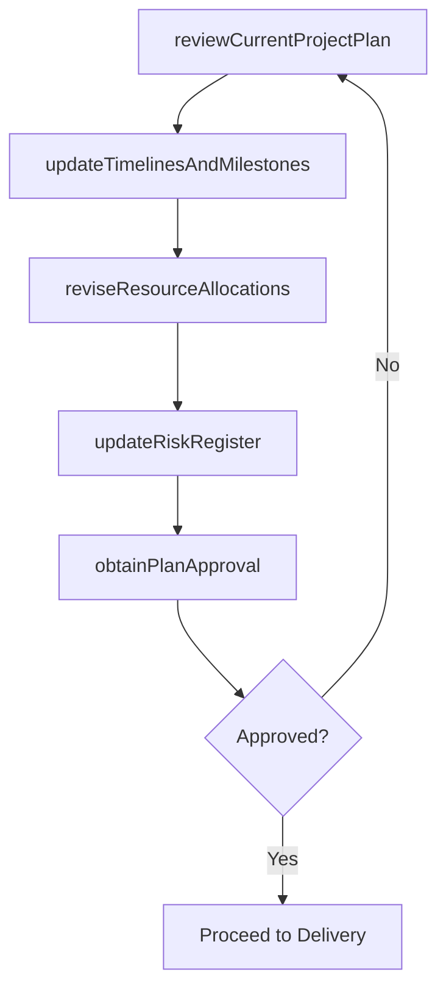

# Modify/revise and approve project plan

> Business-as-Code definition for updating the project plan to reflect refined requirements, approach changes, and stakeholder feedback, then securing formal approval to proceed.

## Overview

Updating the project plan to align with the new solution approach agreed upon with the customer.

## Process Hierarchy



## GraphDL

```yaml
modify/revise:
  object: And Approve Project Plan
  actor: ProjectManager
  result: ApprovedProjectPlan
```

## Actions

| Action | Description |
|--------|-------------|
| reviewCurrentProjectPlan | Examine the existing project plan against refined requirements |
| updateTimelinesAndMilestones | Adjust schedules and milestones based on the revised approach |
| reviseResourceAllocations | Modify team assignments and resource commitments |
| updateRiskRegister | Refresh the risk assessment based on plan changes |
| obtainPlanApproval | Secure stakeholder and customer sign-off on the revised plan |

## Events

| Event | Description |
|-------|-------------|
| currentProjectPlanReviewed | Existing plan reviewed against updated requirements |
| timelinesAndMilestonesUpdated | Schedule and milestone adjustments completed |
| resourceAllocationsRevised | Team assignments updated in the project plan |
| riskRegisterUpdated | Risk assessment refreshed for revised plan |
| planApprovalObtained | Stakeholder approval for revised project plan secured |

## Searches

| Search | Description |
|--------|-------------|
| getProjectPlan | Retrieve the current project plan for an engagement |
| findPlanRevisions | List revision history for a project plan |
| getMilestoneStatus | Get milestone tracking data for the project plan |
| findPlanApprovals | List approval records for a project plan version |

## Process Flow



## RACI Matrix

| Activity | Responsible | Accountable | Consulted | Informed |
|----------|-------------|-------------|-----------|----------|
| reviewCurrentProjectPlan | ProjectManager | EngagementManager | SolutionArchitect | DeliveryTeam |
| updateTimelinesAndMilestones | ProjectManager | EngagementManager | Clients | ResourceManager |
| obtainPlanApproval | ProjectManager | EngagementManager | VP Operations, Client | Finance |

## Related Processes

| Process | Relationship |
|---------|-------------|
| 5.3.1.2 Understand customer requirements | Upstream - refined requirements drive plan changes |
| 5.3.1.6 Identify, select, and assign resources | Downstream - approved plan triggers resource assignment |
| 5.3.2 Execute service delivery | Downstream - approved plan guides execution |

## Related Departments

| Department | Role |
|-----------|------|
| Project Management | Owns project plan modification and approval |
| Service Delivery | Validates plan feasibility and resource needs |
| Finance | Approves budget adjustments in revised plan |

## Related Occupations

| Occupation | Involvement |
|-----------|-------------|
| Project Manager | Primary plan modifier and approval seeker |
| Engagement Manager | Sponsors plan revision process |
| Resource Coordinator | Validates resource allocation changes |

## KPIs

| KPI | Description | Unit |
|-----|-------------|------|
| Plan Revision Cycle Time | Average time to revise and approve a project plan | Days |
| Plan Approval Rate | Percentage of revised plans approved on first submission | % |
| Milestone Accuracy | Percentage of milestones met as defined in the approved plan | % |

## Usage

```typescript
import { modifyReviseAndApproveProjectPlan } from '@headlessly/modify-revise-and-approve-project-plan'

const projectPlan = modifyReviseAndApproveProjectPlan()

// Review and update timelines
const updated = await projectPlan.updateTimelinesAndMilestones({
  engagementId: 'eng-789',
  adjustments: [
    { milestone: 'discovery-complete', newDate: '2026-03-15' },
    { milestone: 'solution-delivered', newDate: '2026-06-30' }
  ]
})

// Update risk register
await projectPlan.updateRiskRegister({
  planId: updated.planId,
  newRisks: ['timeline-compression', 'resource-availability']
})

// Obtain plan approval
await projectPlan.obtainPlanApproval({
  planId: updated.planId,
  approvers: ['engagement-manager', 'client-pm', 'vp-operations']
})
```
