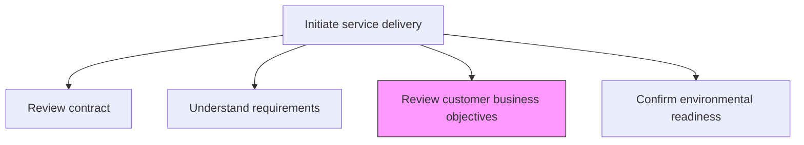
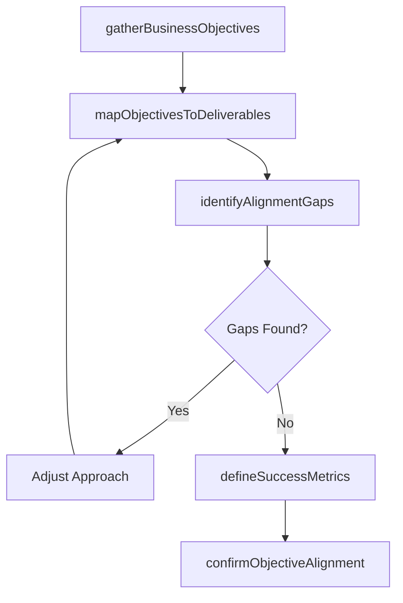

# Review customer business objectives

> Business-as-Code definition for examining the customer's strategic business goals to ensure the service delivery solution directly supports their desired outcomes and value realization.

## Overview

Aligning the customer business objectives with the agreed service delivery solution.

## Process Hierarchy



## GraphDL

```yaml
review:
  object: Customer Business Objectives
  actor: EngagementManager
  result: ObjectivesAlignmentReport
```

## Actions

| Action | Description |
|--------|-------------|
| gatherBusinessObjectives | Collect the customer's strategic goals and success metrics |
| mapObjectivesToDeliverables | Link customer objectives to specific service delivery outputs |
| identifyAlignmentGaps | Detect mismatches between objectives and the proposed solution |
| defineSuccessMetrics | Establish measurable criteria for evaluating objective achievement |
| confirmObjectiveAlignment | Obtain customer confirmation that delivery approach supports objectives |

## Events

| Event | Description |
|-------|-------------|
| businessObjectivesGathered | Customer strategic goals collected and documented |
| objectivesMappedToDeliverables | Objectives linked to specific deliverables |
| alignmentGapsIdentified | Gaps between objectives and solution documented |
| successMetricsDefined | Measurable success criteria established |
| objectiveAlignmentConfirmed | Customer confirmed delivery approach supports their goals |

## Searches

| Search | Description |
|--------|-------------|
| findBusinessObjectives | Retrieve customer objectives for an engagement |
| getObjectiveMapping | Get the mapping between objectives and deliverables |
| findAlignmentGaps | List identified gaps between objectives and solution |
| getSuccessMetrics | Retrieve defined success metrics for an engagement |

## Process Flow



## RACI Matrix

| Activity | Responsible | Accountable | Consulted | Informed |
|----------|-------------|-------------|-----------|----------|
| gatherBusinessObjectives | EngagementManager | ServiceDeliveryManager | Clients | DeliveryTeam |
| mapObjectivesToDeliverables | SolutionArchitect | EngagementManager | ProjectManager | Finance |
| defineSuccessMetrics | EngagementManager | ServiceDeliveryManager | Clients | QualityAssurance |

## Related Processes

| Process | Relationship |
|---------|-------------|
| 5.3.1.2 Understand customer requirements | Parallel - objectives complement detailed requirements |
| 5.3.3.1 Conduct service delivery project review | Downstream - objectives are basis for success evaluation |
| 5.3.1.1 Review contract and agreed terms | Upstream - contract frames objective scope |

## Related Departments

| Department | Role |
|-----------|------|
| Service Delivery | Owns objective alignment review |
| Account Management | Provides strategic customer context |
| Solution Architecture | Maps objectives to technical deliverables |

## Related Occupations

| Occupation | Involvement |
|-----------|-------------|
| Engagement Manager | Primary objective reviewer |
| Solution Architect | Maps objectives to solution components |
| Account Manager | Provides client business context |

## KPIs

| KPI | Description | Unit |
|-----|-------------|------|
| Objective Alignment Score | Degree of alignment between objectives and delivery approach | Score (1-10) |
| Objective Coverage | Percentage of customer objectives addressed by deliverables | % |
| Success Metric Definition Rate | Percentage of objectives with measurable success criteria | % |

## Usage

```typescript
import { reviewCustomerBusinessObjectives } from '@headlessly/review-customer-business-objectives'

const objectives = reviewCustomerBusinessObjectives()

// Gather customer business objectives
const goals = await objectives.gatherBusinessObjectives({
  engagementId: 'eng-789',
  clientStakeholders: ['cto', 'vp-operations', 'program-director']
})

// Map objectives to deliverables
const mapping = await objectives.mapObjectivesToDeliverables({
  objectiveIds: goals.map(g => g.id),
  deliverableList: 'project-plan-v2'
})

// Define success metrics
await objectives.defineSuccessMetrics({
  mappingId: mapping.id,
  metricTypes: ['quantitative', 'qualitative'],
  measurementFrequency: 'monthly'
})
```
