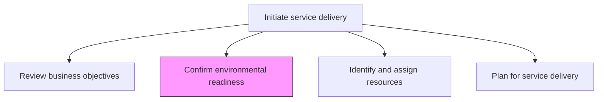
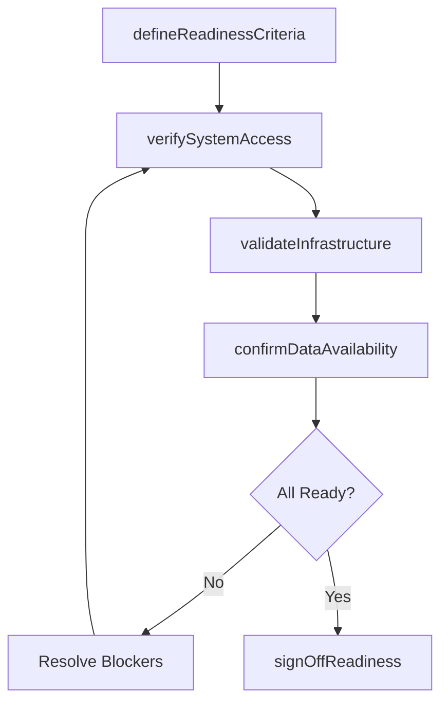

# Confirm environmental readiness

> Business-as-Code definition for verifying that all necessary environments, systems, access, and infrastructure prerequisites are in place before service delivery commences.

## Overview

Confirming that the organization has the recourses necessary to meet the expectations for the solution for service delivery.

## Process Hierarchy



## GraphDL

```yaml
confirm:
  object: Environmental Readiness
  actor: TechnicalLead
  result: ReadinessChecklist
```

## Actions

| Action | Description |
|--------|-------------|
| defineReadinessCriteria | Establish the checklist of prerequisites required for delivery start |
| verifySystemAccess | Confirm that delivery team has required access to customer systems |
| validateInfrastructure | Ensure technical environments and tools are provisioned and functional |
| confirmDataAvailability | Verify that required data and documentation are accessible |
| signOffReadiness | Formally confirm all readiness criteria have been met |

## Events

| Event | Description |
|-------|-------------|
| readinessCriteriaDefined | Prerequisite checklist for delivery start established |
| systemAccessVerified | Delivery team system access confirmed |
| infrastructureValidated | Technical environments verified as operational |
| dataAvailabilityConfirmed | Required data and documents confirmed accessible |
| readinessSignedOff | Formal readiness confirmation completed |

## Searches

| Search | Description |
|--------|-------------|
| getReadinessChecklist | Retrieve the readiness checklist for an engagement |
| findBlockingItems | List readiness items not yet completed |
| getAccessStatus | Get system access status for delivery team members |
| getInfrastructureStatus | Retrieve infrastructure provisioning status |

## Process Flow



## RACI Matrix

| Activity | Responsible | Accountable | Consulted | Informed |
|----------|-------------|-------------|-----------|----------|
| defineReadinessCriteria | TechnicalLead | EngagementManager | ProjectManager | DeliveryTeam |
| verifySystemAccess | TechnicalLead | EngagementManager | Client IT | Security |
| signOffReadiness | EngagementManager | ServiceDeliveryManager | TechnicalLead | All Stakeholders |

## Related Processes

| Process | Relationship |
|---------|-------------|
| 5.3.1.3 Modify/revise and approve project plan | Upstream - project plan defines readiness requirements |
| 5.3.1.7 Plan for service delivery | Downstream - readiness confirmation enables delivery planning |
| 5.3.2.1 Analyze environment and customer needs | Downstream - confirmed environment supports analysis |

## Related Departments

| Department | Role |
|-----------|------|
| Service Delivery | Owns environmental readiness verification |
| IT | Provides infrastructure and access provisioning |
| Security | Validates access controls and compliance |

## Related Occupations

| Occupation | Involvement |
|-----------|-------------|
| Technical Lead | Primary readiness verifier |
| Engagement Manager | Signs off on readiness |
| IT Administrator | Provisions access and infrastructure |

## KPIs

| KPI | Description | Unit |
|-----|-------------|------|
| Readiness Completion Rate | Percentage of checklist items confirmed before delivery start | % |
| Time to Readiness | Average days from initiation to full environmental readiness | Days |
| Blocker Resolution Time | Average time to resolve readiness blockers | Days |

## Usage

```typescript
import { confirmEnvironmentalReadiness } from '@headlessly/confirm-environmental-readiness'

const readiness = confirmEnvironmentalReadiness()

// Define readiness criteria
const checklist = await readiness.defineReadinessCriteria({
  engagementId: 'eng-789',
  categories: ['system-access', 'infrastructure', 'data', 'security']
})

// Verify system access
await readiness.verifySystemAccess({
  checklistId: checklist.id,
  teamMembers: ['lead-architect', 'developer-1', 'developer-2'],
  systems: ['client-cloud', 'client-jira', 'client-repo']
})

// Sign off on readiness
await readiness.signOffReadiness({
  checklistId: checklist.id,
  signedBy: 'engagement-manager',
  deliveryStartDate: '2026-03-01'
})
```
