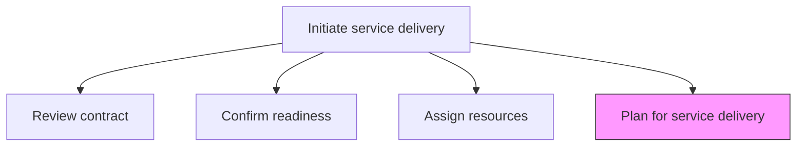
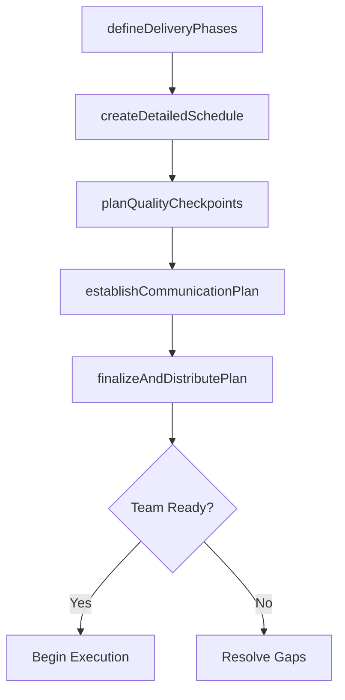

# Plan for service delivery

> Business-as-Code definition for creating the comprehensive delivery plan that orchestrates all activities, resources, timelines, and checkpoints needed to successfully render the service solution.

## Overview

Establishing a plan of action to successfully render a solution for service delivery.

## Process Hierarchy



## GraphDL

```yaml
plan:
  object: For Service Delivery
  actor: ProjectManager
  result: ServiceDeliveryPlan
```

## Actions

| Action | Description |
|--------|-------------|
| defineDeliveryPhases | Break down the engagement into logical delivery phases and workstreams |
| createDetailedSchedule | Build a granular timeline with tasks, dependencies, and milestones |
| planQualityCheckpoints | Define quality gates and review points throughout delivery |
| establishCommunicationPlan | Set up status reporting, stakeholder updates, and meeting cadences |
| finalizeAndDistributePlan | Publish the approved delivery plan to all team members and stakeholders |

## Events

| Event | Description |
|-------|-------------|
| deliveryPhasesDefined | Engagement phases and workstreams established |
| detailedScheduleCreated | Granular task-level schedule published |
| qualityCheckpointsPlanned | Quality gates and review points defined |
| communicationPlanEstablished | Reporting and meeting cadences documented |
| planFinalizedAndDistributed | Delivery plan published to all stakeholders |

## Searches

| Search | Description |
|--------|-------------|
| getDeliveryPlan | Retrieve the service delivery plan for an engagement |
| findDeliveryPhases | List delivery phases and their status |
| getQualityCheckpoints | Get quality gates and review points for an engagement |
| findPlanTasks | List tasks filtered by phase, assignee, or status |

## Process Flow



## RACI Matrix

| Activity | Responsible | Accountable | Consulted | Informed |
|----------|-------------|-------------|-----------|----------|
| defineDeliveryPhases | ProjectManager | EngagementManager | SolutionArchitect | DeliveryTeam |
| createDetailedSchedule | ProjectManager | EngagementManager | Team Leads | ResourceManager |
| finalizeAndDistributePlan | ProjectManager | EngagementManager | Client | All Stakeholders |

## Related Processes

| Process | Relationship |
|---------|-------------|
| 5.3.1.3 Modify/revise and approve project plan | Upstream - approved project plan is foundation for delivery plan |
| 5.3.2 Execute service delivery | Downstream - delivery plan guides execution activities |
| 5.3.1.5 Confirm environmental readiness | Upstream - readiness confirmation enables planning |

## Related Departments

| Department | Role |
|-----------|------|
| Project Management | Owns delivery plan creation and tracking |
| Service Delivery | Provides execution context and constraints |
| Quality Assurance | Defines quality checkpoints and review criteria |

## Related Occupations

| Occupation | Involvement |
|-----------|-------------|
| Project Manager | Primary plan author |
| Engagement Manager | Approves and sponsors the plan |
| Quality Manager | Defines quality gates |

## KPIs

| KPI | Description | Unit |
|-----|-------------|------|
| Plan Readiness Time | Time from initiation to finalized delivery plan | Days |
| Schedule Accuracy | Percentage of tasks completed within planned timelines | % |
| Quality Gate Pass Rate | Percentage of quality checkpoints passed on first review | % |

## Usage

```typescript
import { planForServiceDelivery } from '@headlessly/plan-for-service-delivery'

const planning = planForServiceDelivery()

// Define delivery phases
const phases = await planning.defineDeliveryPhases({
  engagementId: 'eng-789',
  phases: ['discovery', 'design', 'build', 'test', 'deploy', 'transition'],
  methodology: 'agile'
})

// Create detailed schedule
const schedule = await planning.createDetailedSchedule({
  phasesId: phases.id,
  startDate: '2026-03-01',
  endDate: '2026-06-30',
  sprintDuration: '2-weeks'
})

// Finalize and distribute plan
await planning.finalizeAndDistributePlan({
  scheduleId: schedule.id,
  distributeTo: ['delivery-team', 'client-stakeholders', 'management'],
  kickoffDate: '2026-03-03'
})
```
