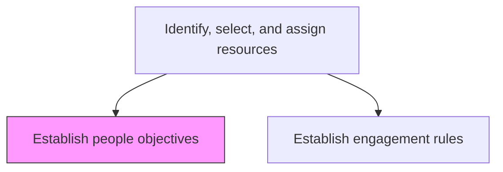
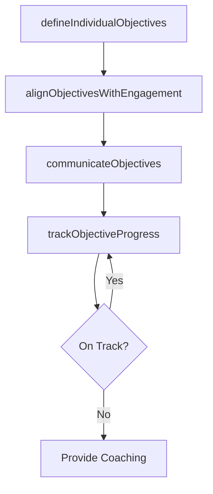

# Establish people objectives

> Business-as-Code definition for setting individual and team performance objectives that align delivery personnel goals with engagement outcomes and professional development.

## Overview

Providing the workforce with a plan of action and goals necessary to provide a service. Make sure that those objectives are met.

## Process Hierarchy



## GraphDL

```yaml
establish:
  object: People Objectives
  actor: EngagementManager
  result: PeopleObjectivesPlan
```

## Actions

| Action | Description |
|--------|-------------|
| defineIndividualObjectives | Set specific goals for each team member aligned with engagement deliverables |
| alignObjectivesWithEngagement | Ensure individual objectives support overall engagement success criteria |
| communicateObjectives | Share objectives with team members and discuss expectations |
| trackObjectiveProgress | Monitor progress toward individual and team objectives |

## Events

| Event | Description |
|-------|-------------|
| individualObjectivesDefined | Individual performance goals established |
| objectivesAlignedWithEngagement | Objectives confirmed as supporting engagement outcomes |
| objectivesCommunicated | Objectives shared and acknowledged by team members |
| objectiveProgressTracked | Progress against objectives reviewed and documented |

## Searches

| Search | Description |
|--------|-------------|
| findPeopleObjectives | Retrieve objectives filtered by person, engagement, or status |
| getObjectiveProgress | Get progress data for specific individual objectives |
| findUnmetObjectives | List objectives not on track for completion |

## Process Flow



## RACI Matrix

| Activity | Responsible | Accountable | Consulted | Informed |
|----------|-------------|-------------|-----------|----------|
| defineIndividualObjectives | EngagementManager | ServiceDeliveryManager | Team Members | HR |
| communicateObjectives | EngagementManager | ServiceDeliveryManager | ProjectManager | ResourceManager |
| trackObjectiveProgress | ProjectManager | EngagementManager | Team Members | HR |

## Related Processes

| Process | Relationship |
|---------|-------------|
| 5.3.1.6.2 Establish engagement rules | Parallel - engagement rules complement people objectives |
| 5.3.1.7 Plan for service delivery | Upstream - delivery plan defines context for people objectives |
| 5.3.3.1 Conduct service delivery project review | Downstream - objectives are evaluated during project review |

## Related Departments

| Department | Role |
|-----------|------|
| Service Delivery | Sets and monitors engagement-specific objectives |
| Human Resources | Aligns engagement objectives with career development |
| Project Management | Tracks objective progress during delivery |

## Related Occupations

| Occupation | Involvement |
|-----------|-------------|
| Engagement Manager | Primary objective setter |
| Project Manager | Tracks objective progress |
| HR Business Partner | Connects objectives to development plans |

## KPIs

| KPI | Description | Unit |
|-----|-------------|------|
| Objective Achievement Rate | Percentage of people objectives met during the engagement | % |
| Objective Clarity Score | Team member rating of how clearly objectives are defined | Score (1-5) |
| Objective Review Frequency | Number of objective progress reviews per engagement | Count |

## Usage

```typescript
import { establishPeopleObjectives } from '@headlessly/establish-people-objectives'

const objectives = establishPeopleObjectives()

// Define individual objectives for the delivery team
const plan = await objectives.defineIndividualObjectives({
  engagementId: 'eng-789',
  teamMembers: [
    { id: 'emp-101', objectives: ['deliver-migration-plan', 'mentor-junior'] },
    { id: 'emp-102', objectives: ['complete-testing', 'document-runbook'] }
  ]
})

// Communicate objectives to the team
await objectives.communicateObjectives({
  planId: plan.id,
  method: 'one-on-one-meetings',
  deadline: '2026-03-05'
})

// Track objective progress
const progress = await objectives.trackObjectiveProgress({
  planId: plan.id,
  reviewDate: '2026-04-01'
})
```
