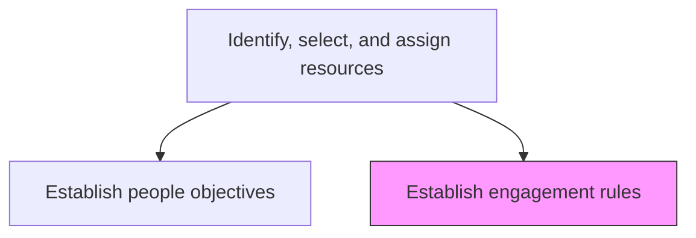
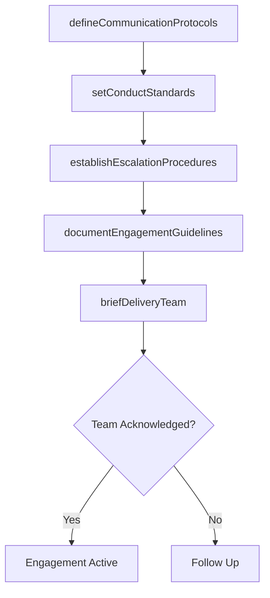

# Establish engagement rules

> Business-as-Code definition for defining the guidelines, protocols, and standards of conduct that govern how delivery team members interact with customers during service delivery.

## Overview

Establishing guidelines for how resources engage with the customer. For example, set rules of accountability, interaction, and accommodation when engaging the customer. Resources should be polite, empathetic, and attentive.

## Process Hierarchy



## GraphDL

```yaml
establish:
  object: Engagement Rules
  actor: EngagementManager
  result: EngagementRulesDocument
```

## Actions

| Action | Description |
|--------|-------------|
| defineCommunicationProtocols | Establish channels, frequency, and escalation paths for client communication |
| setConductStandards | Define professionalism and behavior expectations for client interactions |
| establishEscalationProcedures | Create clear escalation paths for issues and conflicts |
| documentEngagementGuidelines | Formalize all engagement rules into a reference document |
| briefDeliveryTeam | Orient delivery team members on engagement rules and expectations |

## Events

| Event | Description |
|-------|-------------|
| communicationProtocolsDefined | Client communication guidelines established |
| conductStandardsSet | Professional behavior expectations documented |
| escalationProceduresEstablished | Issue escalation paths defined and approved |
| engagementGuidelinesDocumented | Engagement rules formalized in reference document |
| deliveryTeamBriefed | Team oriented on engagement rules and expectations |

## Searches

| Search | Description |
|--------|-------------|
| getEngagementRules | Retrieve engagement rules for a specific engagement |
| findCommunicationProtocols | Get communication guidelines for a client engagement |
| getEscalationProcedures | Retrieve escalation paths and procedures |
| findEngagementGuidelines | List engagement guidelines by category or client |

## Process Flow



## RACI Matrix

| Activity | Responsible | Accountable | Consulted | Informed |
|----------|-------------|-------------|-----------|----------|
| defineCommunicationProtocols | EngagementManager | ServiceDeliveryManager | Client | DeliveryTeam |
| setConductStandards | EngagementManager | ServiceDeliveryManager | HR | AccountManager |
| briefDeliveryTeam | ProjectManager | EngagementManager | Team Leads | All Team Members |

## Related Processes

| Process | Relationship |
|---------|-------------|
| 5.3.1.6.1 Establish people objectives | Parallel - people objectives complement engagement rules |
| 5.3.2 Execute service delivery | Downstream - engagement rules govern execution behavior |
| 5.1.1.1 Set up and maintain governance system | Upstream - governance framework informs engagement standards |

## Related Departments

| Department | Role |
|-----------|------|
| Service Delivery | Owns engagement rules definition |
| Account Management | Provides client relationship context |
| Human Resources | Validates conduct standards alignment with policies |

## Related Occupations

| Occupation | Involvement |
|-----------|-------------|
| Engagement Manager | Primary rules author |
| Project Manager | Briefs team and enforces rules |
| Account Manager | Validates client-facing communication protocols |

## KPIs

| KPI | Description | Unit |
|-----|-------------|------|
| Team Acknowledgment Rate | Percentage of team members acknowledging engagement rules | % |
| Engagement Rule Compliance | Adherence to engagement rules during delivery | Score (1-5) |
| Escalation Response Time | Average time to respond to escalated issues | Hours |

## Usage

```typescript
import { establishEngagementRules } from '@headlessly/establish-engagement-rules'

const rules = establishEngagementRules()

// Define communication protocols
const protocols = await rules.defineCommunicationProtocols({
  engagementId: 'eng-789',
  channels: ['email', 'teams', 'weekly-status-call'],
  escalationLevels: ['team-lead', 'engagement-manager', 'vp-operations']
})

// Document engagement guidelines
const guidelines = await rules.documentEngagementGuidelines({
  protocolsId: protocols.id,
  sections: ['communication', 'conduct', 'escalation', 'confidentiality'],
  clientSpecificRules: true
})

// Brief the delivery team
await rules.briefDeliveryTeam({
  guidelinesId: guidelines.id,
  teamMembers: ['emp-101', 'emp-102', 'emp-103'],
  requireAcknowledgment: true
})
```
