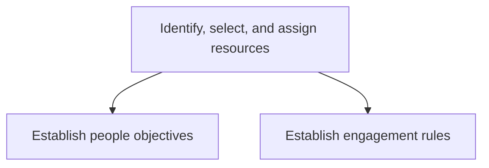
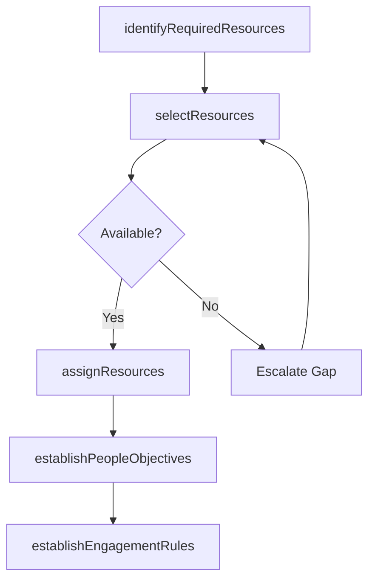

# Identify, select, and assign resources

> Business-as-Code definition for resource identification, selection, and assignment. Models people objective setting, engagement rule establishment, resource matching, and team assignment as programmable workflows.

## Overview

Identifying, selecting, and assigning resources required to deliver service to the customer. Ensure that all objectives are established and met, and the all rules of engagement have been identified and communicated.

## Process Hierarchy



## GraphDL

```yaml
identify,:
  object: Select, And Assign Resources
  actor: ResourceCoordinator
  result: AssignedTeam
```

## Actions

| Action | Description |
|--------|-------------|
| establishPeopleObjectives | Define performance goals and expectations for assigned resources |
| establishEngagementRules | Set guidelines for how resources interact with the customer |
| identifyRequiredResources | Determine resource types, skills, and quantities needed |
| selectResources | Evaluate and choose best-fit resources from available pool |
| assignResources | Formally assign selected resources to the engagement |

## Events

| Event | Description |
|-------|-------------|
| peopleObjectivesEstablished | Individual performance goals set and communicated |
| engagementRulesEstablished | Customer engagement guidelines documented and shared |
| requiredResourcesIdentified | Resource requirements defined for the engagement |
| resourcesSelected | Best-fit resources chosen from available pool |
| resourcesAssigned | Team members formally assigned and notified |

## Searches

| Search | Description |
|--------|-------------|
| getAvailableResources | Query resources by skill, availability, and location |
| getEngagementRules | Retrieve engagement rules for a specific client or project |
| getPeopleObjectives | Query performance objectives for assigned team members |
| getAssignmentHistory | Retrieve past resource assignments for a client or service line |

## Process Flow



## RACI Matrix

| Activity | Responsible | Accountable | Consulted | Informed |
|----------|-------------|-------------|-----------|----------|
| identifyRequiredResources | ProjectManager | EngagementManager | SolutionArchitect | ResourcePlanning |
| selectResources | ResourceCoordinator | EngagementManager | DeliveryLeads, HR | Finance |
| establishEngagementRules | EngagementManager | ServiceDeliveryDirector | Legal, Customer | DeliveryTeam |

## Sub-Processes

| ID | Name | Description |
|----|------|-------------|
| 5.3.1.6.1 | Establish people objectives | Providing the workforce with a plan of action and goals necessary to provide a service. Make sure th |
| 5.3.1.6.2 | Establish engagement rules | Establishing guidelines for how resources engage with the customer. For example, set rules of accoun |

## Related Processes

| Process | Relationship |
|---------|-------------|
| 5.3.1.5 Confirm environmental readiness | Upstream - readiness confirms resource requirements |
| 5.3.1.7 Plan for service delivery | Downstream - assigned team contributes to delivery planning |
| 5.2.2 Create and manage resource plan | Upstream - resource plan provides staffing pool |
| 5.2.3 Enable service-delivery resources | Parallel - training ensures assigned resources are qualified |

## Related Departments

| Department | Role |
|-----------|------|
| Resource Management | Manages resource pool and assignment logistics |
| Engagement Management | Sets engagement rules and people objectives |
| Human Resources | Provides resource profiles and availability data |
| Service Delivery | Consumes assigned team for project execution |

## Related Occupations

| Occupation | Involvement |
|-----------|-------------|
| Resource Coordinator | Resource matching and assignment execution |
| Engagement Manager | Engagement rules and objective setting |
| Project Manager | Requirements definition and team onboarding |

## KPIs

| KPI | Description | Unit |
|-----|-------------|------|
| Resource Fill Rate | Percentage of required roles staffed within target timeline | % |
| Skill Match Accuracy | Degree of alignment between required and assigned skills | Score (1-10) |
| Time to Staff | Average time from resource request to confirmed assignment | Days |
| Engagement Rule Compliance | Percentage of resources briefed on engagement rules before start | % |

## Usage

```typescript
import { identifySelectAndAssignResources } from '@headlessly/identify-select-and-assign-resources'

const client = identifySelectAndAssignResources()

// Identify required resources
const requirements = await client.identifyRequiredResources({
  engagementId: 'ENG-2025-0567',
  roles: [
    { role: 'Technical Lead', skills: ['java', 'microservices'], count: 1 },
    { role: 'Developer', skills: ['java', 'react'], count: 3 }
  ],
  startDate: '2025-07-01'
})

// Establish engagement rules
const rules = await client.establishEngagementRules({
  engagementId: 'ENG-2025-0567',
  communicationProtocol: 'weekly-status-calls',
  escalationPath: ['project-manager', 'engagement-manager', 'delivery-director'],
  accessControls: { vpnRequired: true, ndaSigned: true }
})
```
